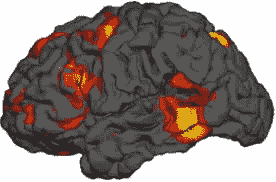
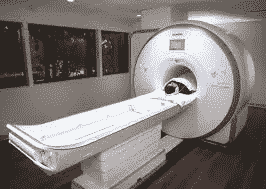
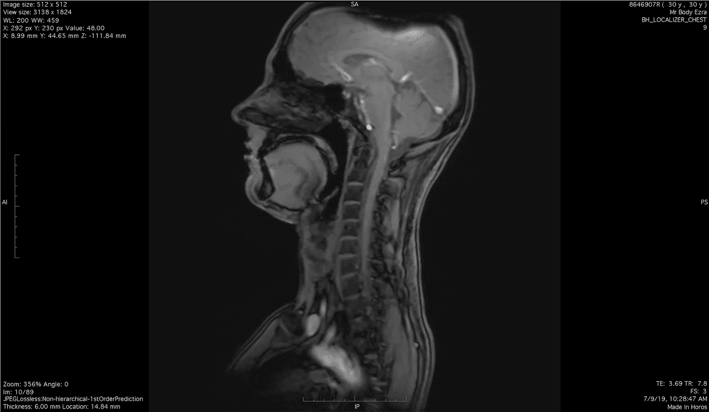
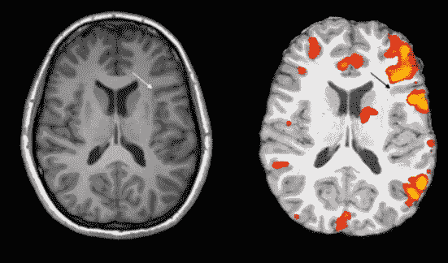
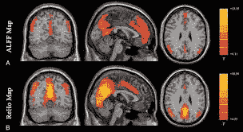
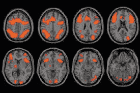
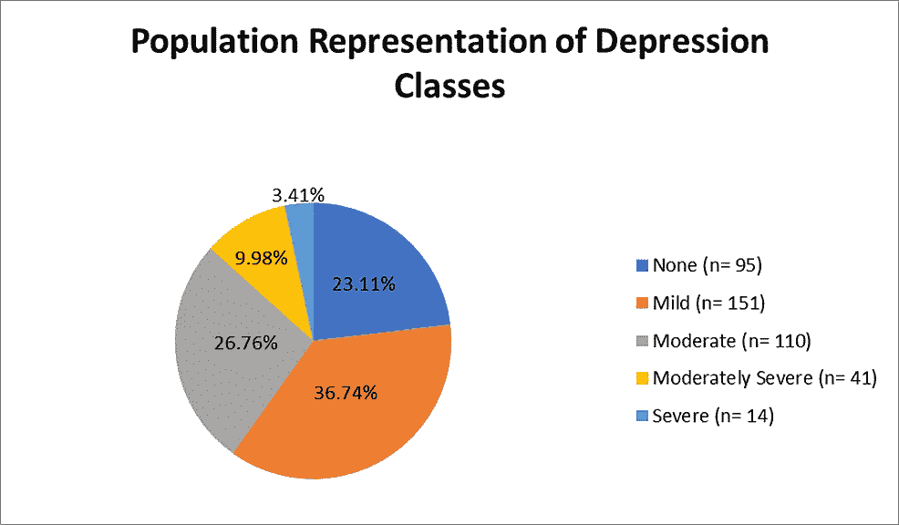

# 抑郁症的功能磁共振成像

> 原文：<https://medium.com/geekculture/functional-mri-imaging-for-major-depressive-disorder-f29de680bd8d?source=collection_archive---------31----------------------->

当听到 MRI 这个词时，大多数人会想到通常用于肌肉撕裂和拉伤的临床扫描。他们没有错，但这并不是唯一的核磁共振扫描，核磁共振可以用于比暂时性损伤更多的地方。事实上，最近的研究表明，它们可能是精确医学和精神病学治疗大脑疾病的未来。一种被称为功能性磁共振成像(f MRI)的特殊磁共振成像对精神疾病，尤其是重度抑郁症有很大的前景。这种方法的大规模实施可以提高每天面临这种情况的数百万人的生活质量。

1.  什么是核磁共振成像？
2.  什么是 fMRI 成像，它与解剖 MRI 有什么不同？
3.  它是如何用于精神疾病的？
4.  什么是重度抑郁症，它在这里具体是如何应用的？
5.  有哪些顾虑？
6.  结论/关键要点
7.  我发现有用的进一步阅读/资源

## 什么是核磁共振成像？

**磁共振成像(MRI)是一种非侵入性医疗成像技术，它使用强磁体和无线电波来创建身体的详细图像。**医生经常使用它来进行诊断或测量患者对治疗的反应。核磁共振成像与 x 光相似，都是用于帮助评估损伤的身体扫描，但与 x 光不同的是，核磁共振成像不仅用于骨骼损伤，而且不使用任何可能有害并具有长期影响的电离辐射。

MRI scanners form images without the use of ionizing radiation.

**它是如何工作的？**

核磁共振扫描是使用特殊的扫描仪进行的。首先，扫描仪使用磁场和无线电波来测量身体不同组织中的含水量。**从这里，它根据水在体内的位置绘制出所有的水，并生成图像。**由于人体的 60 %- 65%是水，因此需要测量的信号很多，图像往往非常详细。

The abundance of water in the human body enables MRI scanners to produce very detailed images.

这些图像对全身都有用，尤其是对软组织和神经系统。MRI 扫描可用于检测血管损伤、血管堵塞、中风、癌症、心脏病、骨感染、关节损伤和各种器官的健康状况不佳。然而，由于核磁共振成像使用非常强的磁铁，那些身体上有任何种类的金属植入物或金属不能轻易取出的人不能进行核磁共振成像扫描。此外，核磁共振成像不太适合对噪音敏感、患有幽闭恐惧症或怀孕的人。

## 什么是 fMRI 成像，它与解剖 MRI 有什么不同？

上面讨论的经典类型的 MRI 被称为解剖 MRI。如果某人使用了准确的术语 MRI，并且没有明确地说他们的意思是其他的，那么这通常就是他们所指的。然而，这并不是说解剖磁共振成像是磁共振成像的主要类型，甚至是最受欢迎的。磁共振成像最流行的亚型之一是功能磁共振成像，也称为功能磁共振成像。

An MRI versus fMRI image

功能性磁共振成像是一种特殊类型的磁共振成像，专门用于绘制大脑活动。它们不同于解剖核磁共振扫描，因为它们不是测量水，而是观察血流。这在观察大脑时特别有用，因为医生和科学家可以看到有多少血液和氧气流向大脑的每个部分，从而了解不同人大脑的哪个区域最活跃。这种技术被称为 BOLD(血氧水平相关)对比成像。

BOLD images from different angles

有两种类型的功能磁共振成像:基于任务和休息状态。**基于任务的磁共振成像是在患者执行一系列针对不同大脑区域的任务时进行的，而静息状态(RS-fmri)是在患者不执行任何特定任务时进行的。**如果试图检查大脑的特定区域及其刺激，通常会使用基于任务的 fMRIs，而静息状态则用于查看大脑的自然血流。

## 功能磁共振成像如何用于精神疾病？

**除了对中风或外科手术的信息有用之外，功能性磁共振成像最近被发现对其他基于大脑的疾病如神经发育和精神疾病有极大的帮助。**目前，我们只关注精神疾病。这些疾病涉及情绪或行为障碍，如重度抑郁症、广泛性焦虑症和精神分裂症。

患有精神疾病的人有非典型的连接体层次，这意味着他们大脑的不同部分比普通大脑具有或多或少的连通性。**通过进行 fMRI 扫描并使用 BOLD 成像来分析血流，我们可以识别异常连接的区域，并解释它们的活动对患者及其整体状况的影响。**

Different levels of activity in the brain interpreted using BOLD

患有精神疾病的人与没有精神疾病的人有着非常不同的连通性，fMRI 数据是理解这一点的重要工具。从 fMRI 扫描中提取的信息可以帮助我们看到大脑的哪些部分具有异常的活动水平，并将其与根本原因以及它对患者情绪或行为的影响联系起来。**从这里，我们能够改善每种疾病的诊断和治疗，并使治疗更加个性化。有一整个领域都专注于此，包括临床和精神病学。这两个领域叫做精准医学和精准精神病学。**

FMRI 成像和分析可以引导人们更好地理解和治疗许多不同的精神疾病。这种方法导致了对各种精神疾病的有趣研究，但今天我们将特别关注重度抑郁症，因为它是最常见的精神疾病之一，影响着数百万人。

## 什么是重度抑郁症，它在这里具体是如何应用的？

**重度抑郁障碍(MDD)是一种基于情绪的精神障碍，导致对活动失去乐趣或兴趣，日常生活乐趣减少。**这是最常见的精神健康疾病之一，估计有超过 2.64 亿人患有这种疾病。世界卫生组织(世卫组织)认为重性抑郁障碍与非致命健康结果相关的负担比例最大。请注意，MDD 被归类为单相抑郁症，不要与双相情感障碍相混淆，双相情感障碍是一种不同的抑郁症。

Major Depressive Disorder sorted by level of severity

**为了推进 MDD 的精准医学和精神病学，并使其更容易识别和诊断(许多其他医学疾病也是如此)，科学家们在大脑中寻找被称为生物标记的生物标记。**这些是病情存在和严重程度的可测量指标。在患有重度抑郁症的人身上找到某些生物标志物可以产生大量关于该疾病在大脑的哪个部分最活跃的信息，这有助于医生看到每个患者的抑郁症状最严重，因此带来了精确性方面。

**对于重度抑郁症来说，这一点尤为重要，因为它是一种非常异质性的疾病，这意味着患有这种疾病的人在他们的个体状况和症状方面存在很大差异。**当试图仅基于我们对整体病情的了解来制定治疗方案时，这会带来挑战，因为疗效会非常不一致。一些人建议 MDD 应该被分成更小的更同质的亚组，这样每个亚组的治疗将更一致，但是像这样的想法要被广泛接受并在临床上实施还需要大量的工作和研究。

就目前而言，使用 fMRI 数据根据广泛可用的资源制定个性化的治疗计划是一个很好的策略，这就是为什么功能性 MRI 的使用对单相抑郁症患者如此重要。

## 有哪些顾虑？

虽然使用 fMRI 和 BOLD 在 MDD 的进展显示了该领域进展的巨大前景，但肯定存在担忧(几乎总是存在)。即使是最好的想法，考虑潜在的挫折也总是很重要的，所以为了透明起见，这里是我遇到的一些最大的担忧:

**传达活动的大胆手法**

正如你现在所了解的，BOLD 技术用于根据流向大脑各部分的血液和氧气水平来检查大脑活动。流向某个区域的血液越多，大脑中该区域的活动就越多。这是用来将不寻常的大脑功能或活动水平与特定的精神疾病联系起来的。

然而，这有几个问题。首先，由于体内的水比血液多得多，功能磁共振成像比解剖核磁共振成像详细得多，这使得这一过程不太精确。其次，这些图像会延迟几秒钟，这可能会在基于任务的 fMRIs 中扭曲结果。最后，我们使用血流量作为思想和活动的精确关联，但这并不一定如此，粗体图像的大小不能传达它是积极的还是消极的，因为它是一个非消极的系统。

**道德规范**

与许多新兴技术一样，可用性也有许多伦理问题。在这种情况下，人们关心的是获得 fMRI 扫描仪和医生来解释它们所需的费用和医疗护理。然而，正如许多这些技术的共同理念一样，如果那些最幸运的人现在就开始使用它们，从长远来看，它们只会变得更便宜，更容易获得。

## 结论/关键要点

*   磁共振成像(MRI)是一种使用强磁体和无线电波来创建身体详细图像的测试。它通过绘制出你体内所有的水的位置来产生高质量的图像。
*   功能性核磁共振成像是一种特殊的核磁共振成像，专门用于绘制大脑活动。它们的工作方式不同于解剖(经典)磁共振成像，因为它们使用 BOLD(血氧水平相关)成像，而不是基于水的技术。
*   有两种类型的功能磁共振成像:基于任务和休息状态。基于任务的磁共振成像是在人们执行一系列针对不同大脑区域的任务时进行的，而静息状态(rs-fMRI)是在人们不执行任何特定任务时进行的。
*   FMRI 图像对于精神疾病和其他脑部疾病非常有用。患有精神疾病的人有非典型的连接体层次，因此使用 fMRI 我们可以识别异常连接的区域，并解释他们的活动对患者和他们的疾病的影响。
*   使用 fMRI 治疗精神疾病非常重要，因为它可以促进精确(个性化)医学和精神病学的发展，改善数百万人的生活质量。
*   重度抑郁障碍(MDD)是一种基于情绪的精神障碍，导致对活动失去乐趣或兴趣，日常生活乐趣减少。FMRI 成像对重度抑郁症尤其重要，因为它是一种非常异质性的疾病，这意味着患有抑郁症的人彼此之间有很大差异。
*   当然也有一些问题，如功能性磁共振成像与解剖学相比缺乏细节，基于任务的功能性磁共振成像的扭曲数据，不精确的结论方法，以及围绕社会下层成员可用性的伦理问题。

## 我发现有用的进一步阅读/资源

 [## 目前对重性抑郁障碍的神经生物学的理解

### 抑郁症在世界范围内非常普遍，并且与显著的发病率和死亡率相关。大约 340…

pubmed.ncbi.nlm.nih.gov](https://pubmed.ncbi.nlm.nih.gov/26429155/) 

https://www . nibib . NIH . gov/science-education/science-topics/magnetic-resonance-imaging-MRI

 [## 功能性磁共振成像:血氧水平依赖(BOLD)成像的基础…

### 功能磁共振成像(fMRI)有两种主要技术:血氧水平依赖(BOLD)技术，这是一种新的成像技术

pubmed.ncbi.nlm.nih.gov](https://pubmed.ncbi.nlm.nih.gov/9803232/) 

[https://sci-hub . do/https://www . NCBI . NLM . NIH . gov/PMC/articles/PMC 4693599/](https://sci-hub.do/https://www.ncbi.nlm.nih.gov/pmc/articles/PMC4693599/)

感谢阅读我的文章，我希望你喜欢！我叫刘冰·博恩施泰因，今年 15 岁，我热衷于神经科学和大脑疾病。我很乐意在 [LinkedIn](https://www.linkedin.com/in/raina-bornstein-bb18331b7/) 上联系，或者你可以在 rainabornstein@gmail.com 联系我，与我交谈或合作。我等不及收到你的来信了！