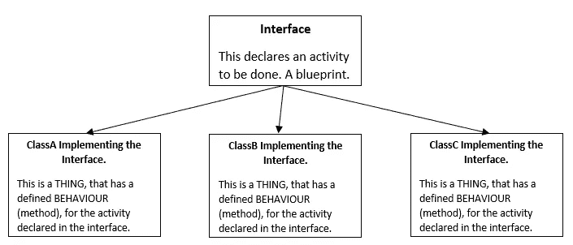

# Java 函数式编程基础

> 原文：<https://medium.com/geekculture/functional-programming-in-java-31c9896fa48b?source=collection_archive---------3----------------------->

*Java 8 Lambdas 基础！*

这个博客旨在解释函数式编程的基础，使用 Java 8 lambdas。这个博客假设你没有函数式编程范例的先验知识，但是有面向对象编程的基础知识。

> ***什么是函数式编程。***

函数式编程只不过是一种编程风格，它提倡纯函数。对于纯函数，我指的是一段代码，它接受一些输入，执行计算，并给出期望的输出。它没有任何“副作用”或任务，比如打印或操纵其作用域之外的变量。这些函数是**一级**函数，也就是说，它们可以简单地用作值，这些值可以作为变量/参数传递给其他函数。

在 Java 8 之前，Java 不支持这种类型的编程。在 Java 8 之前，所有的代码块都属于一个类。因此，为了执行像打印问候信息这样简单的功能，我们必须编写一个单独的类来实现这个逻辑。我们不可能有一个孤立的简单函数来实现这个逻辑。随着 lambda 表达式的引入，这在 Java 8 中发生了改变。

> 当我们已经可以使用主流的面向对象编程做任何我们想做的事情时，为什么我们还需要函数式编程呢？

函数式编程有助于编写清晰简洁的代码，易于维护(在某些情况下)。它允许更容易地使用 API 和库，并支持利用并行处理的方式。

让我们通过比较 Java 7 和 8 中遵循的编程方法来尝试理解 lambdas 提供的优势。我们将看到一个动作如何在 Java 7 和 Java 8 中执行。

## ***Java 7 路——简单 OOP***

为了在面向对象编程范例中实现一个行为，我们应该有一个如下所示的设置:

执行接口中声明的活动的类现在必须创建或检索对象(需要其行为的类的实例)，并将其作为参数传递给它的方法，以便执行活动。请参见下面的代码片段:

我们在这里做了什么？

1.  创建了一个界面“MakeBeverage”。这是需要执行的活动。它给出了一个蓝图，活动的行为应该在名为“make”的方法中定义。
2.  创建了两个实现接口“MakeBeverage”的实体。这些实体对于活动有它们自己的行为，因此，它们的行为是在它们各自的“make”方法的实现中定义的。这个“make”方法中的代码就是它们的动作。
3.  创建了一个名为“BeverageMaker”的 executor 类，该类有一个方法，要求将活动作为参数。此方法根据作为参数传递的实现活动的实体的实例来执行操作。

## ***Java 8 way—Lambda 表达式***

Java 8 引入了 lambda 表达式，使我们能够编写简洁的代码。这是通过消除创建活动实现(接口)的需要来实现的。我们可以简单地将实体的“动作”存储在一个变量中，并将其作为参数传递给 executor 类，而不是创建具有不同行为的不同实体。请看下面的代码:

使用 executor 类“BeverageMakerWithLambda ”,我们不需要实现接口“MakeBeverage”的实体。我们简单地声明了“Action”，即模拟每个实体类作为变量的行为的代码。变量的类型，即活动接口“MakeBeverage”。

> **Java 7 方法和 Java 8 方法的区别在于，我们没有实现一个完整的类来执行一个独立的动作，而是简单地实现了一个函数。**

# ***类型推断***

Java 8 能够自动推导出 Lambda 表达式的返回类型，以及传递给表达式的参数类型。这被称为类型推理。这是由 java 编译器执行的。

**自动！！怎么会？**

Java 将用于创建 lambda 函数的接口命名为**函数接口**。

*   它们内部只能声明一个方法。
*   当用作用于存储 lambda 表达式的变量的类型时，java 编译器检查接口内抽象方法的返回类型和参数类型，并期望 lambda 表达式符合相同的条件。

在我们的示例中，MakeBeverage 接口充当功能接口。

## 我们是否为每个想要实现的 lambda 创建了一个功能接口？

没有必要创建一个新的函数接口来实现你的 lambda 逻辑。只有一个方法的现有 Java 接口可以用于此目的。让我们看一个 Runnable 接口的例子，它只有一个方法。

在上面的代码片段中，Runnable 接口是使用匿名内部类方法和 lambda 方法实现的。可以清楚的看到，在 lambdas 的情况下，代码是多么的清晰简洁。

Java 提供了一个现成的函数接口包，可以根据代码的输入参数和返回类型需求来实现 lambda 函数。关于软件包的详细信息，请参考[https://docs . Oracle . com/javase/8/docs/API/Java/util/function/package-summary . html](https://docs.oracle.com/javase/8/docs/api/java/util/function/package-summary.html)。

这标志着这个博客的结束。Java 8 lambda 是一个巨大的主题，有很好的实现来减少 Java 代码的冗长。使用 lambda 实现 Java 流是一个非常有趣的话题，我将在以后的博客中讨论这个话题。

***练习是唯一的选择*** 👍

*查看我的*[*GitHub*](https://github.com/rgog/TutorialsWorkspace/tree/master/FunctionalProgramming/src)*获取本博客及其他项目的代码。*