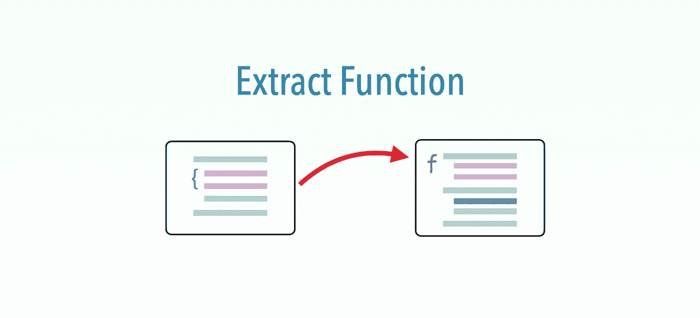

# 功能测试重构:提取功能

> 原文：<https://medium.com/geekculture/functional-test-refactoring-extract-function-5572554c0677?source=collection_archive---------15----------------------->

## 提取一组对可重用功能执行公共用户操作的测试步骤

这是 6 次 [*功能测试重构的第一次*](https://zhiminzhan.medium.com/functional-test-refactoring-598872af9d51) *:* **提取功能**。我将在以下几节中展示每个重构:

*   动机，*为什么？*
*   力学，*如何？*