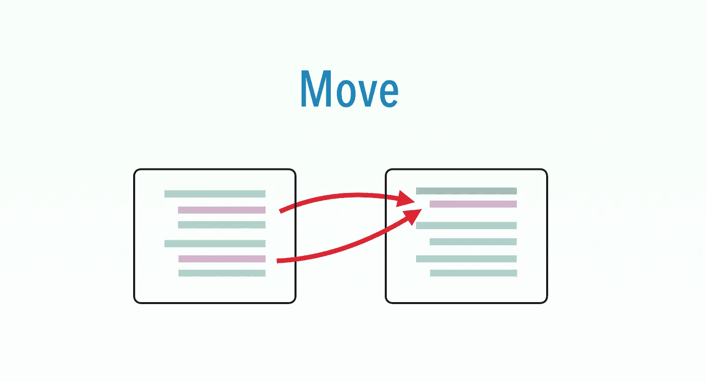

# 功能测试重构:移动

> 原文：<https://medium.com/geekculture/functional-test-refactoring-move-554fd0926af?source=collection_archive---------16----------------------->

## 将测试步骤移动到在测试用例之前/之后执行的部分

这是 6 [*功能测试重构之一*](https://zhiminzhan.medium.com/functional-test-refactoring-598872af9d51) *s:*

*   [提取功能](/p/functional-test-refactoring-extract-function-5572554c0677)
*   [将功能移至助手](/p/functional-test-refactoring-move-to-helper-ce391c10b393)
*   **移动**
*   [提取页面功能](https://zhiminzhan.medium.com/functional-test-refactoring-extract-page-function-596059c67f67)
*   介绍页面对象