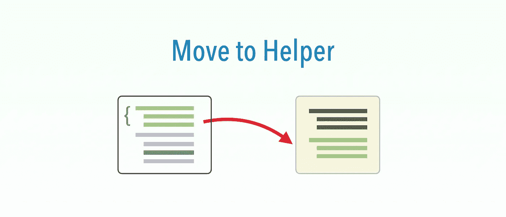

# 功能测试重构:移至助手

> 原文：<https://medium.com/geekculture/functional-test-refactoring-move-to-helper-ce391c10b393?source=collection_archive---------22----------------------->

## 让一个助手函数对所有的测试脚本都可用

这是 6 个 [*功能测试重构之一*](https://zhiminzhan.medium.com/functional-test-refactoring-598872af9d51) *s(参见简介* [*此处*](https://zhiminzhan.medium.com/functional-test-refactoring-598872af9d51) *):*

*   [提取功能](https://zhiminzhan.medium.com/functional-test-refactoring-extract-function-5572554c0677)
*   **将功能移至助手**
*   [移动](https://zhiminzhan.medium.com/functional-test-refactoring-move-554fd0926af)
*   [提取页面功能](https://zhiminzhan.medium.com/functional-test-refactoring-extract-page-function-596059c67f67)
*   介绍页面对象