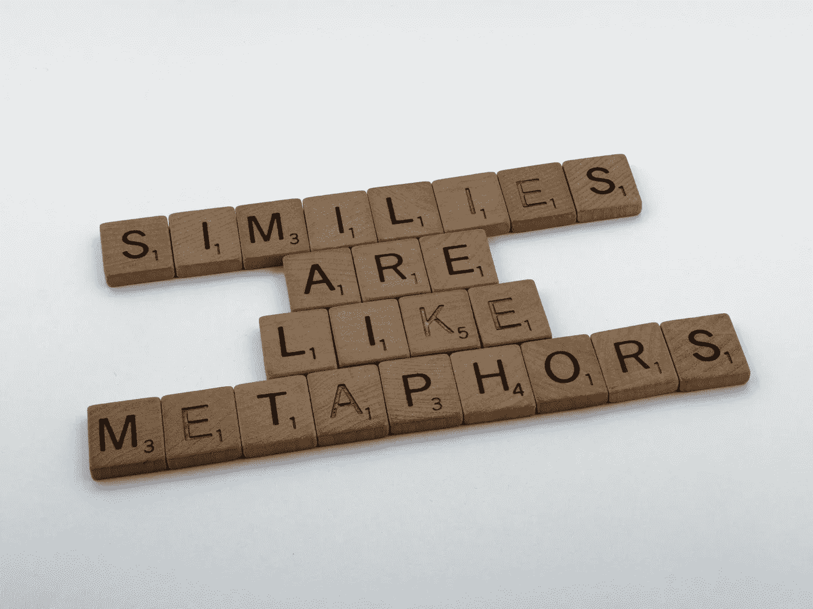

# 编程中的函数就像人类一样

> 原文：<https://medium.com/geekculture/functions-in-programming-are-like-human-beings-5e8d08fdcd50?source=collection_archive---------38----------------------->

## 打个比方——编程功能和人类的相似之处。

以不同的方式看待编程中的函数

Photo by [Brett Jordan](https://unsplash.com/@brett_jordan?utm_source=unsplash&utm_medium=referral&utm_content=creditCopyText) on [Unsplash](https://unsplash.com/s/photos/analogy?utm_source=unsplash&utm_medium=referral&utm_content=creditCopyText)

## 介绍

你最后一次尝试学习编程概念并将其与周围的事物联系起来是什么时候？如果不是！那么你今天很幸运…