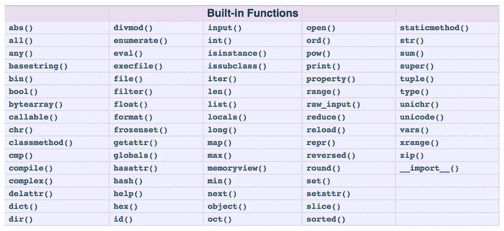
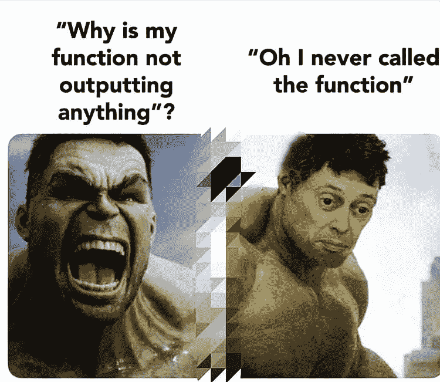

# Python 中的函数以及映射、过滤器和 Lambda 表达式

> 原文：<https://medium.com/geekculture/functions-in-python-along-with-map-filter-and-lambda-expressions-794a6d99f926?source=collection_archive---------12----------------------->


Credit: Unsplash

在**快速代码-Python** 系列的第五章中，我们将了解并实现 Python 中可用的各种函数，并了解如何在您的代码中实现它们，以及如何使用一些非常关键的函数，如 lambda、map 和 filter，使您的代码更高效、更简短。

> 注意:我以线性方式编写了**快速代码——Python**系列，这样即使是新手也可以按照这个系列来理解 Python 实际能做什么。对于擅长基础知识的人来说，你可以跟随这个系列来更新你的概念，或者选择这个系列中你想了解更多的章节。

## **功能**

python 中的函数是一个代码块，只有在被调用时才会运行。Python 函数使用 return 语句返回值(如果指定了 return 语句)。函数声明后，可以在任何地方调用它。您可以将参数中的值传递给函数，以便在执行时使用。

python 中有很多我们可以利用的内置函数。



Credit: stack overflow

使用一些内置函数，

**list()-将元素转换成列表**

```
a = [1,2,3,4,5,6]
b = list(range(1,9))
c = a+b
print(c)**O/P:
[1, 2, 3, 4, 5, 6, 1, 2, 3, 4, 5, 6, 7, 8]**
```

**len()-返回变量的长度**

```
a = [1,2,3,4,5,6]
b = list(range(1,9))
x = len(a)
print(x)
y = len(b)
print(y)**O/P:
6
8**
```

**range()-创建一个介于最小值和最大值之间的范围**

```
a = [1,2,3,4,5,6]
b = list(range(1,9))
sum_a = sum(a)
sum_b = sum(b)
print('sum of two lists : {}'.format(sum_a+sum_b))**O/P:
sum of two lists : 57**
```

**zip()-将两个变量配对**

```
my_list_1 = [1, 2, 3]
my_list_2 = [4, 5, 6]for i, j in zip(my_list_1, my_list_2):
    print(i+j)**O/P:
5
7
9**
```

**使用 zip()创建我们最喜欢的甜点**

```
x = ['vanilla','strawberry','peach']
y = [' sundae',' ice-cream',' smoothie']for i,j in zip(x,y):
 print(i+j)**O/P:
vanilla sundae
strawberry ice-cream
peach smoothie**
```

我们也可以使用关键字`def`创建自己的函数

```
def StudentDetail(name,rollno):
    print('the rollno of the student {} is {}'.format(name,rollno))

StudentDetail('sam',1234)**O/P:
the rollno of the student sam is 1234**
```

上面代码中我们函数的名字是`StudentDetail`，我们创建了两个参数`name`和`rollno`。该函数有一个 print 语句，调用时将执行该语句。

**调用函数**

我们使用函数名调用函数，然后在参数中传递值。



Credit: reddit/mbcoder

使用`return`返回函数的值

```
def subtraction(x,y):
    return x-ysubtraction(10,5)**O/P:
5**
```

## **地图**

map 函数接受一个列表和一个函数。它使用`map()`将该功能应用于列表。这有助于我们使用定义的特定函数对列表进行操作。

```
def subtraction(x,y):
    return x-yx = [5,6,7,8,9]
y = [1,2,3,4,5]z = list(map(subtraction,x,y))
z**O/P:
[4, 4, 4, 4, 4]**
```

在上面的代码中，我们已经映射了函数`subtraction`和列表 x 和 y

```
a = [2,3,4]
b = [5,6,7]def multiply(x, y):
    return x*yc = list(map(multiply, a, b))
c**O/P:
[1, 28, 45, 72, 63]**
```

## **λ表达式**

Lambda 函数可以认为是一个匿名函数，它没有任何名称，但通常在 map()、filter()、reduce()中使用。它们可以接受任意数量的参数，但只能有一个表达式。

写 lambda 函数比写普通函数效率高很多。这有点像在普通清单上写一个清单理解。为您节省大量时间，非常高效。我在之前的博客中已经详细写了关于列表理解的内容。

编写不带 lambda 表达式的函数

```
def my_func(x):
    return x**2
my_func(2)**O/P:
4**
```

使用 lambda 表达式

```
z = lambda x:x**2
z(3)**O/P:
9**
```

在上面的代码中，我们使用了关键字`lambda`，在`:`的右边，我们指定了它需要做的操作。`:`的左边指定了自变量。


Credit: Analytics vidhya

用 lambda 做简单加法

```
sum = lambda a,b : a+b
sum(1,2)**O/P:
3**
```

## **过滤器**

筛选器是一个函数，可应用于只返回通过特定条件的值的列表。


Credit: Real Python

> 使用过滤功能打印偶数和奇数

```
even_and_odd = [1,2,3,4,5,6,7,8,9]only_even = list(filter((lambda x : (x%2 == 0)), even_and_odd))
print(only_even)only_odd = list(filter((lambda y : (y%2 != 0)), even_and_odd))
print(only_odd)**O/P:
[2, 4, 6, 8]
[1, 3, 5, 7, 9]**
```

让我们分解上面的代码，

首先，让我们编写 lambda 表达式来获取偶数

`(lambda x : (x%2 == 0)`

使用过滤函数将我们的 lambda 表达式应用到`even_and_odd`列表，这样我们只得到偶数

```
(filter((lambda y : (y%2 != 0)), even_and_odd))
```

获取输出，并将它们放在一个列表中

```
list(filter((lambda x : (x%2 == 0)), even_and_odd))
```

瞧啊。！我们已经使用 lambda 表达式编写了我们的过滤函数，来查找偶数和奇数

> 打印给定列表中 21 到 28 之间的数字

```
a = [23,45,67,88,12,25,24]between_21_28 = list(filter((lambda x: (x>=21 and x<=28)), a ))
between_21_28**O/P:
[23, 25, 24]**
```

## 使用上述概念的一些实际例子

> 使用函数返回数字的阶乘

```
def fact(x):
    if x == 0:
        return 1
    return x* fact(x-1)number = int(input('Enter an integer: '))
print('the factorial of {} is {}'.format(number,fact(number)))**O/P:
Enter an integer: 6
the factorial of 6 is 720**
```

> 从用户处获取两个数字，并使用 lambda 表达式执行加法和减法

```
a = int(input('enter first number: '))
b = int(input('enter second number: '))sum = lambda x,y : a+b
sub = lambda x,y : a-bprint('Addition : {}, Subtraction = {}'.format(sum(a,b),sub(a,b)))**O/P:
enter first number: 23
enter second number: 12
Addition : 35, Subtraction = 11**
```

> 使用列表理解打印列表中数字的平方

```
original_list = range(2,9)
print([ x**2 for x in original_list])**O/P:
[4, 9, 16, 25, 36, 49, 64]**
```

> 使用 lambda 表达式和映射函数打印列表中的数字立方

```
def cubed(x):
    return(x*x*x)number = [2,3,4]
cube_numbered = list(map(lambda x : cubed(x), number))
print(cube_numbered)**O/P:
[8, 27, 64]**
```

> 使用 lambda 和 filter 函数打印范围内的偶数

```
min = int(input("enter minimum value: "))
max = int(input("enter maximum value: "))numbers = range(min,max)
even_numbers = list(filter(lambda x: (x%2 == 0), numbers))
print(even_numbers)**O/P:
enter minimum value: 23
enter maximum value: 32
[24, 26, 28, 30]**
```

希望您已经理解了如何使用 python 的一些有用的内置函数，并创建自己的函数来返回值。一旦你使用了λ表达式和`map`和`filter`就应该很容易使用它们。

> 注意:如果你在智能手机上阅读博客，代码可能不太适合你。如果你不能正确理解代码，请在 PC/MAC 上阅读博客

仅仅阅读博客是不够的。通过在 IDE 上复制粘贴来运行代码。自己改变变量，看看输出如何变化。最后，试着自己写代码。

> 查看**快速代码-Python** 系列的[上一章](/geekculture/list-comprehension-conditional-and-looping-statements-in-python-16db4ea9e58b)。