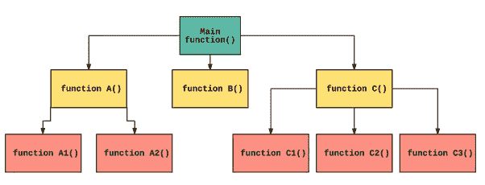

# 功能—可重用逻辑

> 原文：<https://medium.com/geekculture/functions-reusable-logic-b1fad28e72cb?source=collection_archive---------51----------------------->



R 尽管这是总体情况，但实际情况是工厂本身由许多机器组成，每台机器都需要一些原材料，并对其进行加工以生产产品。在编程中也可以这样做。

整个程序可以分成几个功能。每个函数将接受一个输入并产生一个输出。

# 为什么是函数？

[这是我们在上一篇文章中做的一个问答节目。](/geekculture/string-an-array-of-characters-with-0-a133fd56e9d9)您可能已经注意到，对于测验中的每个问题和答案，应该编写大约 7 行代码。每个问题的模式都是一样的。

1.  显示问题
2.  显示选项
3.  要求用户输入一个选项
4.  将输入存储在变量中
5.  比较变量和答案
6.  如果变量和答案匹配，告诉答案是正确的，如果不匹配，告诉答案是错误的。

因为每个问题都重复相同的模式，所以用这种方式编程是多余的，在编程中要减少冗余。

我们可以做的是创建一个函数。该函数将问题、选项和答案作为输入。然后检查答案是否正确，并输出答案是正确还是错误。

# 句法

```
return_type function_name (arg1_type arg1_name, ...) {
   statements
}
```

“返回类型”是函数在处理后返回的内容。如果函数返回一个整数，返回类型将是 int，以此类推。如果函数不返回任何东西，返回类型将是 void。

参数是函数的输入。参数的类型和名称应该在函数名后面的括号中给出。如果有多个参数，请用逗号分隔这些参数。

在花括号中，提供应该由函数执行的代码。

```
int add (int a, int b) 
{
   return a + b;
}
```

这个函数接受两个整数输入，将它们相加，并返回结果整数。

# 调用函数

我们之前所做的是定义函数。定义其返回类型、名称、参数和主体。当我们需要使用函数时，我们应该调用它。要调用一个函数，我们只需给出函数名，并在其后加上括号。

```
add(5, 6);
```

该语句调用函数并提供输入或参数值。如果函数是空的，这就足够了，但是上面的函数返回一个整数。所以，返回的整数应该存储在某个地方。变量是一个很好的地方。

```
int sum;
sum = add(5, 6);
```

现在，返回的整数将存储在“sum”中。该函数接受两个输入:5 和 6，将它们相加，并将结果存储在 sum 中。这是一个小函数，所以做一个两个整数相加的函数没有意义。直接写会更容易

```
sum = 5 + 6;
```

当有更多的代码或逻辑需要重复时，这个函数就派上了用场。对于函数，代码应该只写一次，然后只调用函数。

```
void add(int a, int b) 
{
  printf("%d", a + b);
}
```

这就是 void 函数的定义。注意不要有返回语句。

```
add(5, 6);
```

void 函数将像这样被调用，该函数将 a 和 b 的和打印在屏幕上。

# 内置函数与用户定义函数

以上函数是用户自定义函数，因为是我们定义的。但是在每一种编程语言中，都会有内置函数，这些函数是由语言本身提供的。我们只需要打电话给他们。

“printf()”就是这样一个内置函数。我们只需要调用' printf()'并提供要打印的值作为输入。当我们包含' iostream.h '文件时，C 语言就提供了这个函数。

在我们编写的每个程序中，我们都见过' int main() { } '。看，这是一个函数。返回类型为 int，函数名为 main。主函数是程序开始执行的地方。main 函数告诉编译器:'*嘿编译器，这是执行的起点'。编译器会记住这一点，并将该区域标记为代码执行的起点。主函数的返回类型是 int，这就是“return 0；”的原因语句放在主函数的末尾。由于返回类型是 int，我们必须返回某个整数。*

# 缺省值

我们可以给出函数自变量的默认值。因此，如果没有提供参数，默认值将设置为参数。

```
int add(int a, int b = 6)
{
   return a + b;
}
```

参数 b 的默认值为“6”。因此，如果该函数被称为“add(5)”，b 的值将被设置为“6”，并且该函数将 5 和 6 相加。如果为“b”提供了值，将使用提供的值。

# 使用函数的测验程序

这里，将问题、选项 A、选项 B、选项 C、选项 D 以及答案提供给 ask 函数。该函数在接受用户输入并将输入与答案进行比较后，如果答案是正确的，则返回 1，如果答案是错误的，则返回 0。

看，现在我们不需要编写代码来评估每个问题及其答案。我们只需调用函数，它就会计算。代码也变得更容易阅读。现在，如果我们想改变评估过程中的逻辑，我们只需要改变 ask 函数中的代码。

例如，假设我们现在想给每个正确答案奖励 2 分。以前，我们必须将每个问题的“点数++”行更新为“点数=点数+ 2”。在函数的帮助下，我们只需要改变函数中 points 变量的值。只需将“点数= 1”更新为“点数= 2”。

功能超赞！！

[**Next = >弦阵**](/geekculture/array-of-strings-95621fdf85a0)

[**Previous = > String —一个带有' \0'** 的字符数组 ](/geekculture/string-an-array-of-characters-with-0-a133fd56e9d9)