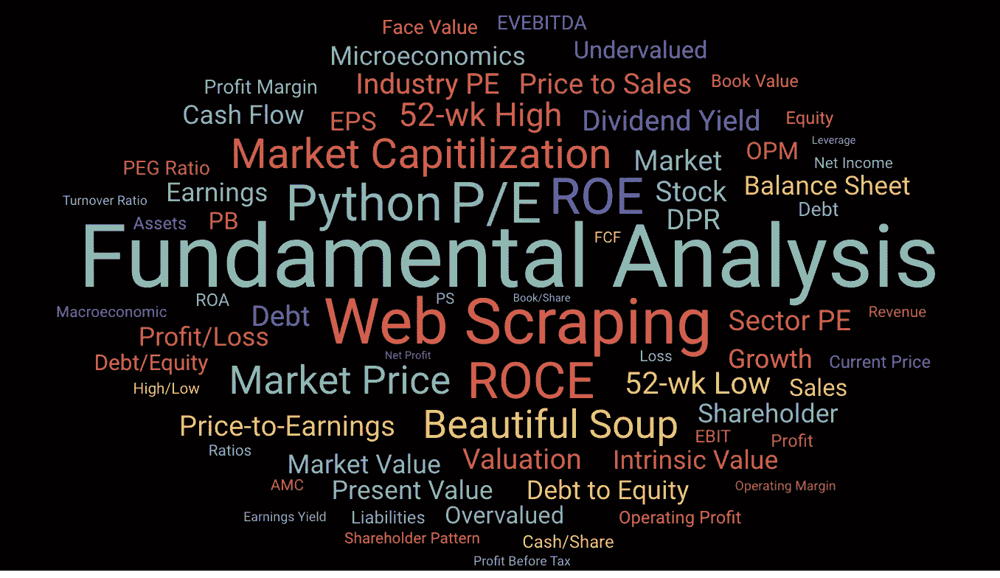
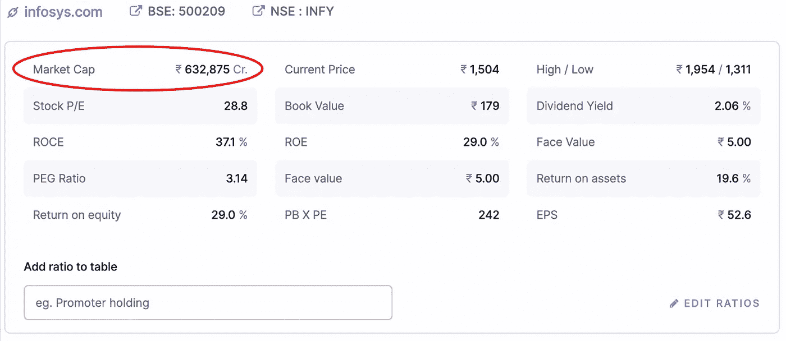
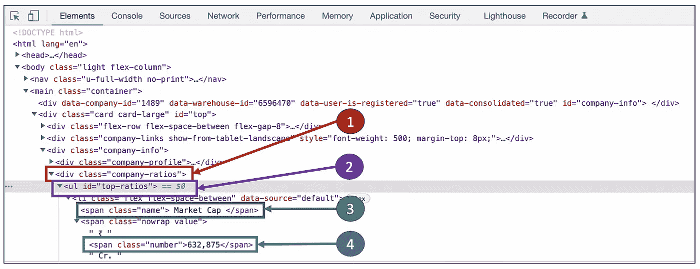
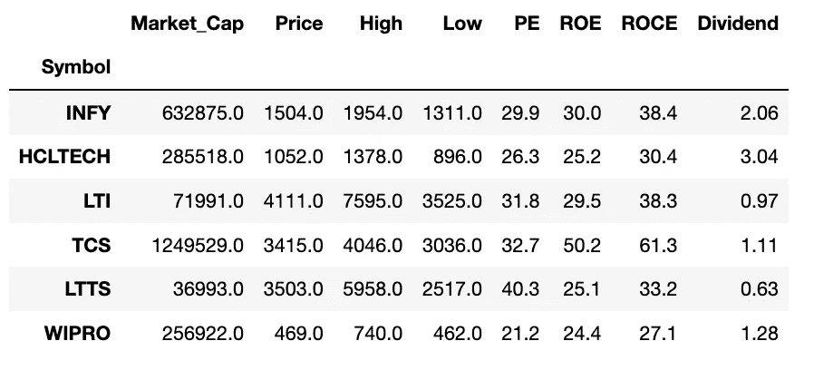
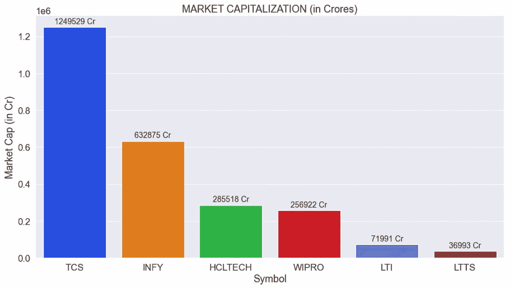
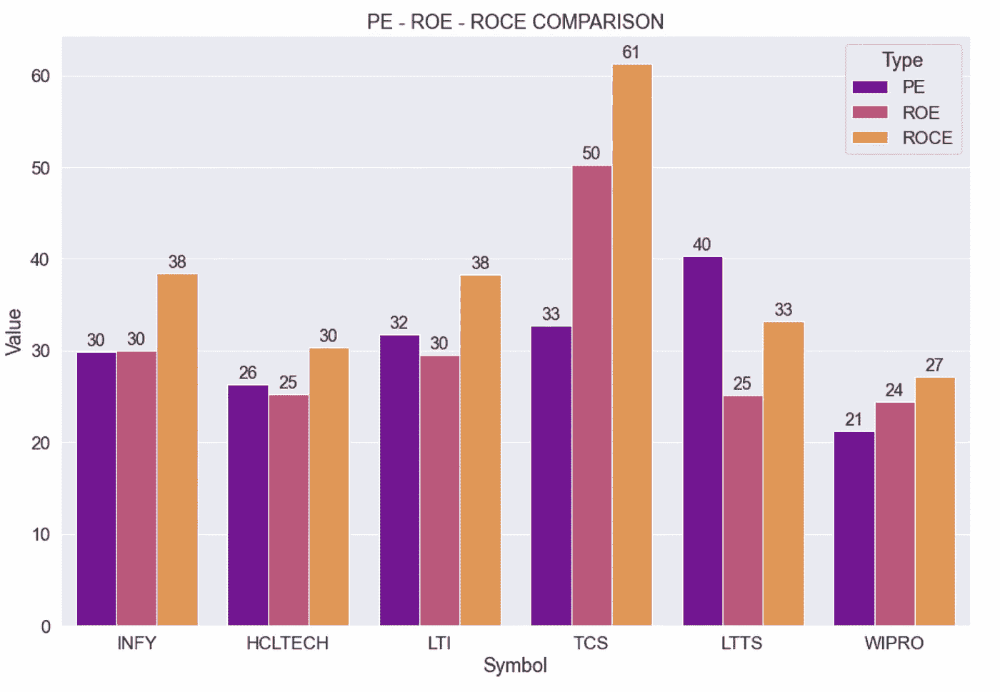
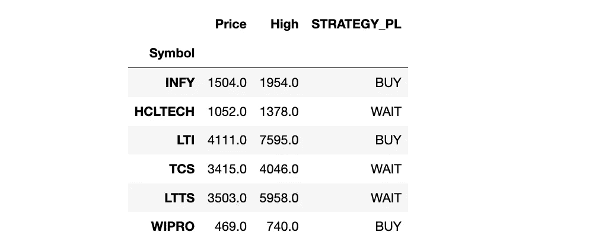
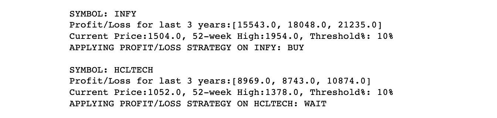

# 使用 Python 进行股票基本面分析

> 原文：<https://medium.com/geekculture/fundamental-analysis-of-stocks-using-python-d5ad050e6372?source=collection_archive---------0----------------------->

**Fundamental Analysis using Python** (Image by Author)

技术分析和基本面分析是分析任何金融市场的两种主要技术。技术分析着眼于过去数据的趋势和模式，而基本面分析着眼于公司的经济和金融因素。

在本文中，我们将以编程方式对一些股票进行基本面分析。要查看技术分析，请参考这个博客:[Python 算法交易技术分析初学者指南](/geekculture/beginners-guide-to-technical-analysis-in-python-for-algorithmic-trading-19164fb6149)

在进入 Python 代码之前，让我们先来了解一下基本分析和网络抓取的基础知识。

# 什么是基本面分析？

基本面分析指导我们到达一个决策点，决定某家公司的股票是否值得购买，以及它的股价是否有合适的估值。为了进行这种分析，它使用了公司层面的因素，如公司的市值、资产负债表、损益表、股东模式、现金流等

基本面分析所需的大部分信息都可以在各种网站上直接获得。在这篇文章中，我们将挑选一个这样的网页，从那里收集信息并用于执行基本分析。

# 网页抓取

从网站手动复制数据是一项繁琐的任务。Web 抓取是一种通过从网站或在线来源提取数据来自动化这一过程的技术。从网站上提取所需数据后，就可以使用这些数据来执行任何类型的数据分析或数据操作活动。

在本文中，我们将使用“Beautiful Soup ”,这是一个用于从 HTML 和 XML 文件中提取数据的 Python 包。它为复杂的 HTML 文档创建一个解析树，然后用来读取数据。

参见[本页](https://www.crummy.com/software/BeautifulSoup/bs4/doc/)了解靓汤概况。

## **抓取网页的步骤**

**第一步:**识别提取数据的 url

**第二步:**检查页面，了解其 HTML 结构

**步骤 3:** 编写代码，从 HTML 中提取所需的数据

## 从其他网站抓取数据

关于使用其他网站进行网络抓取的注意事项。请确保只收集公开的数据。

有些网站为了控制流量，定义了 robots.txt 文件。这给出了不应用于从该特定网站进行网络抓取的 URL 的指示。有关 robots.txt 的更多详细信息，请参考此处的。

# 来刮吧！！

由于基本面分析所需的大部分数据都可以在网上直接获得，所以收集这些信息并用于进一步分析更容易。

在本文中，我们将考虑来自 NSE 的股票，并使用来自 [screener.in](https://www.screener.in/) 的网页来提取特定股票的基本细节。同样的逻辑也适用于任何其他网页。代码可能需要微小的变化，以符合该网页的 html 结构。

本文的目的是为人们提供入门代码，让他们能够快速掌握自己的分析策略。因此，范围仅限于获取一些基本信息和应用简单的购买/等待策略。

# 获取基础数据

在此分析中，我们将考虑国家证券交易所(NSE)的以下 IT 股票:INFY、HCLTECH、LTI、TCS、LTTS 和 WIPRO

## Infosys——使用网络抓取获取市值

举例来说，让我们尝试使用前面列出的 3 个步骤，从 screener 网页中提取 Infosys 股票的市值。

**第一步:识别提取数据的 URL**

网址:【https://www.screener.in/company/INFY 

**第二步:检查页面，了解其 HTML 结构**

使用浏览器检查页面(右键单击页面并选择检查选项)。页面的 HTML 结构可以在这里学习。

对于这个例子，HTML 页面如下所示。

正如在 HTML 结构中看到的，市值出现在 div 类“company-ratios”中。在这个类中，它位于一个 id 为“top-ratios”的 ul 元素(无序列表元素)中。在这里面，市值是一个简单的 span 元素。

**第三步:编写代码从 HTML 中提取所需的数据**

使用这个漂亮的 soup 包，可以将给定 url 的内容读入一个树对象。然后可以遍历它，直到我们得到所需的数据。

使用下面的代码，Infy 股票的市值可以从 screener 的网页中提取。

**输出:**

## 获取股票的其他基本信息

股票的其他参数也可以用类似的方法获取。这可以对任意数量的股票重复进行。这里，我们获取了 6 只不同的 IT 股票的数据。

在这里添加完整的代码会使文章过于冗长。请参考文章末尾提到的资源库，以获得完整代码的访问权限。

下表总结了 6 只 IT 股票的基本数据。

**Summary of extracted stock data**

以下是提取数据的快速指南:

*   Market_Cap —公司已发行股票的总市值
*   价格—股票的当前市场价格
*   高—份额的 52 周高点
*   低—份额的 52 周低点
*   PE——市盈率
*   净资产收益率
*   ROCE——所用资本回报率
*   股息——公司的股息收益率

# 分析股票

一旦获取了数据，就该探索数据了。

作为一个例子，不同的 IT 股票的市值进行了比较。

Infy 的市值几乎是 TCS 的一半。L&T 技术服务(LTTS)在所考虑的 6 只股票中市值最低。

# 比较同一部门的股票

基本面分析通常用于比较同一行业的股票。PE 比率、ROE 和 ROCE 是一些用于比较的常用参数。

**Comparison of PE-ROE-ROCE parameters** (Image by Author)

**PE——市盈率:**它衡量当前股价与其每股收益的比率

**ROE——净资产收益率:**净收益与股东权益的比率。

**ROCE——资本运用回报率:** ROCE 是一家公司的营业利润与其运用的总资本的比率。

**PE + ROE + ROCE:**

*   市盈率通常不单独使用。或者与同行业的其他公司进行比较(例如:Infy 的 PE 与 HCL、LTI、TCS 等的 PE 进行比较)，或者与行业 PE 进行比较(INFY 的 PE 与 It 部门的 PE 进行比较)
*   较高的市盈率表明股票定价很高。较低的市盈率表明一个良好的投资机会(前提是公司的其他基本面良好)
*   高净资产收益率表明该公司善于将收益转化为利润。
*   较高的 ROCE 表明公司为债务持有人创造的回报高于权益持有人。ROCE 比率的值越高，获利的机会就越大。
*   ROE 仅从股东的角度考虑回报，而 ROCE 也考虑债务和其他负债。这为负债累累的公司提供了更好的财务表现指标。
*   如果 ROCE 值高于 ROE 值，这意味着公司正在有效地利用其债务来降低资本成本。
*   *沃伦巴菲特先生，20 世纪最成功的投资者之一*，偏爱 ROE 和 ROCE 值几乎接近且都在 20%以上的公司**

# *创建定制策略*

*我们也可以根据基本面数据运用自己的策略来决定是否买入一只股票。*

## *盈亏战略*

*这是一种策略，在这种策略中，公司过去 n 年的损益数据与当前市场价格一起用于检查该股票现在是否值得购买。这就是策略的运作方式*

**购买条件:**

*   *在过去的几年里，公司的净利润一直在持续增长*
*   **当前市场价格至少比 52 周高点低 10%(股票交易价格不在其历史高点附近)**

*通过考虑过去 3 年的净利润来应用这一策略，对考虑中的 6 只 it 股票给出了以下建议。*

**

***PROFIT-LOSS STRATEGY — IT STOCKS***

**

***VISUALIZING PROFIT-LOSS STRATEGY — IT STOCKS***

*以下是 INFY 和 HCLTECH 过去 3 年净利润的详细信息以及股票的当前价格和 52 周高点*

**

***Details of strategy applied on Infy and HCL stocks***

*通过应用这一策略，Infy、LTI 和 Wipro 股票的买入建议，这意味着它们在过去 3 年的净利润持续增长。*

# *把它们放在一起*

*参考下面的 github repo 来获取用于抓取网页和执行基本面分析的完整代码， [***基本面分析器***](https://github.com/Lakshmi-1212/FundamentalAnalyzer)*

*这只是帮助您快速入门的入门代码。根据你自己的判断，用它来试验其他股票，获取更多的数据，并在这些股票上运用你自己的策略。*

# *最后的话…*

*在本文中，我们只介绍了一种推荐买入/等待的策略。类似地，其他策略(基本面或技术面)也可以用于特定的股票。所有策略的综合结果可用于做出最终的买入/等待/卖出决定。*

*希望这篇文章能帮助你对股票的基本面分析有一个基本的了解，并在 Python 中实现它。一定要尝试其他股票和其他策略。*

****快乐学习&快乐交易！！****

## *如果“PYTHON+TRADING”让你着迷，那就看看这些吧…*

*   *[*算法交易 Python 技术分析入门*](/geekculture/beginners-guide-to-technical-analysis-in-python-for-algorithmic-trading-19164fb6149)*
*   *[*用 Python 构建一个基本的加密交易机器人*](/geekculture/building-a-basic-crypto-trading-bot-in-python-4f272693c375)*
*   *[*四步自动三角套利*](/geekculture/automated-triangular-arbitrage-of-cryptos-in-4-steps-a678f7b01ce7)*
*   *[*识别交易模式—交易者行为分析*](/geekculture/identifying-trading-patterns-behavioural-analysis-of-traders-5184dfa0350b)*
*   **利用 Python 进行股票基本面分析【你在这里】**