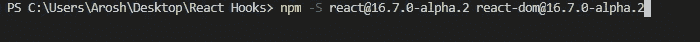

# 反应钩子中状态钩子的基本原理

> 原文：<https://medium.com/geekculture/fundamentals-of-state-hook-in-react-hooks-6e10f46fd2fc?source=collection_archive---------24----------------------->

***什么是反应钩子？***

这个特性在 react 的最新版本中是可用的，它使程序员能够编写普通的 React 程序并处理状态，而无需将它们转换成类组件。React 程序员应该知道，如果没有类的帮助和 React 挂钩，状态是无法创建的，这可以通过在基于函数的组件中使用 *useStateHook* 来实现。钩子不能在类中使用，因为它允许你在没有类帮助的情况下使用它，而类不允许使用生命周期方法，例如 *componentDidMount* 、 *componentDidUpdate* 、*componentduillunmount*等。相反，钩子使用一些内置方法。

***反应钩子的规则***

1.  确保不要在循环、条件或嵌套函数中调用钩子。只能叫顶级的。
2.  确保从 React 组件中调用钩子，而不是在常规的 JavaScript 函数中

**准备好东西**

***如果你想使用钩子*** 你需要确保你已经安装了 React 版本 16.7 或者更高版本

首先，你需要创建一个反应应用程序。(我正在当前所在的文件夹中创建一个 react 项目)

如果您有旧版本，则需要安装 16.7 或更高版本

现在让我们来看看最重要的挂钩之一

**状态挂钩**

这个钩子允许我们在一个函数中处理状态。

在函数组件中使用钩子的第一步是导入 useState 模块。

> `import React, { useState } from 'react';`

***声明一个状态变量***

*在类组件中声明状态变量*

> `class Example extends React.Component {
> constructor(props) {
> super(props);
> this.state = { count: 0 };
> }`

*在功能组件中声明状态变量*

> `function Example() {
> const [count, setCount] = useState(0);
> }`

*在上面的例子中，类组件使用状态创建计数变量，而第二个例子使用钩子在函数中创建计数变量。useState 方法返回两对值，它们可以作为数组的两个元素来访问。第 0 个元素是当前值，第 1 个元素是允许您更新当前值的方法。在上面的例子中，使用析构函数将当前值赋给变量 count，将更新方法赋给变量 setCount。*

**访问美国**

*显示类组件中的计数变量*

> `
You clicked {this.state.count} times
`

*显示功能组件中的计数变量*

> `
You clicked {count} times
`

第一个例子展示了如何在类组件中访问 count 变量，第二个例子展示了如何使用钩子访问 count 变量。

**更新状态下的值**

*更新类组件中的状态变量。setState 方法用于更新类级别的状态变量。*

> `<button onClick={() => this.setState({count: this.state.count+1})}> Click me
> </button>`

*更新功能组件中的状态变量。setCount 方法用于更新钩子状态变量。这是由 useState 方法返回的方法，该方法允许更新计数的当前值。*

> `<button onClick={() => setCount(count + 1)}>
> Click me
> </button>`

**参考**

[https://reactjs.org/docs/hooks-intro.html](https://reactjs.org/docs/hooks-intro.html)