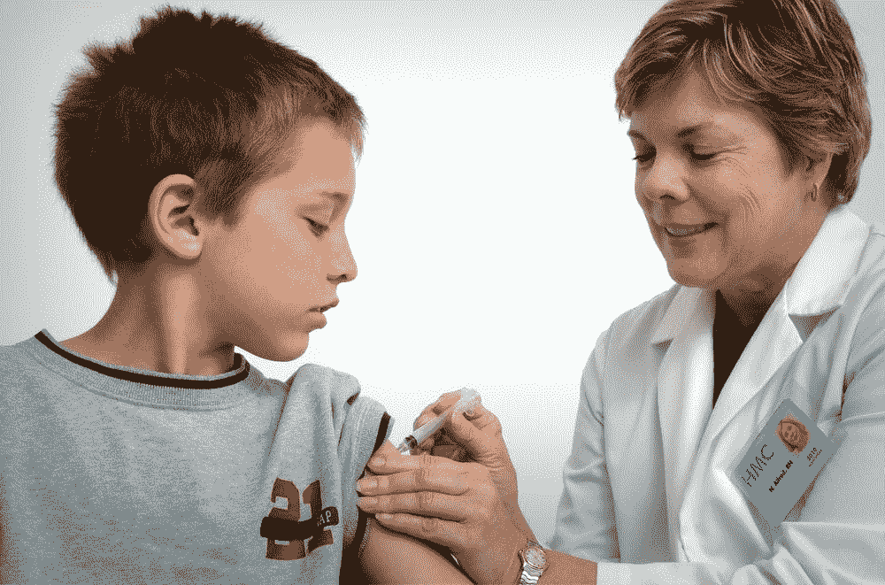

# 非言语个体疼痛机器学习的未来方向

> 原文：<https://medium.com/geekculture/future-directions-of-machine-learning-for-pain-in-individuals-who-are-nonverbal-85e593794344?source=collection_archive---------58----------------------->

## 我们如何为有需要的人发声

Image by the [CDC](https://unsplash.com/@cdc) from [Unsplash](https://unsplash.com/)

# 背景

痛苦是我们都有的经历。从三年级时从单杠上摔下来擦伤膝盖，到你不小心把手放在为朋友做饭的热炉子上。