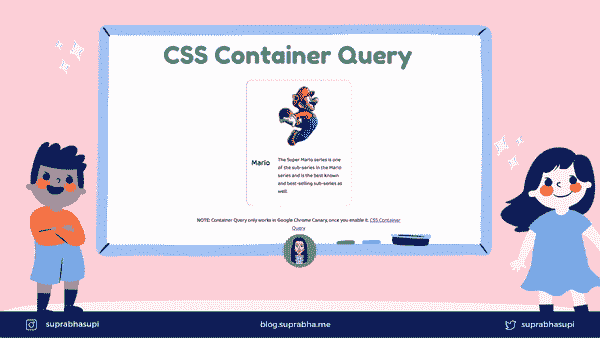
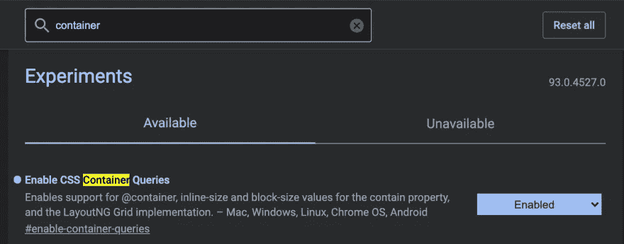
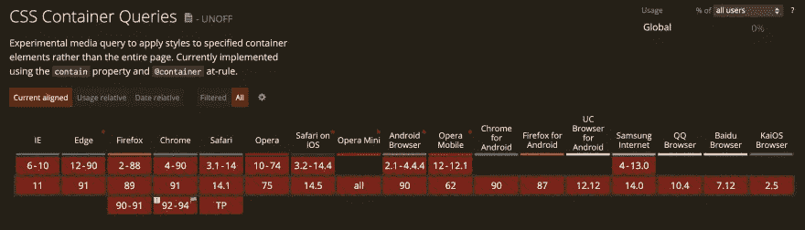

# CSS 的未来——容器查询

> 原文：<https://medium.com/geekculture/future-of-css-container-query-953246a0d1f3?source=collection_archive---------23----------------------->



一个网页由不同的部分和组件组成，我们通过使用 CSS 媒体查询使它们具有响应性。这没有错，但它有局限性。

要使用容器查询，我们必须告诉容器(我们要对其应用查询的元素的父元素)我们关心它的维度，我们使用新的 contain 属性来做到这一点。

# CSS 遏制🔥

```
<h1>My blog</h1>
<section>
  <h2>Heading of a nice section</h2>
  <p>Content here.</p>
</section>
<section>
  <h2>Another heading of another section</h2>
  <p>More content here.</p>
</section>section {
  contain: content;
}
```

**1。无**

指示元素正常呈现，不应用任何包含。

**2。严格**

指示除样式之外的所有包含规则都应用于元素。这相当于`contain: size layout paint`。

**3。内容**

如果我们给每个`<section>`的 contain 属性赋予一个 content 值，那么当插入新元素时，浏览器不需要重新布局或重画包含元素的子树之外的任何区域，尽管如果`<section>`的样式使得它的大小取决于它的内容(例如，使用 height: auto)，那么浏览器可能需要考虑它的大小变化)。

`content`值是`contain: layout paint`的简写。

它告诉浏览器，元素的内部布局与页面的其余部分完全分离，元素的所有内容都绘制在其边界内。

**4。尺寸**

当单独使用时，它在性能优化方面没有提供太多。

如果启用“包含:大小”,您还需要指定已应用该选项的元素的大小。在大多数情况下，如果你不手动给它一个大小，它最终会是零大小。

**5。布局**

指示元素外部的任何内容都不会影响其内部布局，反之亦然。

**6。样式**

指示对于不仅对元素及其后代有影响的属性，这些影响不会逃脱包含元素。请注意，该值在规范中被标记为“有风险”,并不是所有地方都支持。

**7。油漆**

指示元素的后代不会显示在其边界之外。如果包含框不在屏幕上，浏览器不需要绘制它所包含的元素——这些元素也必须在屏幕外，因为它们完全被该框包含。如果一个后代溢出了包含元素的边界，那么这个后代将被裁剪到包含元素的边界框中。

当我们使用媒体查询时，大多数时候我们关心的是可用宽度(或 **inline-size** )。

**注**:你可以，这将随着规范的形成而更新。

# 容器查询解决什么问题？🤔

创建响应式设计时，通常会使用媒体查询来根据视口的大小更改文档布局。媒体查询使我们能够根据范围来确定事物的大小。

我们可以不看视窗大小，而是看容器大小，并根据容器中的空间调整布局。

你需要安装[谷歌 Chrome 金丝雀](https://www.google.com/intl/en/chrome/canary/)来运行这个功能。一旦你在 chrome://flags 中激活了这个功能并启用它。然后需要重启 chrome 金丝雀。



现在，您可以开始编写这样的代码:

```
.parent {
  contain: layout inline-size;
}@container (min-width: 400px) {
  .child {
    display: flex;
    flex-wrap: wrap;
  }
}
```

检查这个代码笔的工作原理👇

# 浏览器支持🌐

这一刻对`container query`的支持不好！



# 群体意见👭

[Ahmad Shadeed 的集装箱查询](https://ishadeed.com/article/say-hello-to-css-container-queries/)

# 参考🧐

*   [CSS 遏制](https://developer.mozilla.org/en-US/docs/Web/CSS/CSS_Containment)
*   [CSS 容器查询](https://developer.mozilla.org/en-US/docs/Web/CSS/CSS_Container_Queries)
*   [我能使用 CSS 容器查询吗](https://caniuse.com/css-container-queries)

🌟[推特](https://twitter.com/suprabhasupi)👩🏻‍💻 [suprabha.me](https://www.suprabha.me/) 🌟 [Instagram](https://www.instagram.com/suprabhasupi/)