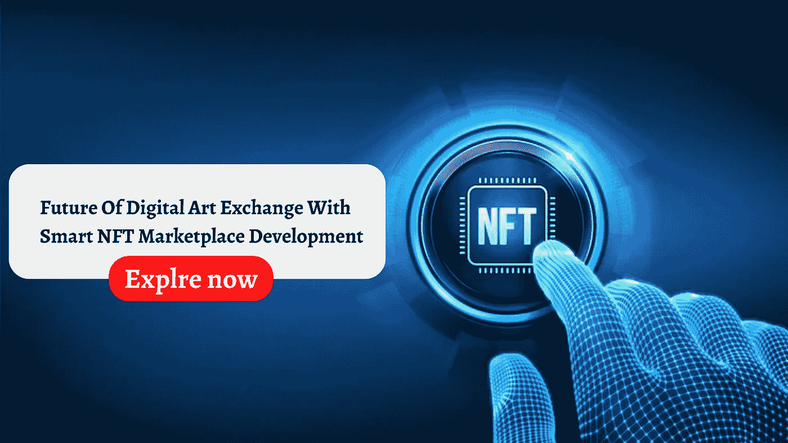

# 智能 NFT 市场发展与数字艺术交易的未来

> 原文：<https://medium.com/geekculture/future-of-digital-art-exchange-with-smart-nft-marketplace-development-e5fe0397e90d?source=collection_archive---------15----------------------->

## **数字艺术交易的未来与智能 NFT 市场的发展**

在今天这个极度活跃的世界里，你可以随时随地看到密码狂。NFT 是一位杰出的男高音。到目前为止，由于主机和中间商平台的引入，内容创作和赚取利润一直是矛盾的。

他们非法分享收入的行为让开发商们抓狂。NFT 的引入克服了这一问题。看看 NFT 提供的无数额外津贴，NFT 发展迅速，密码爱好者正朝着这个方向努力。

通过 [**NFT 市场开发**](https://www.cryptocurrencyscript.com/nft-marketplace-development) 服务，艺术家可以维护他们对永久创作内容的所有权。出版会给你带来丰厚的收入，让你长寿！

一方面，NFT 被用作证明或授权。另一方面，它的不互操作性引起了人们的兴趣。NFT 艺术家不能作为可替换的代币在交换平台上交易。相反，每个 NFT 都有唯一的元数据。

现在让我们看看

关于 NFT 市场的收入来源及其未来。

## **NFT 市场开发:一个充满希望的被动收入来源**

NFTs 大约花了十年的时间，数字资产才获得今天的流行程度。数字资产的真实前景被一个接一个地雕刻出来。NFTs，短期内在市场上取得巨大成功。NFTs 在市场上为投资者和艺术家提供了巨大的回报。

NFT 市场是在区块链以太坊上运行的 ERC-721 标准的帮助下建立的特殊数字资产。它们不能互换，因为它们的价值不同；相反，用户可以用它们交换其他数字资产。

每个代币至少有一个显著特征，不能用于商业交易。由于这种令牌在区块链网络上执行，艺术家和数字内容开发者可以在没有任何中介的情况下与收藏家/卖家联系。NFT 的供应受到限制，以增加或保持价值。

区块链支持 NFT 市场开发服务，从艺术品到游戏收藏品，从地契到汽车，从视频到音乐。

## NFT 市场如何成为数字艺术的未来？

尽管 NFT 起源于 2015 年，但它现在正变得越来越出名。2020 年，NFTs 价值已达到 2.5 亿美元，这一价值比 2019 年高出 3 倍。

NFT 是一种加密资产或一种数字资产，如安全令牌、公用硬币和加密货币，它们利用加密方法来开发货币系统。

NFT 不是货币，而是利用加密货币中使用的技术。如果虚拟货币的单位用数字表示，那么它就是 NFT。表现形式在图像、gif 和视频的范围内可以有所不同。

这些资产不能简单地用相同价值的相同资产替代或交换。

最近，NFT 的想法有利于并支持那些希望在平台上标记其签名产品的创作者。产品可能是视频、音乐和艺术，通过在平台上将其标记为数字资产来产生大量流量。

游戏资产是 NFTs 的关键方面。游戏中提供的收藏品提供了出色的游戏体验。NFT 的这些功能为未来的艺术和游戏开发者提供了一个有益的平台。

## NFT 的衡量标准让你为数字艺术的未来做好了准备？

## NFTs 的功能

1.  NFT 充当数字资产，因为它们是相同的，不能复印或复制。
2.  NFTS 以数字方式对无形和有形资产进行数字验收。
3.  NFT 代币是独特的，因为它们具有不可交换的特殊规格。
4.  NFT 是在区块链上控制的特殊加密令牌；这就是为什么他们不能在交换平台上购买的原因。

## NFTs 的特征

1.  NFT 市场是借助 NFT 工具在区块链开发的。
2.  ERC-721 对所有非功能性测试都是一样的。
3.  NFT 允许添加更多细节，如所有者的 ID 等。
4.  在 NFT 市场的帮助下，很容易找到真正的所有者，因为他们会提供股票和房地产等资产的证明

## **NFTs 亮点**

NFT 是未分段的加密令牌，在区块链中保持唯一值。稀有和古怪是人们期待的两个特征，这证明了在加密领域的增强。

然而，非功能性交易不会被禁锢在数字货币和区块链世界中。此外，保护所有权、跟踪数字资产和保护知识产权是在现实世界中更有价值的行为。

1.  **快速交易**

构建一个 NFT 花费的时间并不多，因此开发人员会在截止日期前完成，并保证按时交付给您。

**2。广泛的可访问性**

NFT 发展是利用在几个行业，因为它有许多优势。广泛的可用性使所有对使用加密货币业务感兴趣的人都可以使用它。

**3。不可互操作**

由于非功能性传输使用 ERC-721 标准，它们是不可互操作的，这意味着它们不能以任何方式使用。

## **关闭思路**

NFT 吸引了全球的金融家和技术专家。NFT 代表着未来，因为它分散了商业活动，提高了透明度。NFT 通过让人们参与 p2p 交易，在促进人们的自由方面发挥了突出的作用。NFT 消除了中介，促进了创作者/艺术家的创新。未来的世界将完全依赖于 NFTs。