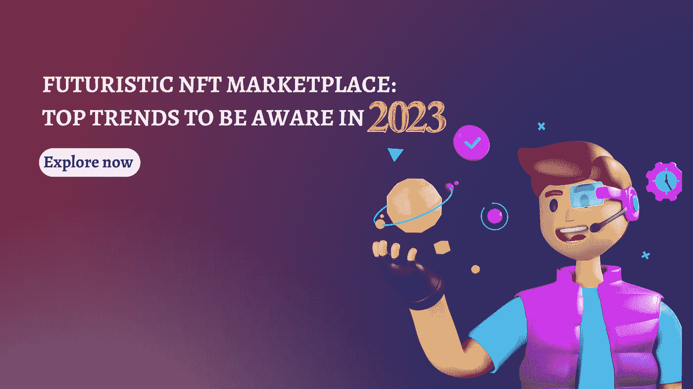

# 未来派的 NFT 市场:2023 年最值得关注的趋势

> 原文：<https://medium.com/geekculture/futuristic-nft-marketplace-top-trends-to-be-aware-in-2023-6490d58e94b6?source=collection_archive---------4----------------------->

在网络媒体之后，每个行业都有一个充满希望的未来。网络和应用是新兴平台。这些使商业成为大市场。不可替代的代币(NFT)市场是个人创作获得完全所有权和收入价值的最时尚的平台。

NFT 市场正随着许多趋势发生变革。意识到这些趋势并准备好迎接这些趋势对于成为一个成功的 NFT 市场业主来说是至关重要的。这篇博客重点介绍了如何 [**创造一个 NFT 市场**](https://www.cryptocurrencyscript.com/nft-marketplace-development) 在未来的加密空间是一个充满希望的市场。然后，它详细描述了加速 NFT 市场发展的主要趋势。

希望在 NFT 工业中有一个有前途的地方？让我们立即转向博客。

## **NFT 市场:2023 年充满希望的未来**

像 Spotify 和网飞这样的平台有无限的免费数字内容。由于这些平台的高知名度，构建 NFTs 吸引了许多人。区块链技术中平台的存在确保了数字内容的真实性。

与传统拍卖类似，对艺术品的深度鉴定预示着原创性。基于区块链的交易强调版税归属，并通过可扩展的 NFT 平台与原创内容创作者分享收入百分比。

投资者总是关注不断变化的 NFT 股票，并从中选出最好的一只。

在这个阶段，你会想到这样一个问题，我如何决定哪一个是最适合商业的 NFT？一个简单的制作方法！让我们在这里找到最佳方案的衡量标准。

一般来说，更多的内容需要更多的投入。具有专业知识的专业平台确保了产品的成功上市。使用辅助工具和服务需要低投资。

一个好的平台是提供各种规模的特殊服务的平台。

2023 年是加密领域最好的 NFT 平台之年。这是由于硬币的稳定增长和 NFT 项目的发展。

元宇宙在 NFT 有很强的参与度，因此投资者和普通用户认为这项技术可以向大约 1000 人出售图像。除了图像托管，NFT 现在作为一个技术中心正在蓬勃发展。由于 Metaverses 和 GameFi 技术，NFT 成为 2022-2023 年的基础技术。

元宇宙概念充当了物理世界和数字世界之间的桥梁。这些不仅允许用户玩游戏。但是，他们可以以一种很好的方式浏览和交易他们喜欢的虚拟资产。

由于创收的选择越来越多，开发 NFT 市场是加密领域的潮流。

在进入 NFT 市场开发之前，你需要了解加密领域的主要趋势。

你的下一步就是那个。

## **加速 2023 年 NFT 市场发展的趋势**

随着区块链技术在加密领域的发展，加密和 NFT 的几个用例正在出现。对于所有权，市场上出现了各种趋势。了解这些趋势至关重要。让我们在这里获得意识。

**所有权艺术**

由于 NFTs 的成本每次都创下新的记录，加密投资者会有一段时间感到被忽略了。这种趋势在于分散的非功能性森林交易，在这种交易中，所有权由许多所有者分享。这使得价格的价值可以承受。

例如，班克斯的大猩猩将作为 10000 个细分的 NFT 的集合出售，每个 750 美元。

NFT 游戏

趋势不再是游戏，而是转移到了游戏和金融(GameFi)。它正以一种快速的方式进入牵引状态。这种 GameFi 空间中的一个特定阶段是轴无限。报告指出，通过代币在游戏中的资产中观察到数十亿美元的收集。游戏和 NFT 是实时的最佳匹配。

例如，NFT 市场密切关注来自《雷霆之地》、《元战争》等游戏的非功能游戏。

**NFT 电影**

从网络系列到特色电影，NFTs 的作用是主要的。对于您的投资和参与，有许多方式可以利用。选择主动或被动是将你的投资转化为高回报的最佳选择。

**时髦的**

时装屋与 NFT 的结合为商业开辟了新的可能性。通过与神话游戏公司博柏利合作，他们得以在旗舰产品 Blankos Block Party 上推出新的 NFT 系列。

同样，杜嘉班纳推出了自己的 NFT 系列，即 Collezione Genesi。看看这些，时尚品牌的名气很大。这些也适用于未来的奢侈品牌。

**为 NFT 音乐做好准备**

专家预测 NFTs 将彻底改变音乐产业。是的。将音乐、歌曲和歌词转化为 NFTs 无疑会提高收入。音乐和艺术的结合是网络市场上一个很好的趋势。

音乐家们说他们第一次得到了公平的补偿。popup 文化在元宇宙的扩张让更多的音乐人进入 NFT 空间，获得更多收入。随着应用程序的发展，音乐和游戏正在相互融合。这种融合让更多的人进入 NFT 空间。

由于细分化的 NFTs，现在拥有一件艺术品或音乐很容易。

**NFT 票务**

最近观察到通过 getting century 将 NFTs 引入门票领域。通过 NFTs 创建票证的能力允许您控制转售市场。这确保了安全的票据存储。

**票务销售和 NFTs 的结合是这一领域最好的例子。NFT 票务的优点有:**

买家拥有终生价值

排斥存取

高激励平台

以各种创新形式在票务流程中利用 NFTs，如:

莱昂国王队——出售不可转让的门票，让购买者获得终身领跑者的资格。

NBA——最近宣布，马克·库班希望将 NFT 门票带入联盟。

DC Comics-warner media 的一个部门为您提供漫画书 NFT 和 DC FanDome 活动的门票。

**PFP NFTs**

在 NFT 领域新发起的趋势是个人资料图片和头像。一个新发布的平台 CryptoPunks 为加密项目的发展奠定了基础。到 2023 年底，通过算法设计的 CryptoPunk NFTs 及其分发产生的收入超过了 40 亿美元。

在个人资料图片的任何变化被观察到的意思，然后 NFT 社区的成员将张开双臂欢迎你。进入私人聊天室和拥有照片是很容易的。

**NFT 分裂**

将大的 NFT 分成小块，如 ERC-20 代币，可以让个人很容易地购买小块。法人股就是最好的例子。由于这种分割，用户可以以较低的价格购买他们在 NFT 的份额。NFT 碎片是可互换的，这意味着它们可以按照相同的条款进行交易或交换。

**AI NFTs**

人工智能(AI)是 NFT 市场上最大、最重要的颠覆者之一。在这里，通过人工智能创造 NFT 艺术。人工智能项目一直在破解 NFT 市场，以获得巨额收入。

**iNFTs**

智能 NFT 是 NFTs 中第二重要的。拥有带人工智能平台的 NFTs 现在被称为智能 NFTs。人与人之间的对话可以学到新的东西。

这个新兴的 NFT 的收入模式被称为“训练赚钱”，这将允许玩家训练 iNFTs 变得更加聪明。iNFTs 是用户参与较多的重要平台。

除了这些顶级趋势之外，市场上还出现了元宇宙趋势。它们是:

**游戏中的 AR/VR**—沙盒，一个以去中心化虚拟世界开发的游戏平台。在这种情况下，玩家使用个性化选项，如改变他们的头像。创新和治理土地。举办活动和交流想法对交易者来说很容易。

**元宇宙事件** —尽管游戏玩家的市场在 2024 年将超过 4000 亿美元。现场环境和社交媒体的机会仍然存在。这些将是 NFT 规划者的巨大选择。

**可编程世界** —世界变得虚拟化、电脑化，控制和操纵是最容易的事情。

**运动追踪**——元宇宙正是一个弥合虚拟与现实之间差距的选择。运动追踪是这个元宇宙事件的最好例子。因此，你可以同时占据虚拟和现实世界。

**3D digital twin Technology-** 像 digital twin Technology 这样的 3D 模型交互、分析和构建技术可以为任何空间创建巨大的 3D 模型和尺寸精确的模型。消费者也使用数字孪生技术在新商店开业前检查新商店。

**遗言**

NFT 趋势走向巅峰。这是进入 NFT 市场的大好时机。要想通过简单的投资获得收益，了解市场趋势至关重要。通过阅读这篇博客，你可能会意识到最流行的趋势。让我们和最好的 [**NFT 市场发展公司**](https://www.cryptocurrencyscript.com/nft-marketplace-development) 一起成为时尚的 NFT 市场的顶尖人物。