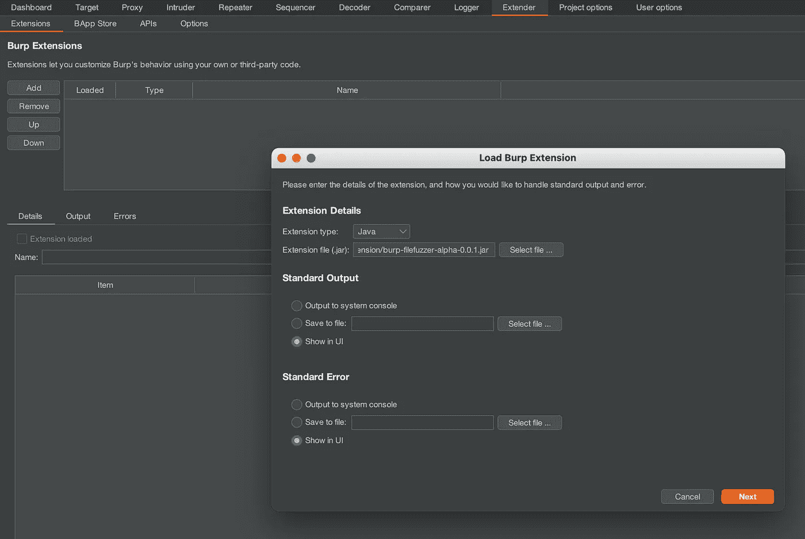
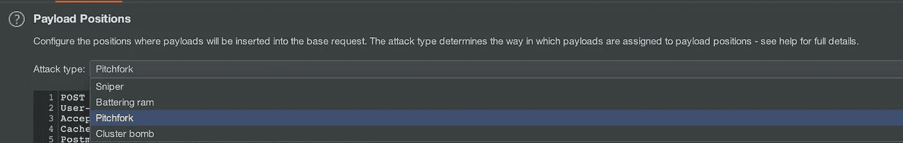
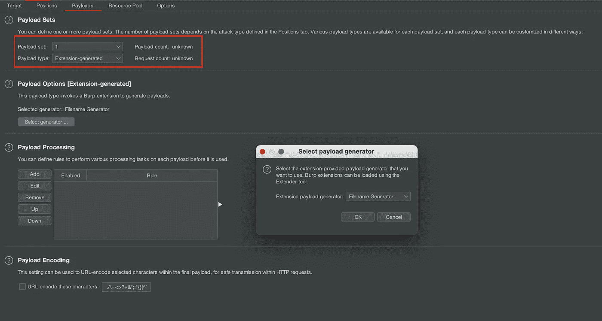
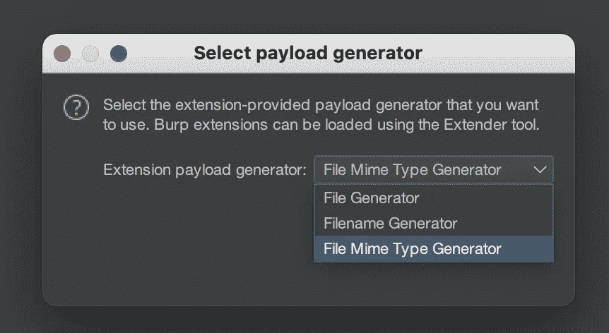
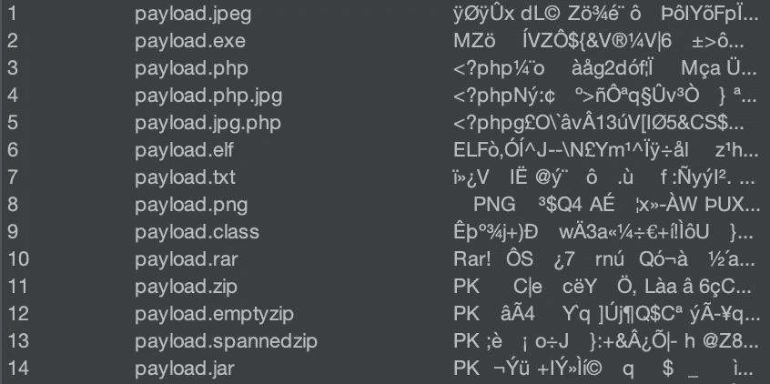
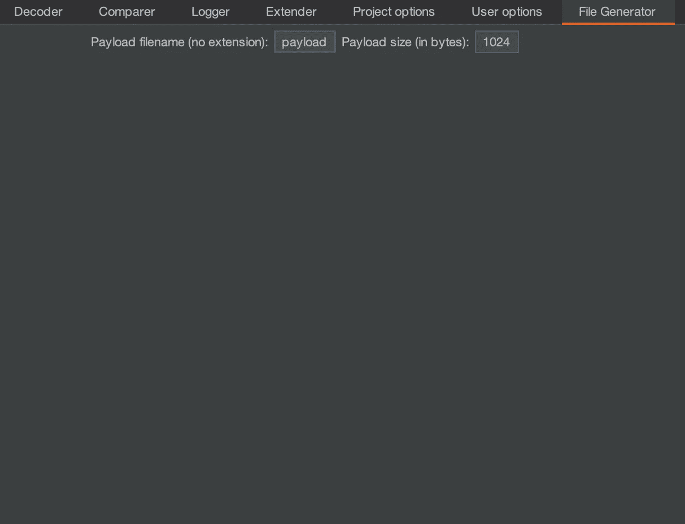

# 模糊文件上传与打嗝入侵者

> 原文：<https://medium.com/geekculture/fuzzing-file-uploads-with-burp-intruder-3482a10a32d5?source=collection_archive---------10----------------------->

由于各种原因，应用程序和网站通常需要允许用户上传文件。有时用户需要上传任意文件，比如像 [S3](https://aws.amazon.com/s3/) 这样的文件绑定服务，但大多数时候，服务期待的是特定类型的文件。你的银行可能想要你的护照照片，用于 [KYC](https://www.investopedia.com/terms/k/knowyourclient.asp) 的目的，[抖音](https://www.tiktok.com)想要一个视频等等。无限制的文件上传会给 web 应用程序带来风险，包括完全系统接管、向后端系统转发攻击或客户端攻击。上传的文件会导致[严重的问题](https://www.reuters.com/technology/hackers-demand-70-million-liberate-data-held-by-companies-hit-mass-cyberattack-2021-07-05/)。

在服务需要特定类型的文件的情况下，最好根据预期的文件类型来验证文件的神奇字节。

## 神奇的字节

文件格式有时会在每个文件的开头指定几个字节。这使得程序能够识别它们。例如，Windows PE 可执行文件(`.exe`文件)以字节序列`4D 5A` ( `MZ`)开始

Magic Bytes at the start of a Windows executable shown in a hex editor ([Hex Fiend](http://hexfiend.com)).

为了防止上传恶意文件，web 应用程序应该对照预期的文件类型检查文件的前几个字节。维基百科上有一个常见文件类型的神奇字节列表。

这些神奇的字节使得通过生成包含对应于不同类型的文件头的合成文件来快速测试允许的文件类型成为可能。我已经创建了一个工具， [HTTPFuzz](/swlh/hacking-http-with-httpfuzz-67cfd061b616) 可以做到这一点，但是我更喜欢呆在 Burp Suite 中，而不是切换到 CLI 窗口。我创建了[文件生成器扩展](https://github.com/JonCooperWorks/burp-filefuzzer)来实现这一点。

## 安装文件模糊器

可以通过 Burp Suite 中的 Extender 选项卡手动安装文件模糊器。它还没有在 BApp 商店上架，因为我想对它进行更多的测试，但我在网络渗透测试中使用它没有问题。

Install File Fuzzer through the JAR

文件 Fuzzer JAR 在 [GitHub](https://github.com/JonCooperWorks/burp-filefuzzer/releases) 上。最好下载最新版本，在撰写本文时是`0.0.2-alpha`。只需通过 Burp Extender 选项卡安装即可。

## 使用文件模糊器测试文件上传

打嗝文件 Fuzzer 将产生不同类型的合成文件。它提供了三个有效负载生成器:一个生成文件，一个生成 MIME 类型，一个生成文件名。

它应该在 Pitchfork 模式下使用，注入点放在文件和文件名上。这将导致 Burp 文件 Fuzzer 生成合成文件和适当的文件名和 MIME 类型。

根据文件名和文件内容的位置设置有效载荷集。文件名通常位于多部分请求的第一位。

文件名、MIME 类型和合成文件的有效载荷应该是分别由文件名生成器、文件 MIME 类型生成器和文件生成器生成的扩展名。

Payload Generators included with File Fuzzer

为了获得最佳效果，禁用文件名和 MIME 类型的 URL 编码，以防止文件名中的`.`和 MIME 类型中的`/`被 URL 编码。

配置攻击后，只需开始攻击，如果需要，Burp 入侵者将生成有效载荷、文件名和 MIME 类型。随着时间的推移，我会添加更多的类型，但是您可以通过将它们添加到 [FileTypes.kt](https://github.com/JonCooperWorks/burp-filefuzzer/blob/master/src/main/java/FileTypes.kt) 中的`fileHeaders`来添加对其他文件类型的支持。

File Generator generating synthetic files with appropriate filenames

文件生成器将添加一个标签到 Burp 的用户界面，允许您设置上传文件的有效载荷大小和基本文件名。如果不设置大小，它将默认为 1024 字节(1 KB)。

File Generator UI tab that will generate 1024 byte large files named payload.exe, payload.jpg.php, etc.

## 获取文件模糊器

File Fuzzer 是开源的，代码在 [GitHub](https://github.com/JonCooperWorks/burp-filefuzzer) 上。你可以在[发布页面](https://github.com/JonCooperWorks/burp-filefuzzer/releases)上获得一个预构建的 JAR。它目前处于 alpha 阶段，但一旦经过更多人的测试，我会将它添加到 BApp 商店中。我用这个扩展让我的网页测试生活变得更简单。