# 2021 年如何设置 Vim？(2/3)

> 原文：<https://medium.com/geekculture/fuzzy-searchhow-to-set-up-vim-in-2021-2-3-b8eae1b77497?source=collection_archive---------0----------------------->

# 像 ide 一样设置 Vim 的综合指南第 2 部分:插件

*这是旨在向您传授 vim 基础知识的系列课程的一部分。* [*第一部分是关于我的。vimrc 配置*](/@edominguez.se/vim-101-a-comprehensive-guide-to-using-vim-like-an-ide-1-3-vimrc-d484cc41fc2) *。第二部分是关于插件的。第三部分将像专业人士一样使用 Vim。*

*我为曾经的 Vim 新手写这些文章。但是即使到昨天为止，我还在学习关于 Vim 的新东西，所以谁知道呢，呆一会儿听听吧！*

## 插件时间到了


Everywhere indeed

我也可以向你推荐[这篇文章](https://www.reddit.com/r/vim/comments/bfxr2z/vim_theory_and_reflections/)中投票最多的评论，但是我的观点是你绝对**应该**尝试所有引起你注意的插件和配置。随着时间的推移，你会发现自己删除了越来越多的插件，因为你意识到你不再需要它们，甚至更糟的是，你从来没有真正使用过它们。

这是我进入 vimworld 一年后选择的插件。和以前一样，如果你只是想看看它并继续前进，这里是:

我将在最后链接配置。现在，让我们来分解一下。

## [插头](https://github.com/junegunn/vim-plug)

首先:让我们给你一个插件管理器。*需要一个*吗？不，不是真的。你总是可以手动管理你的插件，我认为插件管理器只是简化了将 git 库克隆到正确的文件夹、保持更新、清理未使用的插件等过程。就是这样。现在，*你想要一个吗？是的，你知道。这关乎生活质量。我喜欢亲手做很多事情，因为我讨厌仅仅为了方便而交出控制权，但是幕后并没有什么神奇的事情发生。这是我想都不敢想的手工操作。*

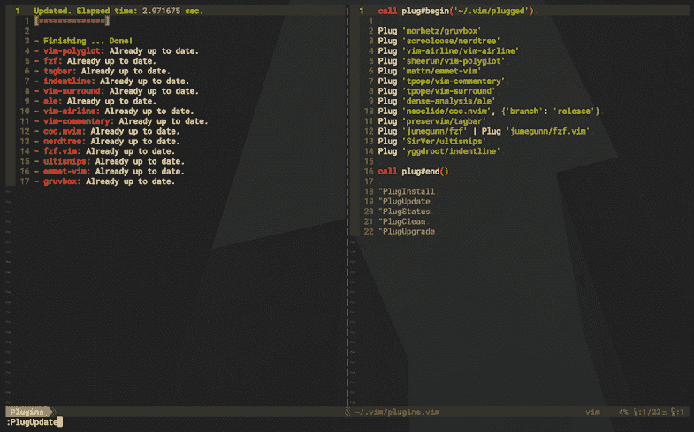

I mean, look at this… of course you want one.

您可以在他们的 [git repo](https://github.com/junegunn/vim-plug) 中找到您需要了解的一切，从安装到自动化和命令。我可以给你一个 TL；unix 类系统上的 *Vim 的灾难恢复*。不是 Neovim，不是 Windows。所有这些信息都在他们的回购协议中。

打开您最喜欢的终端模拟器并打开 mofo:

```
curl -fLo ~/.vim/autoload/plug.vim --create-dirs \
    [https://raw.githubusercontent.com/junegunn/vim-plug/master/plug.vim](https://raw.githubusercontent.com/junegunn/vim-plug/master/plug.vim)
```

基本上你是在你的`$HOME/.vim/`目录下创建一个名为`autoload/`的文件夹，并从 GitHub 下载`plug.vim`到这个文件夹中。

然后，你只需要给你的`.vimrc`添加一个`call plug#begin()`和一个`call plug#end()`，并在这两个部分之间添加你想要安装的插件。参考我上面的要点。完成后，保存、重新加载并`:PlugInstall`离开。

你可以注意到我在`plug#begin()`部分指定了一个路径，就像这样:

```
call plug#begin(**'~/.vim/plugged'**)
```

插件将在那里安装。您可以随意命名它，但是根据文档，您应该避免使用标准的 Vim 目录名，比如“plugin”。

哦，还有为什么**插**而不是说[](https://github.com/VundleVim/Vundle.vim)**？一开始用的是 vundle，后来因为听说多年没有积极维护，就换成了 plug。老实说，我和温德勒之间从来没有问题。但是，我们在这里。**

## **[格鲁沃克斯](https://github.com/morhetz/gruvbox)**

**Gruvbox 是一个美丽的主题，具有复古的外观。这是一见钟情，在可预见的未来，我看不出自己会用任何其他主题。**

**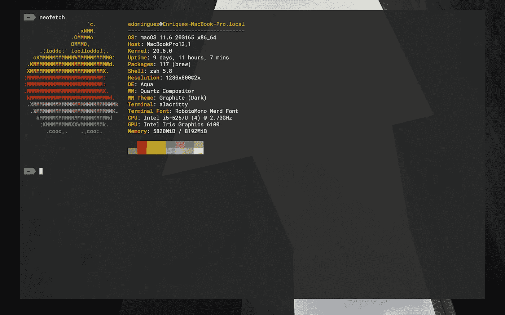**

**I even set my terminal colors to match Gruvbox**

**也许你是一个吸血鬼。没关系，逻辑都是一样的，但是我将讨论一些可能是也可能不是 gruvbox 特有的调整，所以记住它们是个好主意。还记得第 1 部分中的这些设置吗？**

```
set termguicolors
let g:gruvbox_italic=1
colorscheme gruvbox
set background=dark
hi Normal guibg=NONE ctermbg=NONE
let g:terminal_ansi_colors = [
    \ '#282828', '#cc241d', '#98971a', '#d79921',
    \ '#458588', '#b16286', '#689d6a', '#a89984',
    \ '#928374', '#fb4934', '#b8bb26', '#fabd2f',
    \ '#83a598', '#d3869b', '#8ec07c', '#ebdbb2',
\]
```

**`truecolor`是针对像素的 24 位颜色值的规范。它有 16，777，216 种可能的颜色；这比 8 位的 256 种可能的颜色多了一些。您应该通过运行`echo $COLORTERM`并执行本报告[中建议的测试来检查您的终端是否支持 truecolor。如果您的终端支持 truecolor，那么我们可以安全地在我们的。vimrc 在 Vim 中启用 24 位颜色。信不信由你，我不知不觉地度过了几乎一年没有`termguicolors`的日子，感觉我一直生活在谎言中。](https://github.com/termstandard/colors)**

**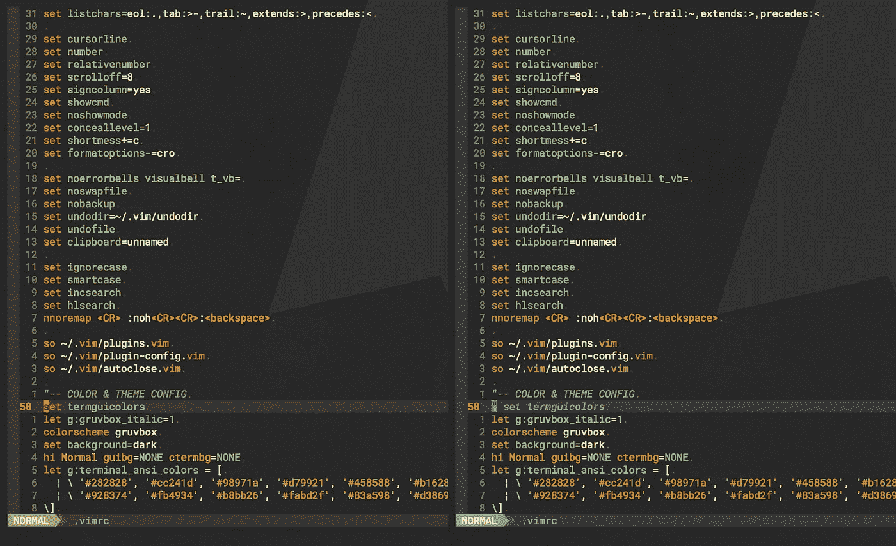**

**It’s night and day**

**注意，如果您不是从终端而是从 GUI 使用 Vim，您可能不需要混合颜色。**

**要强制斜体，必须在调用`**colorscheme gruvbox**` 之前声明变量`**let g:gruvbox_italic=1**` *，否则它们可能无法工作。`**background=dark**` 设定了 gruvbox 的黑暗主题，与`background=light`相对。如果你想试一试，但我的眼睛受不了，文本编辑器上的浅色主题让人想起一些旧的 macromedia Dreamweaver 版本的痛苦回忆。***

**`**hi Normal guibg=NONE ctermbg=NONE**` 设置`vim editor`和`vim terminal`背景为`none`，渲染它们透明，就像我截图上看到的。稍微半透明的背景实际上是我的终端模拟器的，设置为 95%的不透明度。**

**分配给`**terminal_ansi_colors**` 变量的十六进制颜色数组就是`vim terminal`颜色。由于我们启用了`termguicolors`，出于某种原因，Vim 终端退回到您系统的默认调色板，这肯定不太好，所以我们必须手动设置。是的，如果您不知道，您可以使用`:term`在 vim 中运行一个终端。查看`:help terminal`了解更多信息。**

**如果你没有让`termguicolors`工作，试试`:help xterm-true-color`，在那里他们谈论明确地设置一些设置。如果你正在使用`tmux`，你可能也需要相应地设置它。**

**查看该网站了解更多主题。**

## **[NerdTree](https://github.com/preservim/nerdtree)**

**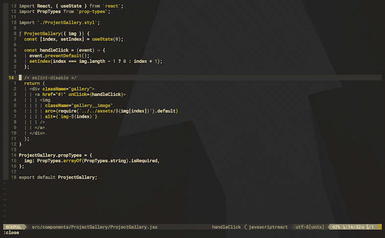**

**NerdTree file system explorer**

**这里不多说了。在 IDE 上需要一个文件系统资源管理器。有些人可能会说你不需要 NerdTree，因为你可以用原生的 Vim explorer 获得相同的结果，尝试用`:Explore`或`:Vexplore`进行垂直分割。把[这篇](https://vonheikemen.github.io/devlog/tools/using-netrw-vim-builtin-file-explorer/)文章检查出来。自己决定吧。 *Meh* 。**

**NerdTree 有几个[有趣的插件](https://github.com/preservim/nerdtree#nerdtree-plugins)，我用的是其中的*绝对没有*，但是你可以在 VSCode 上获得不同文件格式的图标，或者显示 Git 标志等等。如果您尝试使用 NerdTree，您应该通过在树中按`?`来查看完整的命令列表。我用得最多的是`s`在垂直**分割**中打开文件、`t`在新的**标签**中打开文件，以及`R`刷新树并显示在 Vim 之外对目录所做的更改。**

**以防你不知道，你可以通过点击`control w + direction`，在窗口中切换。`^wl`向右，`^wk`向上，以此类推。我告诉你这些是因为 NerdTree 不仅允许你打开 split，而且它本身就是一个 split:你可以用`^wh`导航回 NedTree。箭也有用。此外，您还可以通过分别位于右侧和左侧的`gt`和`gT`选项卡进行导航。是的，Vim 支持标签。第 3 部分将详细介绍这一点。**

```
nnoremap <C-t> :NERDTreeToggle<CR>
let NERDTreeShowHidden=1
let NERDTreeRespectWildIgnore=1
set wildignore+=*.DS_Store,*.min.*
autocmd BufWinEnter * silent NERDTreeMirror.
```

**`**nnoremap**`重新映射`**^t**` `(control + t)`以打开或关闭 NerdTree。`**NERDTreeShowHidden**`确实如其名，它显示隐藏的文件；我希望能够访问我的。来自 NerdTree 的 env 文件，但不是烦人的。存储系统文件。这就是为什么我启用了`**NERDTreeRespectWildIgnore**` 并设置列表包括`.DS_Store`和任何缩小的`.min`文件。您可以根据需要增加这个列表。`**autocmf** **BufWinEnter**`的最后一行告诉 Vim，每当打开一个新标签页时，打开当前 NerdTree 的一个副本，因此有了`**NERDTreeMirror**`。**

**他们的[回购](https://github.com/preservim/nerdtree#frequently-asked-questions)里还有很多设定的例子，你应该去看看。**

## **[航空公司](https://github.com/vim-airline/vim-airline)**

**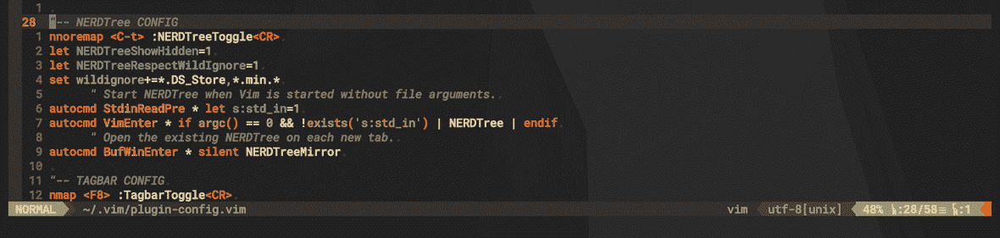**

**Airline in action**

**当然，你可以像一个自尊的 Vim 书呆子一样，创建自己的自定义状态线。也许有一天我会，但同时…**

**[航空公司](https://github.com/vim-airline/vim-airline)是 Vim 的轻量级状态线形式。它为您提供模式信息(正常、插入、可视等)。)、文件路径、文件格式、错误和光标位置。它也可以处理标签，但我从来不喜欢它的感觉。**

**如果你想要更多系统范围的东西，请查看[电力线](https://github.com/powerline/powerline)。它不再是 Vim 插件了，它是用 Python 写的，并且集成了 tmux、bash、zsh 和其他几个应用程序。**

**你应该考虑安装和使用[电力线字体](https://github.com/powerline/fonts)或[书呆子字体](https://github.com/ryanoasis/nerd-fonts)来让漂亮的符号在飞机上出现，尽管没有它们也很好。**

## **[多语种](https://github.com/sheerun/vim-polyglot)**

**Polyglot 是一个广泛的语言包集合，允许 Vim 正确地突出语法。不用安装不同的语言作为不同的插件，只需安装一次 polyglot 就可以了。只有一个插件要更新，只有一行在你的。vimrc，并且每个语言包都是按需自动加载的，因此*它* *不会影响您的启动时间。*看一下支持的[语言列表](https://github.com/sheerun/vim-polyglot#language-packs)，其实挺可观的；其中一半我从未听说过。**

**顺便说一下，Polyglot 附带了一些预配置的隐藏选项。实际上不是多语言，而是每个单独的语言包。看看这个，你就明白了:**

**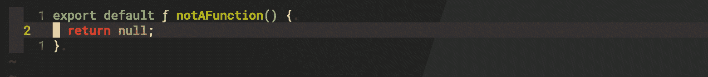**

**You can conceal keywords into single characters**

**在窗帘后面，它是这样做的:**

```
syntax match jsFunction function conceal cchar=ƒ
syntax match { tag } { keyword } conceal cchar={ character } 
```

**只是它使用三元运算符来检查您的。vimrc 查看您是否在某处声明了`javascript_conceal_function`，如果您声明了，它会将其值赋给`cchar`参数。所以你真正要做的就是声明这个:**

```
let g:javascript_conceal_function="ƒ"
```

**这里有完整的 javascript 列表。记住 polyglot 是一个集合，所以如果你想要特定语言的细节，查看他们的 repo 中的列表。**

**你可以用那个图案来设定你的客户隐藏。我会让你谷歌一下细节。它也可以用`regex`代替`keyword`，`tag`就是你给那组隐藏字符起的名字。比如说，你想将`<=`隐藏到`≤`中，将`>=`隐藏到`≥`中，你可能会将它们都标记为`jsOperatos`。但是这超出了本文的范围。**

**注意，这个特性可能与另一个插件 **Indentline** 冲突。当我们在下面讨论 Indentline 时，我们将讨论更多关于隐藏的内容。**

## **[埃米特](https://github.com/mattn/emmet-vim)**

****

**如果你过去做过 HTML，你可能知道 emmet。如果你没有，你就错过了。简单地说，你只需要写一行指令，emmet 就可以快速地把它扩展成标记。我把文件留在这里给你。**

**它甚至可以与 React 一起工作，自动插入`className=""`而不是`class=""`等等。如果你像我一样，总是把扩展名`.jsx`添加到 React 文件*中，你需要把它添加到你的。vimrc 确保 emmet 识别文件扩展名:***

```
let g:user_emmet_settings = {
\  'javascript' : {
\      'extends' : 'jsx',
\  },
\}
```

**唯一要记住的是如何扩展 Vim 中的 emmet 弦。你必须打`**^y,**`，那是`control + y + ,`。您可以将`^y`重新映射到`^z`或您喜欢的任何组合，但`**,**` 始终是最终触发器。**

## **[解说](https://github.com/tpope/vim-commentary)**

**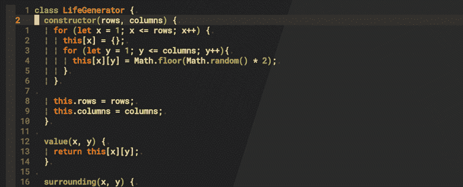**

**Easy**

**`gcc`对一行进行注释，`gc`对视觉选择进行注释，就像上面的 gif。重复以取消注释。**

***中的`gc`正常的*模式也是带距离+方向参数的，所以比如说`gc5j`会注释你的线和下面的五条。现在你明白为什么我们在. vimrc 中设置了`relativenumber`。**

**还有[书呆子评论者](https://github.com/preservim/nerdcommenter)，不过我还没试过。**

## **[包围](https://github.com/tpope/vim-surround)**

**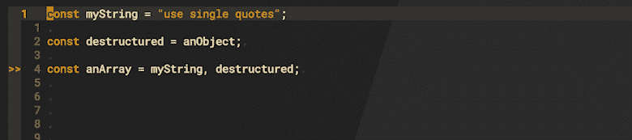**

**Surround with ease. Ease is the keyword here.**

**在*正常*模式下，你的面包和黄油将会是`ysw + character`。把它想象成“你用“某物”包围了单词”。请记住，如果你输入一个左括号或右括号，它会有不同的表现:`ysw}`会像你所期望的那样把你的单词包围起来`{word}`，但是左括号`ysw{`会给你`{ word }`内部空格。`[, ], (, and )`也是如此。`w`是一个距离参数，所以你完全可以像`ys5w'`一样用单引号括起五个单词。在*可视化*模式下，进行选择，并直接用大写`S + character`将其包围。**

**你的东西已经被*和*包围了，你想改变或者删除它，你分别`cs`或者`ds`。想一想“将这周围改为那周围”和“删除周围的字符”。例如，`cs"'`会将双引号改为单引号，而`ds(`会将括号一起删除。你不再需要输入距离，因为你已经告诉它要瞄准什么了。**

**而像`<p>...</p>`这样的 html 标签呢？你使用`t`，t 作为*标签*。例如，`yswt li >`会在`<li>...</li>`标签中包含您的单词。当您输入`t`时，Vim 期待一个输入，您告诉他您已经完成了右括号`>`的操作。阅读[报告](https://github.com/tpope/vim-surround)中的完整命令列表。**

## **[麦芽酒](https://github.com/dense-analysis/ale)**

**ALE 代表**异步 Lint 引擎**。只是引擎，不是棉绒。linter 是一个工具，它可以检查你的代码中的错误、漏洞和可疑的风格。ALE 毫不费力地集成了许多标准服务，包括 [ESlint](https://eslint.org/docs/user-guide/getting-started) 或各种 [LSP](https://microsoft.github.io/language-server-protocol/) 如微软的`tsserver`。还记得我们在[第 1 部分](/@edominguez.se/vim-101-a-comprehensive-guide-to-using-vim-like-an-ide-1-3-vimrc-d484cc41fc2)中启用了一个`signcolumn`吗？ALE 会在那里标记你的错误。**

**就个人而言，我只使用 ALE *进行 ESLint 集成。在使用您选择的包管理器对 Javasript 项目进行[安装和**初始化**](https://eslint.org/docs/user-guide/getting-started) ESLint 之后，ALE 将在您退出插入模式时自动*实时* lint 您的代码并标记任何错误。我总是使用 Airbnb javascript 风格规则，但是 ESLint 会在初始化时提示你选择你喜欢的规则。***

**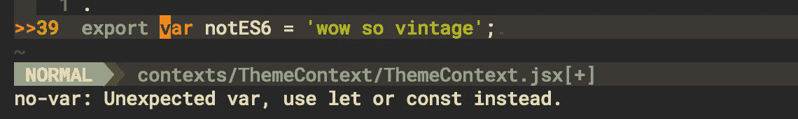**

**Error flag and description**

**不言而喻，我们不想为每一个人都建立 ESLint。我们创建的 js 文件。有时我们只想快速地尝试一些代码，不值得花费时间和精力来安装和配置所有的包，但是我们仍然喜欢某种林挺。嗯，正如我所说，ALE 与 Typescript `tsserver`集成在一起，为你提供类似 vs code[的智能感知](https://code.visualstudio.com/docs/editor/intellisense)。这意味着你不仅可以得到错误标志，还可以得到自动完成，为此 ALE 提供了与[de complete](https://github.com/Shougo/deoplete.nvim)的集成，这是一个管理自动完成列表的插件。你可以在这里阅读详情[。但是正如我所说的，我只使用 ALE 作为 ESLint，因为我使用了另一个插件来自动完成。我们一会儿会谈到。](https://github.com/dense-analysis/ale#2iii-completion)**

**值得注意的是，ALE 可以根据您使用的任何规则自动修复您的代码。我们已经讨论过 ESLint，但是如果你使用了 Prettier(我没有)，ALE 也可以在保存时使用它进行自动修复。Vim 还有一个专用的[漂亮插件。你有选择。如果你想尝试自动修复功能，你可以在你的。vimrc:](https://github.com/prettier/vim-prettier)**

```
let g:ale_fixers = {
\   '*': ['remove_trailing_lines', 'trim_whitespace'],
\   'javascript': ['prettier', 'eslint'],
\   'javascriptreact': ['prettier', 'eslint'],
\}
```

**您可以手动设置规则，或者告诉 ALE 从`eslint`、`prettier`、两者中选择规则，或者您为您的语言使用的任何[服务中选择规则:您只需为所讨论的语言创建一个服务数组。要运行自动修复程序，只需输入命令`:ALEFix`，或者将其设置为在你的。vimrc:](https://github.com/dense-analysis/ale/blob/master/supported-tools.md)**

```
let g:ale_fix_on_save = 1
```

## **[COC](https://github.com/neoclide/coc.nvim)**

****

**IntelliSense suggest ‘return’. TabNine correctly infers the module import.**

**COC 是我最喜欢的自动补全工具。我已经提到过[de complete](https://github.com/Shougo/deoplete.nvim)，我过去也用过 [YouCompleteMe](https://github.com/ycm-core/YouCompleteMe) 。你可以自己尝试。我只能告诉你，一旦我尝试了 COC，我就不会回头。赞。**

**所以，你安装插件。现在怎么办？您想要智能感知的`tsserver`集成吗？`:CocInstall coc-tsserver`。想要 [AI 辅助自动完成](https://www.tabnine.com)？`:CocInstall coc-tabnine`。不是从语言文档字典中建议完成，TabNine 从你的代码中学习，并以一种让你说“它怎么知道我要键入什么？”的方式建议东西。**

**我已经知道了我的设置，所以我只用了一行代码:**

```
:CocInstall coc-tsserver coc-tabnine coc-pyright coc-html coc-css
```

**查看支持的语言服务器的完整列表。见鬼，如果你不想使用 ALE 作为 ESLint，你甚至可以`:CocInstall coc-eslint`，然后[在你的`:CocConfig`中按照你想要的方式](https://github.com/neoclide/coc-eslint#features)设置它。**

**我鼓励您阅读他们的[示例配置](https://github.com/neoclide/coc.nvim#example-vim-configuration)，向您的. vimrc 添加一些有用的行。由于我禁用了不需要的交换文件`set updatetime=300`，这是交换文件更新时间，但我添加了这个:**

```
set shortmess+=c
```

**它将`c`附加到消息配置中，这样您就不会在您的建议下拉列表中得到不必要的信息，比如“匹配 2 个中的 1 个”。大概`c`代表裁剪，但是谁知道呢。**

**最后，因为我在林挺使用 ALE，并且我希望 ALE 在我的状态行中显示错误消息(而不是在对话框中显示 COC)，所以我将这一行添加到我的`:CocConfig`:**

```
"diagnostic.displayByAle": true
```

**这是我的。vimrc 告诉 ALE 将语言服务器协议部分全部留给 COC:**

```
let g:ale_disable_lsp = 1
```

**如果你刚刚安装了 COC，你的:CocConfig 文件可能是空的。记住这是一个. json 文件，所以简单地用花括号把它括起来。**

## **[终极剪辑](https://github.com/SirVer/ultisnips)**

**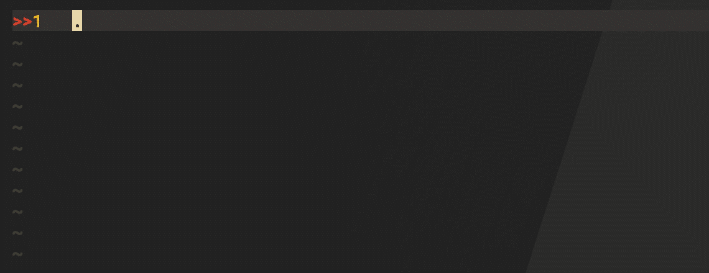**

**‘React Functional Component’ snippet**

**UltiSnips 允许你保存你经常重复使用的代码块，也就是代码片段，然后用一个简单的命令调用它们。UltiSnips 实际上只是引擎，如果你想要一个完整的功能代码片段库，安装这些[代码片段](https://github.com/honza/vim-snippets)。**

**我删除了 snippets pluggin(snippets 本身，而不是引擎)，因为我意识到我真正使用的唯一 snippets 是一个带导出的 React simple 功能组件，我甚至不喜欢默认组件的风格，所以我自己创建了一个。为此，打开一个具有您想要的语言扩展的文件，在我的例子中，我已经在处理一个`.jsx`文件，并触发`:UltiSnipsEdit`到**自动**为该特定语言在`~/.vim/UltiSnips/`中创建一个新文件，在这个例子中是`javascriptreact`。**

**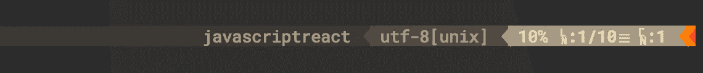**

**Polyglot calls it ‘javascriptreact’**

```
snippet ***rfc*** "react functional component" b
import React from 'react';function ${1:`!p snip.rv = snip.basename`}(${2}) {
  return (
    <>${3:}
    </>
  );
}export default $4`!p snip.rv = snip.basename`;
endsnippet
```

**我写了上面的片段，你可以在上面的 gif 中看到它。如果您复制/粘贴它，您可能需要`retab`或确保用制表符替换空格。我上面提到的[片段文件](https://github.com/honza/vim-snippets/tree/master/UltiSnips)是一个很好的灵感来源，你可以在 repo 中查看它们，不需要安装它们。**

**现在，每当我想扩展我的代码片段时，只需键入`rfc`并用`^j`、(`control + j`)触发它，因为我在我的。vimrc:**

```
let g:UltiSnipsExpandTrigger="<c-j>"
let g:UltiSnipsListSnippets="<c-l>"
```

**`^j`或您想要设置的任何组合，也会在“停靠点”之间跳转。参见`1:`、`2:`等？这些是跳转要做的停留，它们允许我在需要时快速插入道具，或者在`<>` 片段中插入一些代码。另一方面，`^l`允许您输入片段的部分名称并部署匹配列表，以防您不记得片段的完整名称。对我来说，这完全没用，因为我只有一个也是唯一的`rfc`片段。**

**虽然我不使用它，但您可能希望您的代码片段出现在 COC 自动完成列表中。在这种情况下，看看[这个](https://github.com/neoclide/coc-snippets)扩展，你可以像往常一样用`:CocInstall coc-snippets`安装。**

**最后一件事，如果你决定安装 Vim snippets 集合，一定要好好了解文件是如何命名的，以及你的状态行是如何调用你的文件格式的。让我解释一下:*可能是*因为 Polyglot 的 React 库，我的 Vim 调用`.jsx`文件`'javascriptreact'`并且在一个文件中读取具有该确切名称的片段。如果你看一下 Vim 片段 [repo](https://github.com/honza/vim-snippets/tree/master/UltiSnips) ，它们的 React 文件叫做`'javascript_react'`，UltiSnip 不会用我的实际设置来读取它，所以我必须手动删除下划线。我不知道这是为什么，也许是为了与另一个库兼容，但这是一个需要记住的细节。**

## **[FZF](https://github.com/junegunn/fzf)&FZF[。VIM](https://github.com/junegunn/fzf.vim)**

**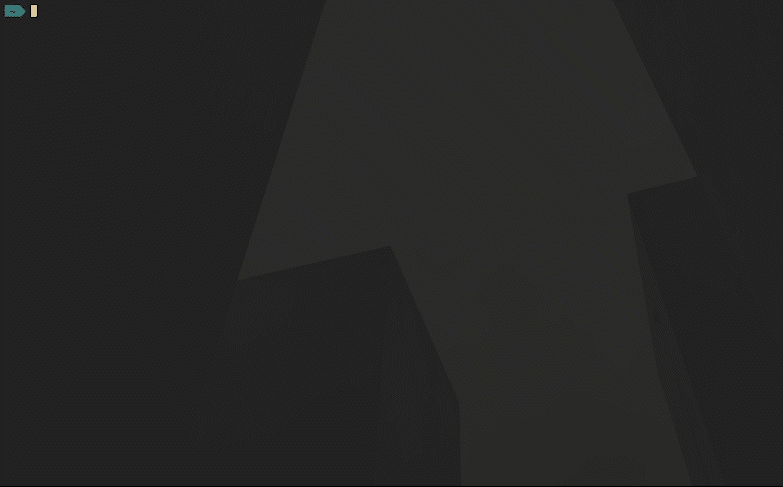**

****fzf** running in the shell with partial names**

**`fzf`是一个模糊搜索过程，让您直接从终端快速搜索目录内容中的文件名匹配。这比我的操作系统的 spotlight 要快得多，尤其是当我已经在终端上的时候。**

**我用`brew install fzf`安装了它，但是你可以用你系统的软件包管理器，甚至是 Window 的`choco`来获得它。我也把它作为 Vim 插件，但老实说，我不知道这是多余的还是必要的。**

**问题是，即使你能让`fzf`与你的插件管理器保持同步，fzf 也不是一个真正的 Vim 插件，因此有了`[fzf.vim](https://github.com/junegunn/fzf.vim)`！它有几个依赖项，你需要安装在你的系统中才能完全访问它的功能，但是相信我，它们都是值得的。**

**显然你需要`fzf`来让 fzf.vim 正常工作。您用`:File`触发文件搜索，它看起来像这样:**

**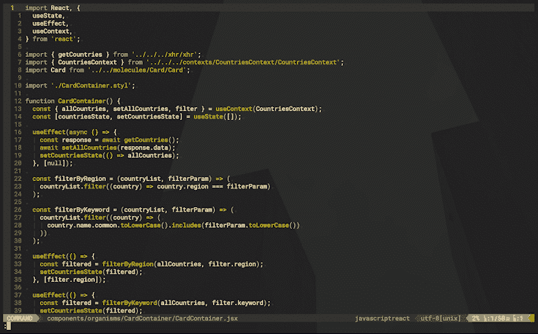**

**Files fuzzy search**

**你还需要 fzf.vim 的`Rg` ( [ripgrep](https://github.com/BurntSushi/ripgrep) )或者`Ag`([silver searcher](https://github.com/ggreer/the_silver_searcher))来在你的项目文件中搜索*。您可以通过您的包管理器在系统范围内获得它们，并在 Vim 中使用`:Rg`或`:Ag`来触发它们。我用`Rg`，看起来是这样的:***

**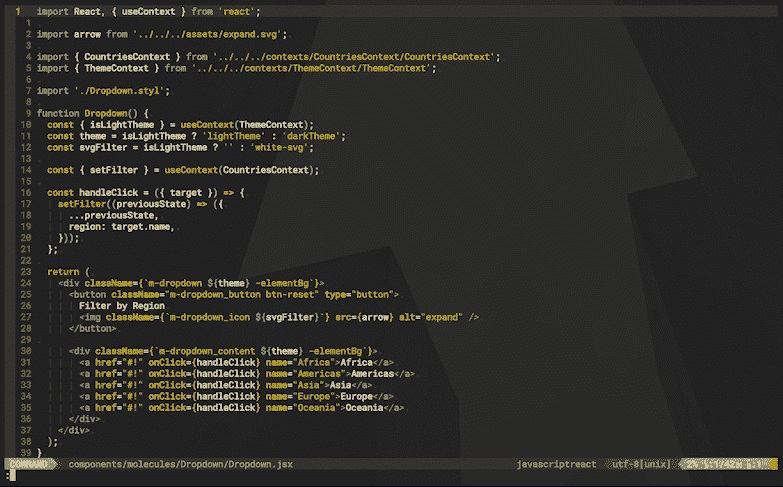**

****Rg** gets regex matches within files**

**您还可以安装一个 [ctags 实现](https://github.com/universal-ctags/ctags)，它允许您索引文件中的“标签”(函数、变量、类……)，然后使用`:Tags`在项目范围内浏览它们。标签对于下一个插件来说也很方便。**

## **[标签栏](https://github.com/preservim/tagbar)**

**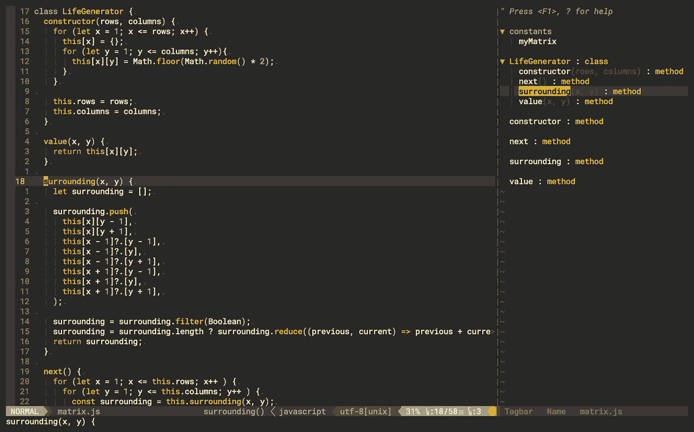**

**Same as last plugin’s **:Tags** but for a buffer**

**这对于像上面这样的小文件来说没有什么意义，但是这个截图清楚地说明了 Tagbar 是如何索引当前文件中的标签的。它获取类、函数、变量、原语等。当你不得不编辑一个庞大的 1500 行的 ES5 文件时，它真的闪闪发光。这可能永远不会发生在你身上，但如果发生了，你会很高兴拥有 Tagbar。**

**记得把这样的东西放在你的。vimrc:**

```
nmap <F8> :TagbarToggle<CR>
```

**就这样，通过`f8`键切换。**

## **[缩进线](https://github.com/Yggdroot/indentLine)**

**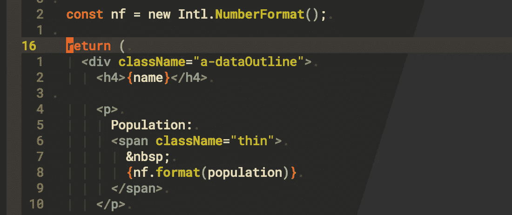**

**Visual lines for space-indentation**

**我不想重提几十年前的`tab` vs `space`缩进困境。我可以为双方提供合理的论据，但我碰巧用了空格。如果你使用制表符，你不需要缩进，简单的回到你的。vimrc，并设置您希望选项卡显示的任何字符。如果需要复习，请参考[第 1 部分](/@edominguez.se/vim-101-a-comprehensive-guide-to-using-vim-like-an-ide-1-3-vimrc-d484cc41fc2)。**

**另一方面，如果你使用 spaces，你可能会发现这个插件很有用。或者不是。在任何情况下，它都利用了 Vim 的隐藏特性，并且非常易于配置，因为它允许您覆盖隐藏组的默认高亮设置。你想让橙色背景上的线条是绿色的，就像这样疯狂:**

```
let g:indentLine_color_gui = '#A4E57E'
let g:indentLine_bgcolor_gui = '#FF5F00'
```

**或者类似于:**

```
let g:indentLine_color_term = 239
let g:indentLine_bgcolor_term = 202
```

**如果你没有启用. vimrc 中的`termguicolors`**

**问题是我想让它们尽可能的微妙，我不想被它们分散注意力，所以我把它们设置成适当的低对比度的灰色。但是，我告诉过你这些设置会覆盖隐藏组默认的高亮设置，所以如果你像我们上面讨论的那样对“null”或“function”这样的关键字使用隐藏，它们也会变灰，几乎看不见，在我看来这是不允许的。**

**你总是可以选择一种足够明显的颜色来清楚地看到隐藏的字符，但又不会分散注意力，使缩进行在你的屏幕上变得嘈杂。我找不到这样的颜色，所以我选择了微妙的缩进线，而不是完全隐藏语法，并最终禁用了它。你可能会选择相反的。明天我可能会改变主意。谁知道呢。**

**在他们的[报告](https://github.com/Yggdroot/indentLine#customization)中查看 IndentLine 的更多配置选项。您可以用如下方式更改缩进字符:**

```
let g:indentLine_char = '.'
```

**您的文件将改为用点缩进。只要确保你的。vimrc 的字符编码设置为 UTF-8。**

# **此外…**

## **[编辑配置](https://github.com/editorconfig/editorconfig-vim)**

**就在我写这篇文章的时候， [Simone Conti](https://medium.com/u/4540da9eb8c6?source=post_page-----b8eae1b77497--------------------------------) 指出，与其像我在[第一部分](/@edominguez.se/vim-101-a-comprehensive-guide-to-using-vim-like-an-ide-1-3-vimrc-d484cc41fc2)中建议的那样，对每种语言的标签设置进行硬编码，不如使用 [EditorConfig](https://editorconfig.org) 约定来确保编辑器、文件和项目之间的一致性。这是 Vim 插件。我还是得尝试一下，但如果是为了增强一致性，那就把我算进去。**

## **[Vimspector](https://github.com/puremourning/vimspector)**

**一个非常像 VSCode 的图形调试器。a 必须有。**

## **[风筝](https://github.com/kiteco/vim-plugin)**

**提供 AI **和**文档辅助自动完成。Kite 没有使用`COC+tsserver+TabNine`，而是在一个插件中提供了所有这些服务，而且更好。主要的问题是你需要运行风筝引擎作为 Vim 插件连接的专用桌面应用，但是[下载](https://www.kite.com/download/)已经不可用*快一年了*。我碰巧有一个. dmg，但我不认为风筝的人会喜欢我分享它。我绝对不会给你安装程序。我真的不鼓励你问我要，这样你就可以试试。不要，因为我肯定不会给你发下载链接。眨眼眨眼。**

## **[彩虹括号](https://github.com/frazrepo/vim-rainbow)**

**如果你更喜欢彩色括号对，而不是缩进行，试试吧。**

## **[逃犯](https://github.com/tpope/vim-fugitive)**

**我刚意识到逃犯在单词中间有 git。另一个是 Tim Pope，环绕和评论的创造者，逃犯允许你从你的缓冲区调用 Git 命令。**

**既然我们在谈论 Git，你可能也想检查一下 [Git 槽](https://github.com/airblade/vim-gitgutter/)。只是给你一些选择，我从来没有真正使用过。**

## **[病原体](https://github.com/tpope/vim-pathogen)**

**同样由 Tim Pope 开发，如果你喜欢的话，它允许你“在他们自己的私有目录中安装插件和运行时文件”。**

**正如我承诺的，这是我的插件配置:**

**我试图将标签栏配置为索引。jsx 文件，但我从来没有得到它相当点。然后我意识到这是浪费时间，因为我的组件总是很小，我真的不需要标签栏。jsx…**

**就这些了，请继续关注第 3 部分，我们将讨论所有关于 Vim 导航的内容。**