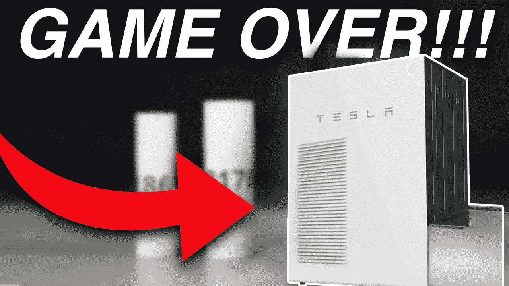
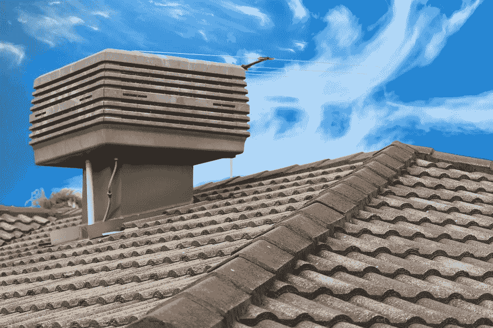
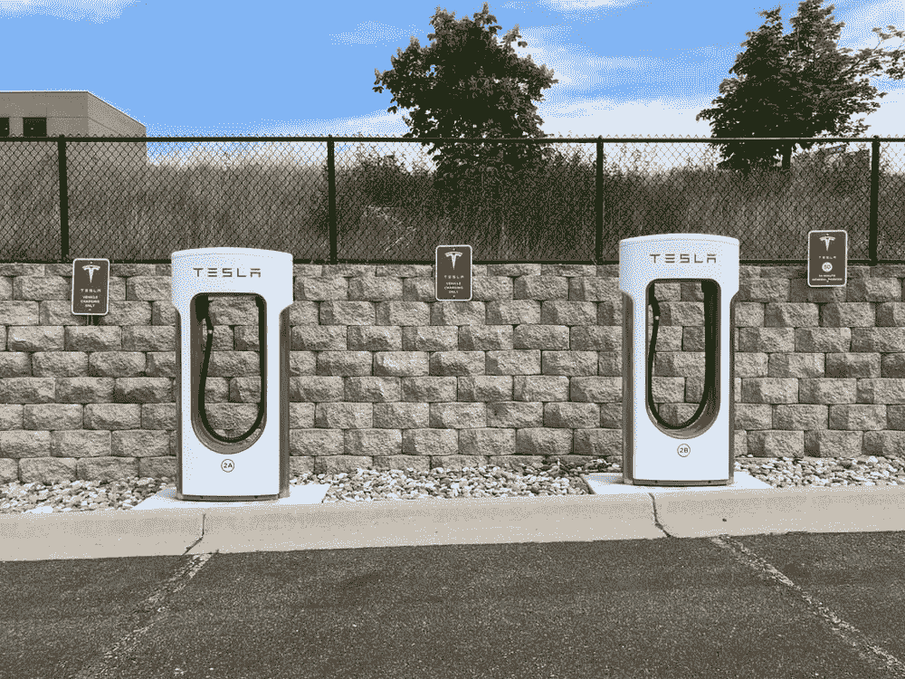
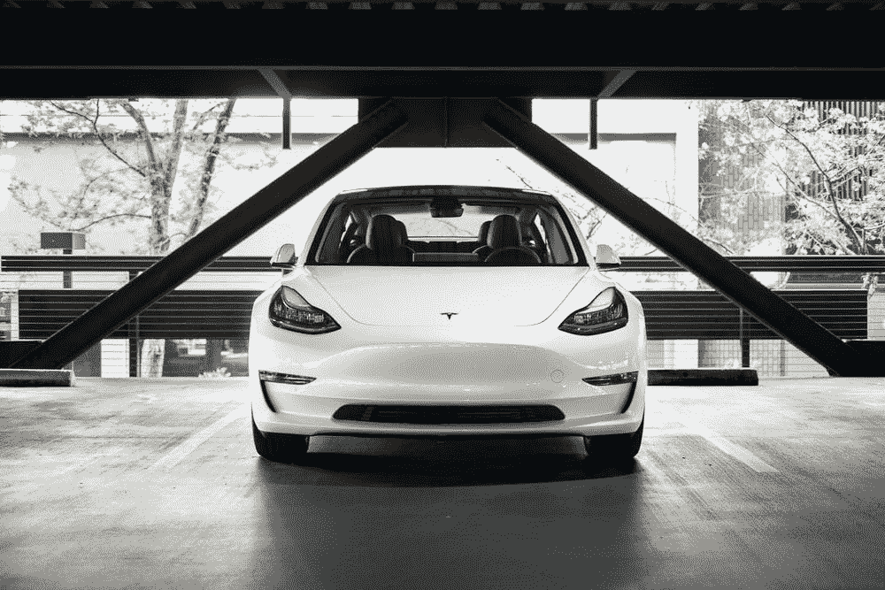

# 游戏结束！！！埃隆·马斯克的 HVAC 项目扼杀了标准的家庭供暖和空调行业。'

> 原文：<https://medium.com/geekculture/game-over-elon-musks-hvac-project-to-kill-the-standard-home-heating-and-ac-industry-e2c6678ebead?source=collection_archive---------13----------------------->

Photo by Author

那么，我从哪里开始呢？埃隆·马斯克和特斯拉正在设计一个暖通空调项目，以颠覆价值 3000 亿美元的标准家庭供暖和空调行业。

特斯拉作为一家公司，以打破陈规而闻名。首先，他们推出了电动汽车，打破了汽油发动机汽车的燃料模式。然后他们开始致力于用 100%的绿色太阳能为家庭提供能源，现在他们正在研究 HVAC 系统。

HVAC 代表“供暖、通风和空调”让事情变得清楚，大多数家庭已经有了一个供暖、通风和空调系统。但是有一个新的革命性的特斯拉暖通空调系统在工程中。特斯拉暖通空调系统背后的愿景是使用尽可能少的能源，同时比目前市场上可用的能源更有效。两年前，埃隆·马斯克第一次对国产 HVACs 表现出兴趣。

Photo by [ShaunNameNotTaken](https://pixabay.com/users/shaunnamenottaken-11004713/) from [Pixabay](https://pixabay.com/images/id-5970232/)

特斯拉汽车目前以无论环境条件如何都能为乘客提供宁静优质的新鲜空气而闻名，这要归功于特斯拉内部的“HEPA”过滤器，其效率比普通过滤器高出 10%。举个例子，特斯拉的过滤器过滤细菌的能力强 300 倍，过滤过敏原的能力强 500 倍，过滤煤烟或烟雾的能力强 700 倍，过滤病毒的能力强 800 倍。

有趣的是，特斯拉将这些极端的空气净化机制称为“生物武器防御模式”此外，这些过滤器还可以净化车外的空气，让车辆周围的人感觉更好。特斯拉汽车的加热和冷却系统涉及到精心的共生，例如，新的特斯拉 Model Y 有一个更好的解决方案来提高电池续航里程，并通过其新的 HVAC 系统来实现这一点。这个系统将热量从车内较热的地方转移到较冷的地方。有了这个系统，汽车现在能够在外部温度极低时保持电池在最佳温度，以避免电池的续航里程和效率下降。2020 年 6 月，特斯拉发布了一个软件更新，此后该车现在开始要求用户在寒冷的天气里，只要附近有增压器，就给电池加热。

Photo by [Chad Russell](https://www.pexels.com/@theidahoan?utm_content=attributionCopyText&utm_medium=referral&utm_source=pexels) from [Pexels](https://www.pexels.com/photo/two-white-and-red-tesla-charging-station-2480315/?utm_content=attributionCopyText&utm_medium=referral&utm_source=pexels)

给出一些关于汽车 HVAC 的有用信息是很重要的，因为只有这样你才能了解特斯拉对国内 HVAC 的看法。Elon Musk 说，他想象了一个完整的家庭 HVAC 系统，该系统受某人特斯拉汽车内的温度控制的启发，并可能与该控制相联系。在这个项目背后，主要目标是部署太阳能发电系统，这需要更节能的系统。这个想法是为了降低家庭总能源使用量，这样太阳能系统就是一个家庭所需要依赖的。

这些系统将利用特斯拉汽车上使用的类似 HEPA 过滤器，因此国内空气质量也必将得到改善。对于过敏体质的人来说，这些系统将会改变他们的生活。这些系统也将连接到汽车上，这样你就可以在回家的时候从汽车上打开系统，而不是整天保持室内凉爽，这样可以节省大量能源。作为一家公司，特斯拉避免通过化石燃料生产能源，作为电动汽车革命的先驱，我们可以期待特斯拉的暖通空调系统是高能效，操作简单，极简主义，就像特斯拉 Model 3 几乎不可见的前气流通风口一样，从而保证更多的可居住空间，最后通过消除燃料成本和控制电力消耗来降低电力成本，从而实现绿色环保。

Photo by [Charlie Deets](https://unsplash.com/@charliedeets) from [Unsplash](https://unsplash.com/photos/D1W5QenBzlU)

特斯拉产品利用了更好的技术，并保证了更高的效率，因此它们通常以更高的价格开始，但随着特斯拉在制造这些产品方面变得更有效率，价格会随着产量的增加而下降。

让我们来谈谈特斯拉在关注什么，以及他们为什么想从事这个项目。根据美国能源管理局的数据，美国普通家庭在空调上的花费约占家庭能源总支出的 12%。在特别温暖的州，这个数字上升到 27%。在美国，大约 60%的家庭使用中央空调系统，而 23%的家庭使用单独的空调设备，只有 5%的家庭两者都使用，因此这两种产品的市场都很大。全球空调市场约为 780 亿美元，并以每年 10%的速度增长。

Photo by [Sergei Akulich](https://www.pexels.com/@sergei-akulich-1322276?utm_content=attributionCopyText&utm_medium=referral&utm_source=pexels) from [Pexels](https://www.pexels.com/photo/aerial-photography-of-brown-concrete-building-2539462/?utm_content=attributionCopyText&utm_medium=referral&utm_source=pexels)

作为一家公司，发布日期是特斯拉最糟糕的噩梦，因为他们很少能在最初宣布的日期发布产品。比如跑车在哪里？它应该在 2020 年问世。那么，让我们来谈谈特斯拉在这个项目中所取得的进展。在 2020 年特斯拉电池日活动中，Elon Musk 被问及他对家庭热管理系统的意图，在回答时，他提到家庭 HVACs 是最受欢迎的项目，他补充说，他的公司已经在这些系统上做了大量工作。根据 Elon 的报价，可以预测这些产品将在 2021 年底进入测试，到 2022 年它们很可能会取代你目前的暖通空调系统。然而，如果你想知道你能买到新的特斯拉 HVAC 系统的确切日期，我们只能耸耸肩。

# **OUTRO:**

那么，当特斯拉开始运输他们的多用途暖通空调系统时，你会抛弃你的传统家用空调系统吗？

请在下面的评论区告诉我们。

如果你喜欢这篇文章，请鼓掌离开我们，并考虑订阅我们的博客。我们会在下一集看到你。在那之前。