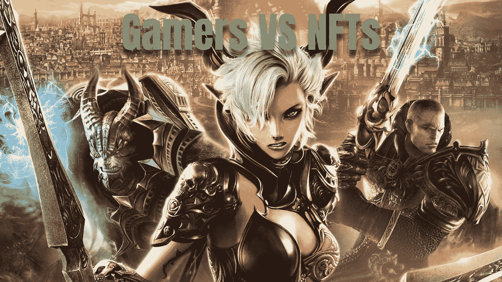

# 游戏玩家 vs NFT——web 3 仍然缺乏基础

> 原文：<https://medium.com/geekculture/gamers-vs-nft-web3-still-lacks-fundamentals-eeab12b6bf36?source=collection_archive---------5----------------------->

## 游戏公司会促进数字资产的自我保管吗？

游戏中数字物品的自我所有权和游戏平台中数字资产的令牌化将预示着元宇宙游戏方面的开始。

然而，游戏行业的顶级公司最近对 NFTs、Web3 和…