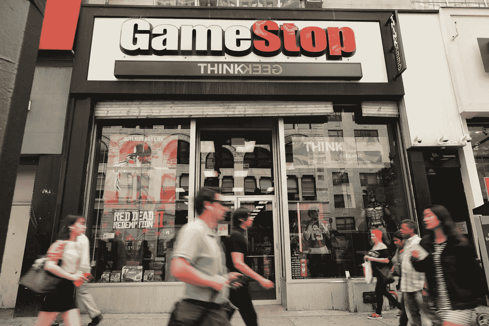
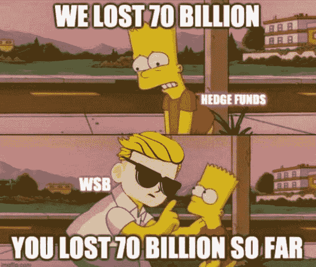
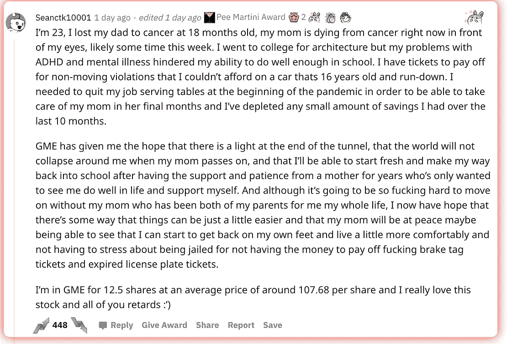
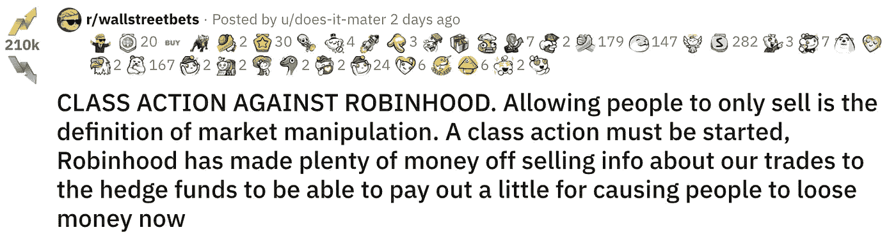
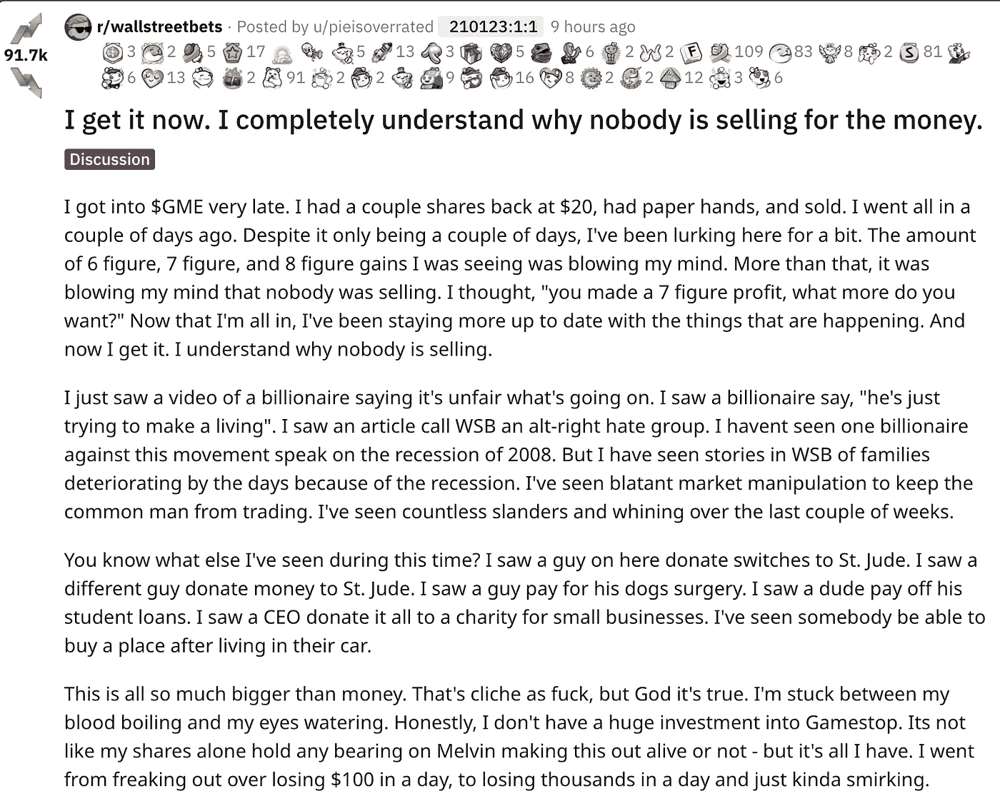
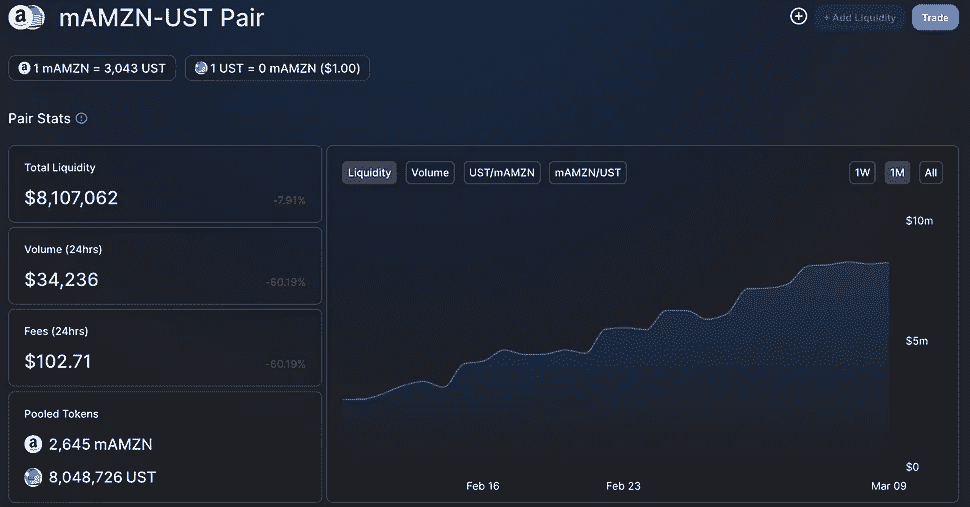
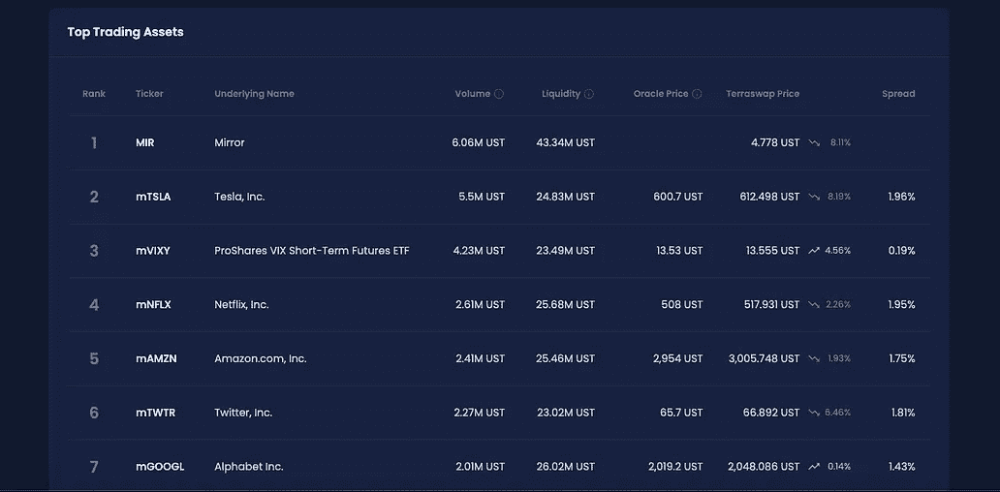

# GameStop、Robinhood 和 DeFi

> 原文：<https://medium.com/geekculture/gamestop-robinhood-and-defi-3046152c9fe6?source=collection_archive---------23----------------------->

## 鉴于$GME 最近的事件，为什么需要 DEXes

Image from Spencer Platt/Getty Images

*免责声明:本文出于教育目的。希望人们发现这些更新有助于跟上这些天来 crypto 飞速发展的步伐。这不是财务建议；始终对硬币进行自己的尽职调查:)*

快速说明:我本打算在今年 1 月下旬发生[罗宾汉-GameStop 惨败](https://www.cnet.com/personal-finance/investing/robinhood-backlash-what-you-should-know-about-the-gamestop-stock-controversy/)几天后写这篇博客。我几次试图写一份关于这一历史时刻的引人注目的草稿，但我没能恰当地表达出我想说的话。

这个事件中有太多东西需要剖析:美国票据交换所系统、TradFi 和审查制度的问题，罗宾汉的品牌，股票的迷因化，什么是做空，r/wallstreetbets 的兴起…

过了一段时间，我意识到这篇文章已经不合时宜了。大量的文章涌现出来，更好地解释了我在初稿中试图表达的内容。我最终放弃了试图综合我对这件事的复杂感受。相反，我尽力讲述一个关于 DeFi 和 DEXes 的重点故事。

在过去的四年里，我一直在股票市场交易。在这个宏大的计划中，时间并不长，但我已经经历了一些不可思议、近乎荒谬的事情:AMD[和 Tesla](https://www.forbes.com/sites/greatspeculations/2020/02/24/amds-stock-is-up-more-than-4x-since-february-2017heres-why/)的迅速崛起，在玩 [2u 盈利](https://www.yahoo.com/lifestyle/2u-stock-plummets-company-slashes-192300194.html)时失去了一切，Hertz 和 Eastman Kodak 的泡沫，当然还有 Covid 导致的圣经中的 3 月崩盘。

也就是说，过去的这个[(在我写这篇文章的时候)是我迄今为止在股票市场上看到的最疯狂的事情。](https://marker.medium.com/gamestop-proves-were-in-a-meme-stock-bubble-b3f39163a77f?source=search_post---------0)

我该如何描述我上周目睹的一切？

这部分是笑话，部分是文化时代精神，部分是传销，部分是阶级斗争。

本周，由广受欢迎、恶名昭彰的 subreddit[r/wall street bets](https://www.reddit.com/r/wallstreetbets/)领衔的集体互联网与梅尔文资本(Melvin Capital)和股票市场上的其他卖空者展开了斗争。

到目前为止，Redditors 赢了。

从 2020 年 12 月起，GameStop——以及其他 meme 股票——上涨了 1700%。仅在一月份，美国的卖空者就累计损失超过[700 亿美元](https://www.reuters.com/article/us-retail-trading-shortbets-idUSKBN29X1SW)。

在这一切之中，我们有潮湿的迷因，也有有益健康的故事。

Source from r/wsb

我们有亿万富翁[在电视直播](https://www.cnbc.com/video/2021/01/28/interactive-brokers-chairman-worried-about-integrity-of-the-market.html)上恳求监管和阻止散户交易者。

我们有共和党人、民主党人、埃隆·马斯克和米娅·卡莉法的复仇者呼吁保护散户交易者。

当然，我们有一个对冲基金与经纪公司合谋暂停交易、压低某些股票价值的大阴谋。

由于股票市场基础设施的崩溃，我们几乎经历了第二次大金融危机。稍后将详细介绍。

Source from [r/wsb](https://www.reddit.com/r/wallstreetbets/comments/l6x130/class_action_against_robinhood_allowing_people_to/?utm_source=share&utm_medium=web2x&context=3)

Source from [r/wsb](https://www.reddit.com/r/wallstreetbets/comments/l8pegt/i_get_it_now_i_completely_understand_why_nobody/?utm_source=share&utm_medium=web2x&context=3)

# TLDR 谈 GameStop 和其他 meme stonks 的进展

"好吧，吉米，你到底在说什么？"

TLDR；本周(在撰写本文时)，互联网就对冲基金和其他卖空者大量卖空的股票展开了战争。由散户组成的互联网决定投资股票，导致股价飙升，并导致卖空者亏损。

在我进入更多细节之前，先了解一下卖空意味着什么是很重要的。

从高层次来看，卖空者是指在股票下跌时，利用特定金融工具(如卖空和看跌期权)赚钱的个人和企业。例子有著名的房地产市场[大空头](https://en.wikipedia.org/wiki/The_Big_Short_(film))和比尔阿克曼的[康宝莱](https://www.cnbc.com/2019/12/13/reliving-the-carl-icahn-and-bill-ackman-herbalife-feud-on-cnbc.html)空头。

加倍做空背后的机制。

像香橼研究(Citron Research)和梅尔文资本(Melvin Capital)这样的公司认为，有些过时的公司可能会继续贬值。像 GameStop(GME)、AMC Theatres(AMC)、贝德柏士比昂公司(BBBY)和诺基亚(挪威)这样的公司——我们就称它们为 BANG stocks 或 meme stonks。

散户投资者意识到这些公司是有价值的，但股价要么因为做空而被压低，要么有可能用大量的买入压力“挤压”卖空者。

当卖空者想要退出头寸时，他们必须以市场价格回购股票——这实际上导致了一个反馈循环，随着卖空者累积越来越多的损失，股价越来越高。

# 2021 年 1 月 27 日，星期四，罗宾汉发生了什么

2021 年 1 月 27 日星期四，罗宾汉和其他经纪人决定冻结购买 GME 和 AMC 等 meme 股票的能力，理由是“动荡的市场条件”。

互联网很快得出结论，罗宾汉正与传统金融服务机构合作，惩罚挑战卖空者/对冲基金的散户投资者。

很快，关于罗宾汉与 GME 卖空者梅尔文资本(Melvin Capital)的投资者 Citadel 的关系的讨论就开始了。Citadel 是 Robinhood 的最大客户，购买后者的数据给前置散户的交易员以获利。

人们愤怒了，“如果产品是免费的，你就不是顾客，你就是产品”这句格言在每个人的脑海中回响。

罗宾汉的官方声明是，由于 GME 和 AMC 等股票的波动性，美国中央清算所 [DTCC](https://www.dtcc.com/) 要求罗宾汉持有额外的抵押品，以满足[股票交易的 T+2 结算期](https://en.wikipedia.org/wiki/T%2B2#:~:text=The%20most%20common%20current%20settlement,for%20payment%20from%20the%20purchaser.)。

但事情似乎很可疑，Robinhood 的首席执行官 Vlad Tenev 不得不向国会就此事件作证。

# 我对这一事件的看法

高三第二学期，我开了个 Robinhood 账户。从那以后，我再也没有回头——慢慢地建立了一个投资组合。

我爱罗宾汉。太美了，太好用了。这很有趣——也许太有趣了。闪亮的按钮告诉我，这只是一个被打败的视频游戏。安静的早晨，我失去了所有的头寸，意识到我不知道期权是如何运作的。

但经历了这一切，我得到了很多乐趣。我了解了股票市场，并因此成为一个更有责任感、更懂金融的人。

本周发生的事情(在撰写本文时)远没有 Reddit 和 Twitter 上的人所说的那么邪恶。我真的相信 DTCC 的武断规则迫使罗宾汉陷入困境。

话虽如此，我仍在将资金从罗宾汉转移到富达(我把所有无聊的投资和退休账户都放在那里)。并不是因为他们不“为人民服务”，而是因为本周，以及在 Covid 锁定期间的许多其他时间，他们向我展示了他们是一家有时难以应对的初创公司。

但我并不把冻结归咎于罗宾汉，而是更多地归咎于三个因素:

1.  陈旧的系统，股票需要两天时间进行正式清算/结算
2.  这是一个集中的失败点，DTCC 对罗宾汉进行了模糊的单边评估，以支持他们的抵押品
3.  依赖第三方经纪人交易资产的投资者

我相信 DeFi 可以解决这些问题，使这种情况不再发生。

# 为什么 DeFi 是解决方案

所有这三个因素都可以通过加密和现有的(以及即将出现的)DeFi 解决方案轻松解决。

关于古老的系统——为什么股票需要两天时间才能清算？这源于股票被记录在纸上并从一个经纪人转移到另一个经纪人的时代。

现在，一切都是数字化的，可以在几秒钟内完成交易；然而，美国股票系统仍然在 T+2 交付模式下运行。

DeFi 是一个互联网原生的金融系统，这意味着资产可以即时结算，因为基础资产纯粹是数据。

在集中的故障点上，crypto 中没有 DTCC 的等价物。没有权威机构——只有一个纯粹的分散系统，在系统规则下自主行动者一起工作。

在第三方经纪人方面，crypto 中的个人不需要像经纪公司那样的看门人来连接到交易所并获得流动性。这相当于人们能够直接在纳斯达克交易，而不是以交易费的形式向富达支付进入纳斯达克订单簿的权利。

现有系统让散户投资者面临交易对手风险，像罗宾汉这样的中央机构可以以任何武断的理由审查和限制其用户的访问。

Crypto 通过允许个人直接连接到价值产生的源头而消除了这种风险——不需要攫取金钱的中间人。

“吉米，这对交易加密货币来说很好，但像 GME 这样的股票呢？”

真正吸引人的是，已经有解决方案可以让投资者以加密的方式投资股票。

像 [Mirror](https://terra.mirror.finance/stake) 、 [Synthetix](https://cryptobriefing.com/synthetix-now-allows-users-to-trade-top-tech-stocks/) 、甚至[币安](https://www.coindesk.com/binance-allows-users-to-trade-tokenized-stock-tokens-starting-with-tesla)这样的公司现在都在创造“合成股票”——本质上是完全模仿价格并跟踪与之相关的任何资产的价格变动的加密资产——在这种情况下，像$GME $AMC $BB 等这样的股票。

非美国人第一次可以公开、不受限制地投资和交易美国股票。没有必要创建一个海外银行账户和一个美国经纪账户。现在，任何拥有电话和互联网连接的人都可以参与新的开放金融市场——即时结算，没有集中的交易对手风险。

一旦 DeFi 完全反映了股票市场，就不会再有 Robinhood-GameStop 类型的事件了:)

Trading mAssets (mirrored assets) on Mirror Protocol

如果你认为这篇博文值得你花 5 分钟来阅读，请在下面鼓掌(最多 50 次)或者与一个会从这篇内容中受益的朋友分享。非常感谢！