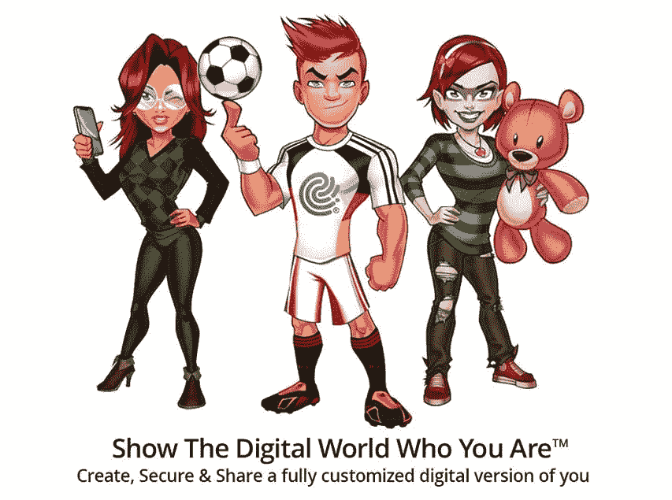

# 用液态化身游戏化自我主权身份

> 原文：<https://medium.com/geekculture/gamifying-self-sovereign-identities-with-liquid-avatar-509bea3a864e?source=collection_archive---------22----------------------->

## 我与首席执行官大卫·卢卡奇(David Lucatch)讨论了他们使用区块链和游戏化来推广自我管理数字身份的计划。

Source: [Liquid Avatar website](https://liquidavatar.com/)

在不久的[未来](https://lancengym.medium.com/the-next-big-thing-after-websites-and-mobile-apps-a15d61465e2f)中，我们都将作为虚拟角色在线度过时光，探索虚拟现实空间或玩游戏。一家初创公司正在寻求建立我们的…