# 用 Python 进行游戏股票分析:回报和技术指标

> 原文：<https://medium.com/geekculture/gaming-stock-analysis-with-python-returns-and-technical-indicators-ee244f0d7c36?source=collection_archive---------23----------------------->

## 艺电、Take Two 和动视的比较分析


Source: [Unsplash](https://unsplash.com/)

免责声明:*本文并非财务建议，仅用于教育和分析目的。*

*特别感谢何塞·波尔蒂利亚和他的 Udemy*[*“Python 用于金融分析和算法交易”*](https://www.udemy.com/course/python-for-finance-and-trading-algorithms/) *课程，我强烈推荐给任何对金融和数据科学感兴趣的人，不管他的 Python 水平如何。*

与其他科技行业一样，游戏类股票也受到新产品发布会、会议等的严重影响。由于新冠肺炎疫情，越来越多的人留在室内，游戏行业成为全球封锁期间的赢家之一，[2020 年收入增长 12%，达到 1.399 亿美元。但是传统游戏巨头的股票表现如何呢？它们是如何相互竞争的？让我们来看看:](https://venturebeat.com/2021/01/06/superdata-games-grew-12-to-139-9-billion-in-2020-amid-pandemic/)

为了这次分析，我选择了**电子艺界(EA)** 、**Take Two Interactive(TTWO)**和**动视暴雪(ATVI)** ，三家最大的游戏开发商和[市值最高的游戏股票](https://www.yahoo.com/now/11-best-gaming-stocks-buy-195817383.html)。像微软和索尼这样的公司也是该行业的领先企业，但我决定不选择它们，以便严格地在开发者之间进行比较，而不是在游戏机提供商之间。

EA 很可能是三个拥有热门系列的开发商中最大的名字，如 *FIFA、* *Madden NFL、* *极品飞车、*和*模拟人生*。以 Two 开发的最畅销的主机游戏*侠盗猎车手 V* 为例，还有其他成功的特许经营，如*红色死亡救赎*和 *NBA 2K* 。最后，动视暴雪，这三家公司中最有价值的，也是市值最大的开发商，负责广受欢迎的使命召唤和魔兽世界。

**我们的目标:**通过比较这三只股票的价格趋势、收益、相关性和一些流行的技术指标来分析它们的表现。我们将导入并使用三个流行的 Python 库进行数据分析(numpy、pandas 和 matplotlib ),并使用 yfinance 从 Yahoo Finance 加载股票数据。

**将股票数据加载到 Python:**

我们将用下面的代码导入库并加载 2010 年 1 月到 2021 年 8 月的 EA 股票数据:

```
#Importing libraries
import yfinance as yf
import numpy as np
import pandas as pd
import matplotlib.pyplot as plt
%matplotlib inline#Loading EA's stock data into Python from Yahoo Finance
ticker= "EA"
EA_df = yf.download(ticker, start="2010-01-01", end="2021-08-01")
EA_df
```

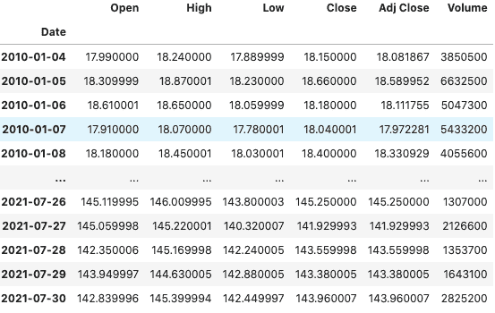

Output for EA_df

然后我们会对 Take Two 和 Activision 做同样的事情。我已经将它们的数据帧分别表示为 *TT_df* 和 *AT_df* 。

**量价分析:**

现在，让我们一起绘制股票价格图，以比较它们的运动和增长。对于所有指标，我使用调整后的收盘价，因为我考虑到了公司行为(如股息和股票分割)，因此比收盘价更准确地代表了历史数据。为了绘制价格，我们使用:

```
#Plotting price movement over our selected time period
EA_df['Adj Close'].plot(label='EA',figsize=(16,8),title='Prices')
TT_df['Adj Close'].plot(label='TTWO')
AT_df['Adj Close'].plot(label='ATVI')
plt.legend();
```

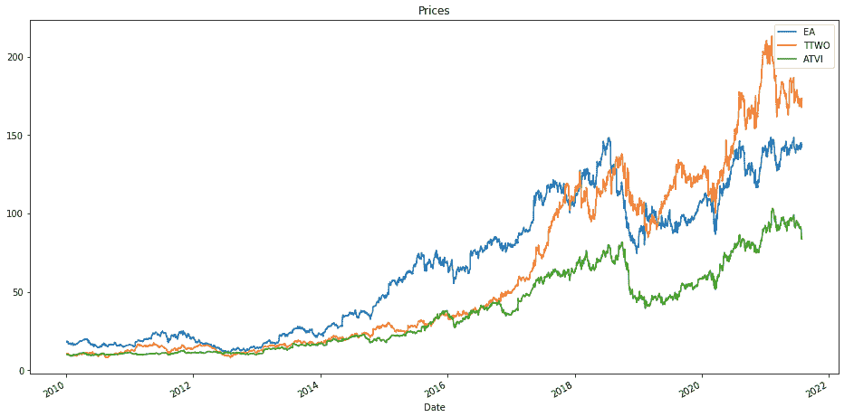

Price movement for the three stocks

正如我们所见，EA 在这十年开始时是最有价值的股票，但 Take Two 最终在 2018 年赶上了它，并在 2020 年彻底超越了它。另一方面，动视在这十年的大部分时间里都落后于其他两家，尤其是在 2017 年之后。

然而，我们还应该看看其他指标，如成交量和市值，以便对股票进行更有力的比较，因为分析师使用成交量来衡量股票的实力和需求，而市值告诉我们一个人将花多少钱来购买公司的所有股票，让我们对公司的估值有一个更清晰的了解。此外，股票分割(Activision 有过六次，Take Two one 和 EA zero)也降低了股票价格，同时保持了市值不变。让我们来看看股票的交易量:

```
#Plotting volume traded
EA_df['Volume'].plot(label='EA',figsize=(16,8),title='Volume Traded')
TT_df['Volume'].plot(label='TTWO')
AT_df['Volume'].plot(label='ATVI')
plt.legend();
```

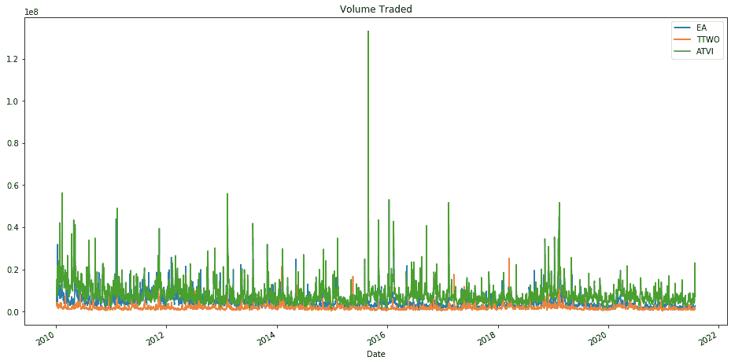

Volume traded for EA, TTWO, and ATVI

尽管价格较低，但 Activison 的销量在大部分时间内都超过了 EA 和 Take Two，在 2015 年 8 月左右大幅飙升，可能是因为该公司当年在 Q2 的强劲业绩以及该股加入标准普尔 500 指数，导致该股创下历史新高。

然而，更高的销量并不一定意味着动视比艺电更有价值。为了更好地理解估值，我们可以用股票价格乘以交易量来得到交易的总金额。这不完全是市值，但让我们看到了流入股票的真实资金。为此，我们使用以下代码:

```
#Calculating and plotting total money traded for each stock
EA_df['Total Traded'] = EA_df['Adj Close']*EA_df['Volume']
TT_df['Total Traded'] = TT_df['Adj Close']*TT_df['Volume']
AT_df['Total Traded'] = AT_df['Adj Close']*AT_df['Volume']EA_df['Total Traded'].plot(label='EA',figsize=(16,8), title = 'Total Money Traded')
TT_df['Total Traded'].plot(label='TTWO')
AT_df['Total Traded'].plot(label='ATVI')
plt.legend()
plt.ylabel('Total Traded')
```

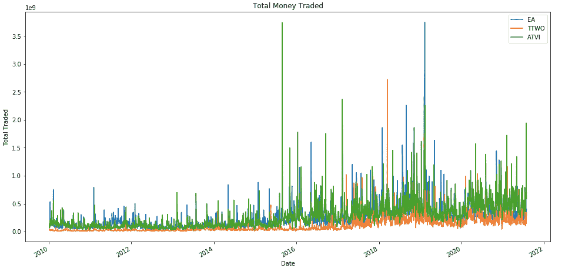

Total money traded for the three stocks

动视在大部分时间内的总交易量再次较高，但每家公司都出现了关键的跳跃，尤其是 EA 在 2019 年初。当年 2 月 8 日， [EA 股价上涨超过 11%，](https://docs.google.com/document/d/1n3In08MxTm80eqGdWG6tnrCN7a4qaRrn4XUMj-51vZ0/edit#)在它宣布 battle royale 游戏 Apex Legends 上线 72 小时即突破 1000 万之后。动视是交易金额最多的公司，也是本文撰写时市值最高的公司。

**技术指标:**

技术分析帮助交易者确定进入和退出交易的正确时间。最受欢迎的技术指标可能是简单移动平均线(SMA)，它是一段时间内价格的平均值。平滑价格波动的 SMA 通常与价格一起绘制，以检查价格趋势的潜在变化。两个常用的时间周期是 50 天均线和 200 天均线，用来捕捉中期和长期趋势。为了计算和绘制 SMA，我们可以使用熊猫的滚动平均值，如下所示:

```
#Calculating and plotting moving averages
EA_df['MA50'] = EA_df['Adj Close'].rolling(50).mean()
EA_df['MA200'] = EA_df['Adj Close'].rolling(200).mean()
EA_df[['Adj Close','MA50','MA200']].plot(figsize=(16,8), title = 'EA Moving Averages')
```

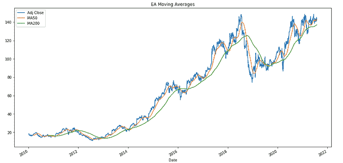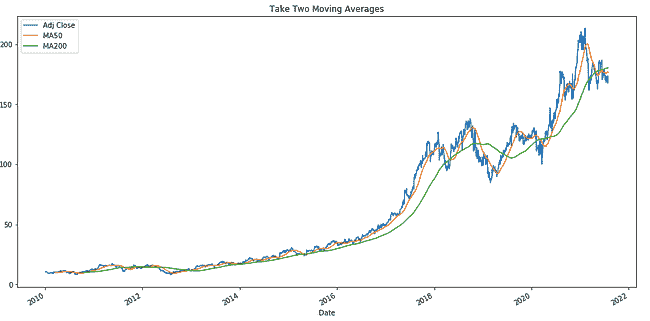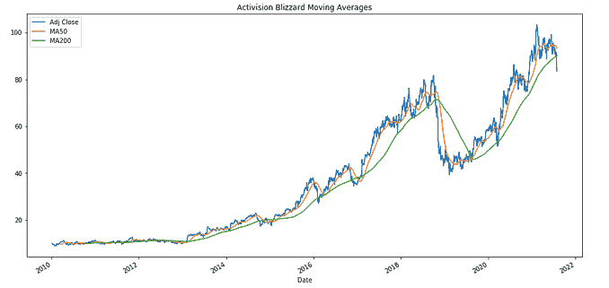

50-day and 200-day moving averages for the three companies

[50 天均线在 200 天均线下方交叉表明潜在的抛售，因此股价下跌。](https://www.investopedia.com/terms/s/sma.asp)另一方面，50 天均线上升到 200 天均线之上表明股价上涨，这两种交易模式在很大程度上都反映在所有三只股票指标的表现上。然而，尽管动视的 50 天 SMA 自 2019 年底以来一直高于 200 天 SMA，但最近该股明显下跌，原因是[今年 7 月提起的持续性骚扰诉讼](https://www.fool.com/investing/2021/08/05/why-is-everyone-talking-about-activision-blizzard/)，危及其品牌和对游戏和电子竞技比赛的赞助。

另一个广受欢迎的技术指标是移动平均线收敛背离(MACD)，[，它是通过从 12 期(短期)均线中减去 26 期(长期)指数移动平均线(EMA)计算出来的。](https://www.investopedia.com/terms/m/macd.asp)均线类似于均线，但更重视最近的价格数据。通常，一条“信号线”，或 9 期均线，是用 MACD 绘制的，信号线上方的 MACD 交叉表示看涨势头(“看涨交叉”)，而 MACD 低于信号线意味着看跌信号(“看跌交叉”)。

在 Python 中使用 MACD 的一个简单方法是通过 pandas-ta，这是一个包含 100 多个技术指标的 pandas 包。为了简单起见，我们来看看最近三个月的 MACDs。我们使用下面的代码来导入库并绘制 MACD 和信号线(12_26_9 对应于短期、长期和信号线周期，而 MACD 指的是信号线本身):

```
#Importing pandas_ta and loading MACD data into our dataframe
import pandas_ta as pta
EA_macd = pta.macd(EA_df['Adj Close'])['MACD_12_26_9'].tail(63) #Number of trading days between May 1 and August 1 is 63
EA_signal = pta.macd(EA_df['Adj Close'])['MACDs_12_26_9'].tail(63)
pta.macd(EA_df['Adj Close'])#Plotting EA's MACD and signal line
EA_macd.plot(label='EA MACD',figsize=(16,8), title = 'EA MACD')
EA_signal.plot(label = 'Signal Line')
plt.legend()
```

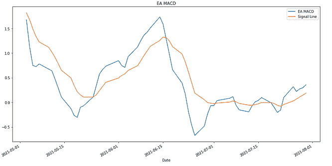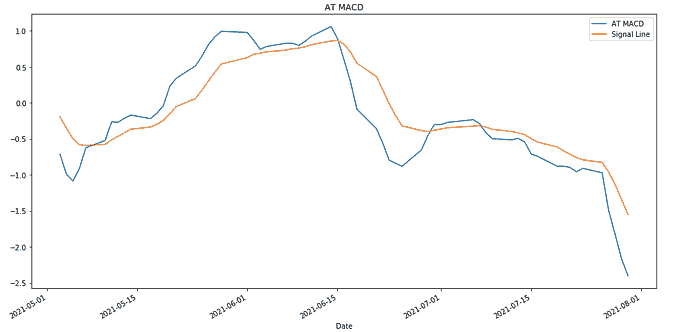

MACDs plotted against signal lines for the three stocks

有趣的是，这三只股票在这个时间段开始时都是下跌趋势，然后是看涨交叉，这三只股票都在 6 月 15 日左右出现了看跌交叉，这标志着最大的年度游戏展 E3 的结束。Take Two 的股票尤其受到打击，在该公司提交了一个关于多样性和包容性的小组委员会，同时避免宣布任何即将推出的游戏后，该公司的股票在接下来的一周内下跌了 7%。 EA 和 Take Two 以上升趋势结束了 7 月，EA [宣布体育特许经营 *Madden* 和*FIFA*终极团队的预订量](https://www.nasdaq.com/articles/1-reason-electronic-arts-is-a-screaming-buy-2021-08-11)增加，Take Two [报告 Q2 收益优于预期](https://www.businesswire.com/news/home/20210802005541/en/Take-Two-Interactive-Software-Inc.-Reports-Better-Than-Expected-Results-for-Fiscal-First-Quarter-2022)，经常性消费者支出同比增长 15%。然而，在诉讼消息浮出水面后，动视的 MACD 继续暴跌。

**退货分析:**

当然，要想知道哪只股票在一段时间内是最好的投资，我们需要看看回报率。计算回报的公式是:

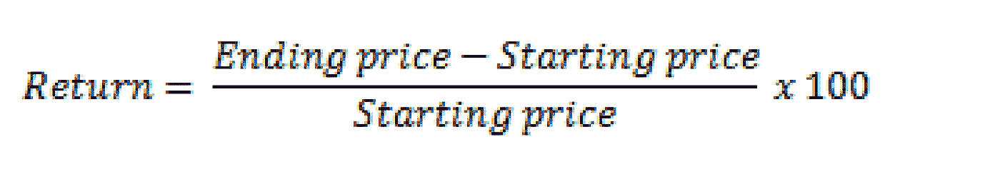

Formula for calculating returns (Source: [The Motley Fool](https://www.fool.com/knowledge-center/how-to-calculate-return-on-indices-in-a-stock-mark.aspx))

首先，我们来看看日收益率，它衡量的是股票价格从一天到第二天的百分比变化。为此，我们可以像这样使用 pandas 的 pct_change:

```
#Calculating daily return
EA_df['Returns'] = EA_df['Adj Close'].pct_change(1)
EA_df
```

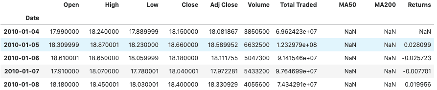

Output for EA_df (now with a “Returns” column)

为了比较股票的每日收益，我们可以使用内核密度图来显示收益的分布，我们将使用以下代码来实现:

```
#Kernel density plot/estimation to compare returns
EA_df['Returns'].plot(kind='kde',label='EA',figsize=(12,6), title = 'Daily Returns KDE')
TT_df['Returns'].plot(kind='kde',label='Take Two')
AT_df['Returns'].plot(kind='kde',label='Activision')
plt.legend()
```

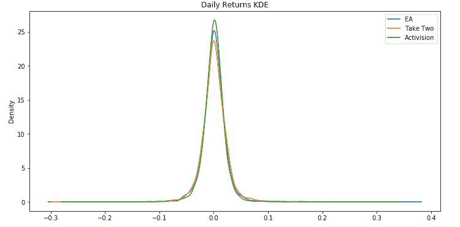

Daily Returns Kernel Density Plot

Activision 既有最高的峰值，也有最窄的分布，这意味着它在三只股票的回报中具有最高的均值和最小的波动性，而 EA 的分布最广，回报波动最大。因此，从每日回报来看，动视似乎是最有吸引力的股票。

然而，我们还想看看累积回报，即股票价格在整个时间段内的总变化，以得出更宏观的结论。在绘制回报之前，我们可以像这样使用 numpy 的 cumprod:

```
#Cumulative return calculations
EA_df['Cumulative Return'] = (1 + EA_df['Returns']).cumprod()
EA_df.head()
```

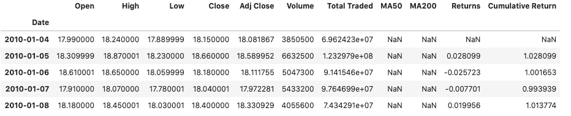

EA_df now with a “Cumulative Return” column

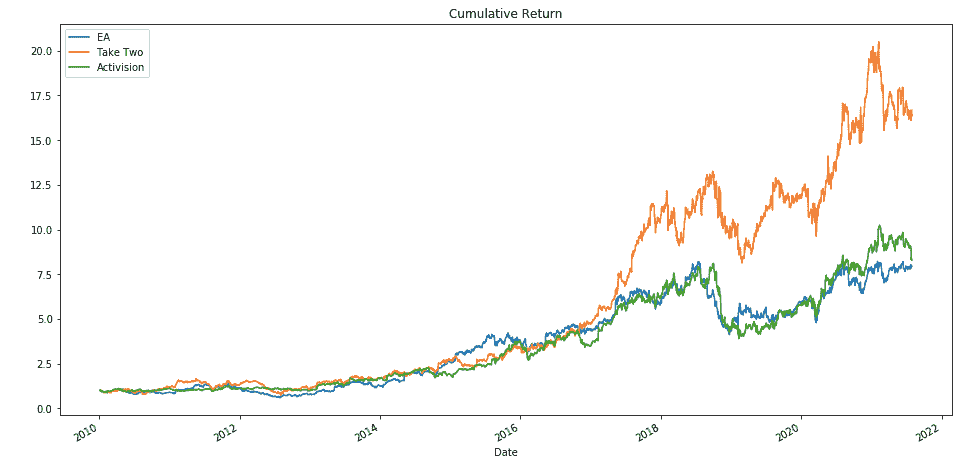

Cumulative returns plot for the three stocks

在这里，Take Two 在过去四年中的累计回报率最高，在 2017 年初左右超过了它的两个竞争对手，而 Activision 在 2020 年末超过了 EA。为什么动视，尽管是三者中最有价值的，却没有产生最高的回报？Take Two 取得了巨大的财务增长，[从 2017 年到 2020 年](https://www.forbes.com/sites/greatspeculations/2021/04/13/is-take-two-interactive-a-better-pick-over-activision-blizzard-stock/?sh=20a17db970bc)其收入增长了 72%，营业利润率增长了 351%，而同期动视的收入和营业利润率仅增长了 16%和 107%。此外， [Take Two 从 2017 年到 2021 年将研发支出增加了 165%，导致每股自由现金流大幅增加 676%](https://www.nasdaq.com/articles/1-reason-take-two-is-a-better-growth-stock-than-activision-blizzard-2021-06-16) ，而动视将研发支出增加了 63%，每股自由现金流增加了 69%。随着 Take Two 以更高的速度投资新人才，它通过更高的收入增长以及可支配现金量的更高增长，为股东创造了更好的价值。

现在我们已经计算了回报，我们可以看看相关性，看看一只股票的回报是否受到其他股票的影响。一种方法是相关矩阵:

```
#Creating a dataframe for our correlation matrix
cumulative_df = pd.concat([EA_df['Cumulative Return'], TT_df['Cumulative Return'], AT_df['Cumulative Return']], axis = 1)
cumulative_df.columns = ['EA Cum Return', 'Take Two Cum Return', 'Activision Cum Return']#Calculating correlations between cumulative returns
corrMatrix = cumulative_df.corr()
corrMatrix.style.background_gradient(cmap = 'coolwarm')
```

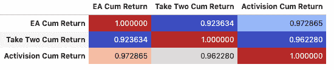

Correlation matrix for cumulative returns

所有三只股票的回报都有很强的相关性，相关性超过 0.9。有趣的是，艺电和动视的关系最密切，这可能是因为[这两家公司在 2010 年代初的销售增长方面表现相似。](https://www.fool.com/investing/general/2014/09/08/activision-blizzard-vs-ea-which-is-a-better-buy.aspx)

**关闭思路:**

尽管动视是三家公司中最有价值的(市值最高)，但 Take Two 为投资者带来的回报也最高，这可能是由于其强劲的财务增长。最近几个月，这三家公司在 E3 2021 之后都出现了下跌，而动视的价格由于 7 月份提起的性骚扰诉讼而继续暴跌。此外，EA 和 Activision 在回报方面的相关性最强，这可能是由于 2010 年代初类似的销售业绩。

因此，Python 是股票价格分析和比较的强大工具。我鼓励你利用它的库来进行你自己的分析，同时检查价格趋势背后的潜在原因的新闻来源，并且总的来说，跟上行业的发展。请查看我认为对撰写本文有帮助的资源:

1.  **何塞·波尔蒂利亚在 Udemy 上的**课程:[用于金融分析和算法交易的 Python](https://www.udemy.com/course/python-for-finance-and-trading-algorithms/)
2.  **Vincent Tatan 的**[12 分钟:Pandas 和 Scikit 的股票分析——在](https://towardsdatascience.com/in-12-minutes-stocks-analysis-with-pandas-and-scikit-learn-a8d8a7b50ee7)[中学习](https://towardsdatascience.com/)走向数据科学
3.  **卢克·波西的** [用 Python 实现 MACD](https://towardsdatascience.com/implementing-macd-in-python-cc9b2280126a)
4.  [熊猫-ta 库文档](https://technical-analysis-library-in-python.readthedocs.io/en/latest/)

谢谢大家！