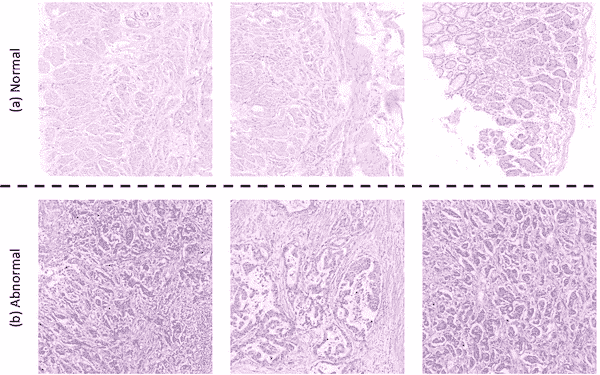
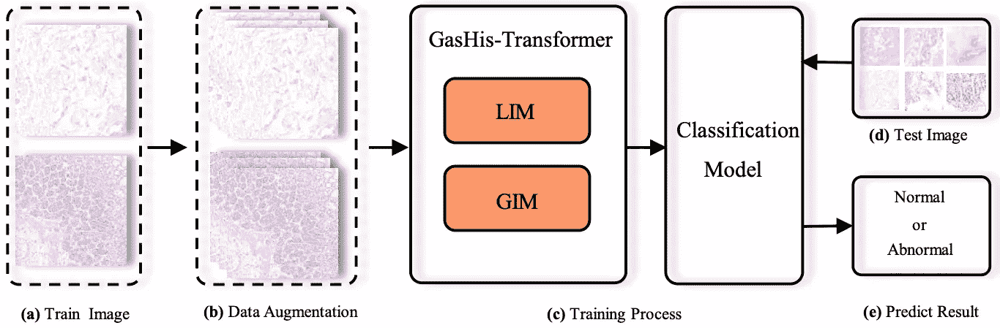
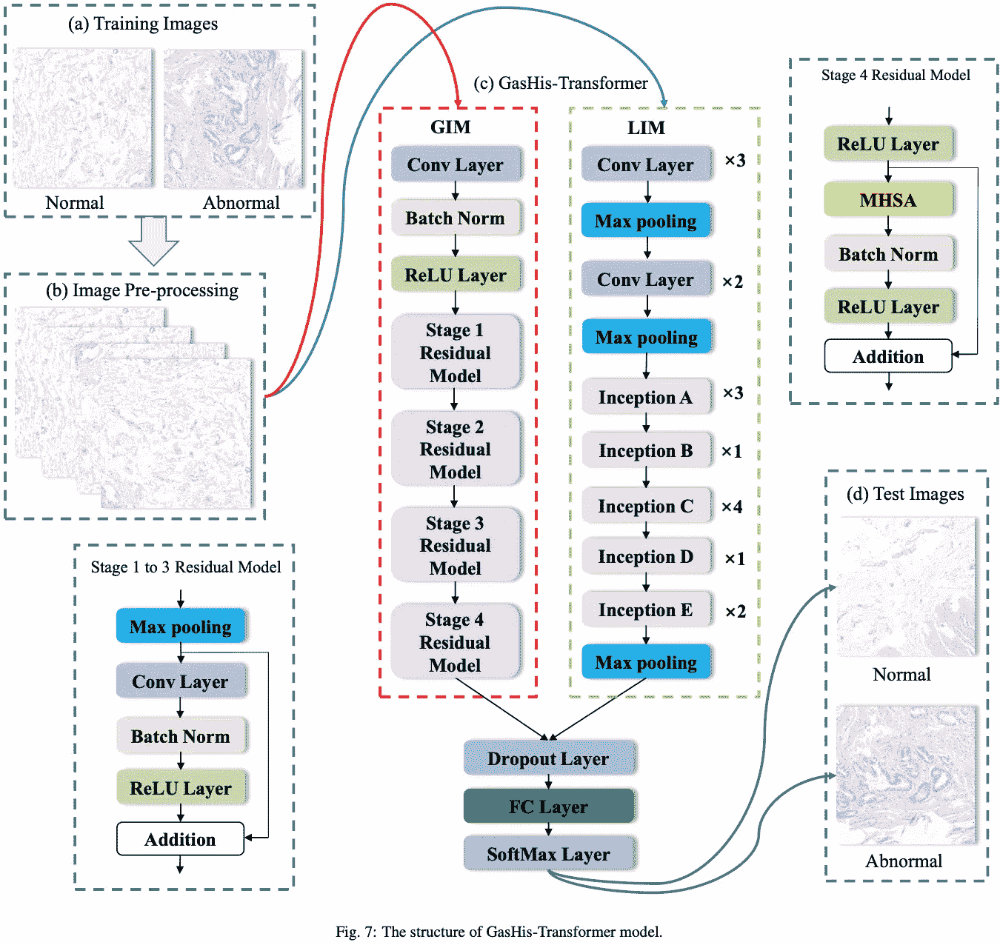
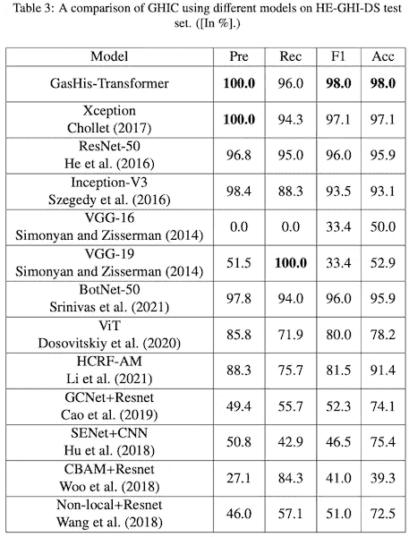
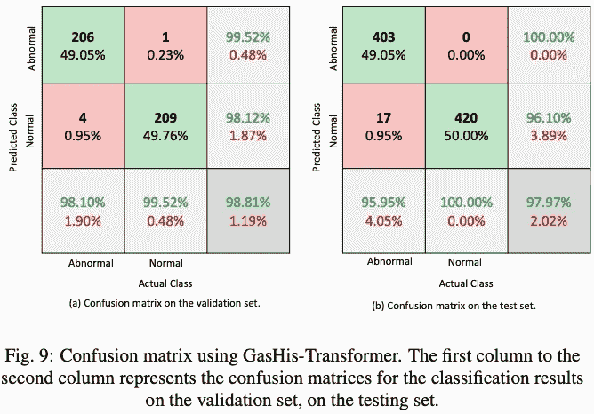

# 通过变压器、gash is-变压器的胃组织病理学图像分类

> 原文：<https://medium.com/geekculture/gastric-histopathology-image-classification-by-transformer-gashis-transformer-f8536a5e98df?source=collection_archive---------60----------------------->

## 基于 CNN 和 Transformer 融合的胃组织病理学图像分类

GasHis-Transformer 是实现胃组织病理学图像分类(GHIC)的模型，在胃癌诊断中自动将胃的显微图像分为正常和异常两种情况，如图所示。

# 要点

GasHis-Transformer 是一种多尺度图像分类模型，它结合了 Vision Transformer (ViT)和 CNN 的最佳特性，其中 ViT 适用于全局信息，CNN 适用于局部信息。

GasHis-Transformer 由两个重要模块组成，全局信息模块(GIM)和本地信息模块(LIM)，如下图所示。

GasHisTransformer 在胃组织病理学数据集的测试数据上具有较高的分类性能，估计精度、召回率、F1 值和准确度分别为 98.0%、100.0%、96.0%和 98.0%。

# 履行

GasHisTransformer 由两个模块组成:全局信息模块(GIM)和本地信息模块(LIM)。全球信息模块(GIM)基于 BoTNet-50 从胃组织病理学图像中提取全球信息。局部信息模块(LIM)基于 Inception-V3 的并行结构，以多尺度方式获取胃部组织病理学图像的局部信息。LIM 模块(Inception-V3)的输入尺寸从 299x299 更改为 224x224，以匹配 GIM 模块和 LIM 模块的特征尺寸。2048 维特征分别由 GIM 和 LIM 融合，4096 维特征通过 FC 层和 Softmax 进行胃癌诊断。

# 实验结果

从实验结果来看，非常有趣的是，他们成功地利用了两种不同网络的工作方式:擅长全球信息的 Vision Transformer (ViT)和擅长本地信息的 CNN (ResNet-50，BotNet-50)。

另外，下面的混淆矩阵说明 GasHisTransformer 的收敛和泛化能力很高，足以满足实际使用。在验证集中，206 个异常图像和 209 个正常图像被分类到正确的类别，4 个异常图像被误分类为正常(假阳性)，1 个正常图像被误分类为异常(假阴性)。在测试集中，403 个异常图像和 420 个正常图像被分类到正确的类别中。只有 17 个异常图像被误分类为正常(假阳性)，并且没有假阴性。

# 参考

【GasHis-Transformer】陈浩源。，陈力。，李晓燕。，王戈。，胡伟明。，李依馨。，刘万里。，孙昌浩。，禹东么。，岳阳腾。马尔钦·格泽戈尔泽克。, 2021.GasHis-Transformer:一种用于胃组织病理学图像分类的多尺度视觉转换器方法。arXiv 预印本 arXiv:2104.14528。

[僵尸网络] Srinivas，a .，Lin，T.Y .，Parmar，n .，Shlens，j .，Abbeel，p .，Vaswani，a .，2021。视觉识别的瓶颈变压器。arXiv 预印本 arXiv:2101.11605。

[Inception-V3]塞格迪，c .，万霍克，v .，约费，s .，施伦斯，j .，沃伊纳，z .，2016。重新思考计算机视觉的初始架构，载于:IEEE 计算机视觉和模式识别会议论文集，第 2818–2826 页。

[ViT] Dosovitskiy，a .，Beyer，l .，科列斯尼科夫，a .，Weissenborn，d .，Zhai，x .，Unterthiner，t .，Dehghani，m .，Minderer，m .，Heigold，g .，Gelly，s .，等人，2020 年。一幅图像相当于 16x16 个字:大规模图像识别的变形金刚。arXiv 预印本:2010.11929。