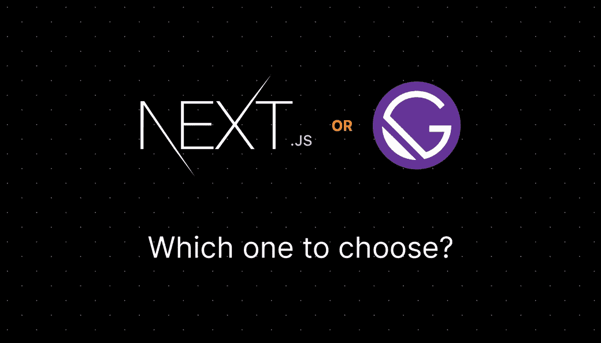

# 盖茨比还是下一个？

> 原文：<https://medium.com/geekculture/gatsby-or-next-93bee00fcb73?source=collection_archive---------1----------------------->

今年，静态网站建设者取得了压倒性的进步，这使得选择正确的系统更加困难。网络上的大多数比较都已经过时了。这就是为什么我们要重新看待盖茨比和 NextJS。利用我们在 2020 年学到的教训，做出自己的选择！

第一个 Jamify 博客的创始人是盖茨比。在 2020 年初，这似乎是一个静态网站建设者的安全赌注:一个备受好评的…