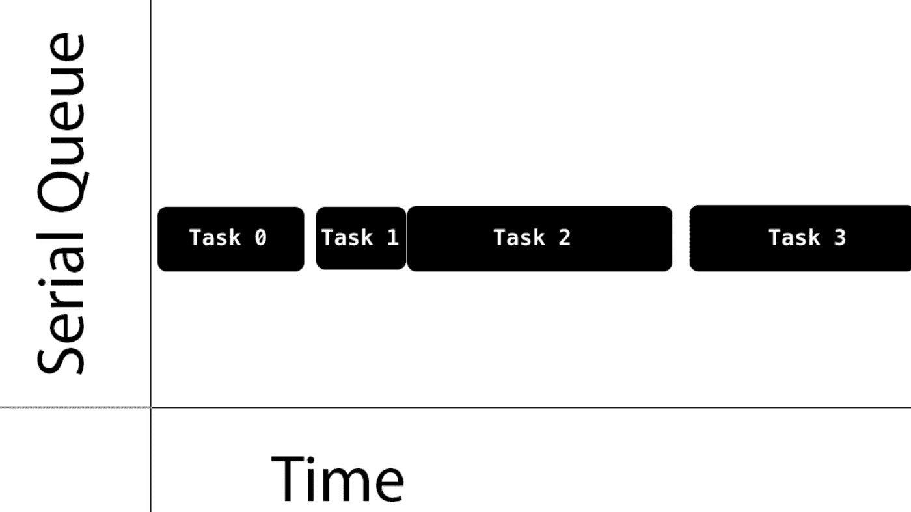
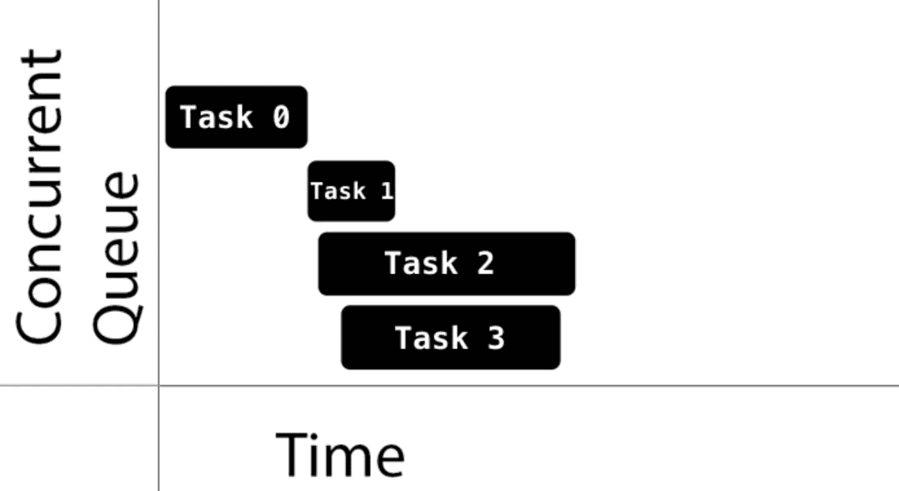

# Swift 中的 GCD(大中央调度)

> 原文：<https://medium.com/geekculture/gcd-grand-central-dispatch-in-swift-923df84e8ca5?source=collection_archive---------9----------------------->

多任务处理允许我们同时运行几个任务。**GCD(Grand Central Dispatch)**是 iOS 中实现多任务的最简单方式。我们将任务添加到调度队列中，然后在多个线程上同时执行。

每个 iOS 应用程序都有一个主线程，用来显示用户界面和监听事件。复杂的计算可能会降低主线程的速度，并冻结应用程序。这就是多线程发挥作用的地方。我们必须将所有繁重的工作转移到后台线程，然后将结果转移回主线程。这描述了与*大中央调度*的主要工作模式。

*中央调度*提供了一个*基于任务的*范例。GCD 中没有显式的线程管理，这使得编写代码时无需考虑线程。

**队列**

如前所述，GCD 通过一个名为 DispatchQueue 的类对**调度队列**进行操作。我们向这个队列提交工作单元，GCD 将按照先进先出的顺序执行它们，保证第一个提交的任务是第一个开始的任务。

调度队列是线程安全的，这意味着我们可以同时从多个线程访问它们。当我们理解分派队列如何为我们自己的代码部分提供线程安全时，GCD 的好处就显而易见了。关键是选择正确的*类*调度队列和正确的*调度函数*向队列提交工作。

队列可以是**串行**或**并发**。

**串行队列**

串行队列保证在任何给定时间只有一个任务运行。GCD 控制执行时间。我们不知道一个任务结束和下一个任务开始之间的时间

**并发队列**

并发队列允许多个任务同时运行。队列保证任务按照我们添加它们的顺序开始。任务可以以任何顺序完成，我们不知道下一个任务开始需要多长时间，也不知道在任何给定时间正在运行的任务的数量。

请注意任务 1、任务 2 和任务 3 是如何一个接一个地快速开始的。另一方面，任务 1 在任务 0 之后过了一段时间才开始。还要注意，虽然任务 3 在任务 2 之后开始，但它首先完成。

何时开始一项任务完全取决于 GCD。如果一个任务的执行时间与另一个任务重叠，则由 GCD 决定它是否应该在不同的内核上运行(如果有内核的话),或者执行上下文切换来运行不同的任务。

GCD 提供了三种主要的队列类型:

**主队列**:运行在主线程上，是一个串行队列。

**dispatch queue . main . async {**

**self . view . background color = ui color . red**

**}**

**全局队列**:整个系统共享的并发队列。有四种不同优先级的队列:高、默认、低和后台。后台优先级队列具有最低的优先级，在任何 I/O 活动中都会受到限制，以最大限度地减少对系统的负面影响。

**let global queue = dispatch queue . global()**

**globalQueue.async {**

**对于 0 中的 I..< 5 {**

**打印(" \(i)")**

**}**

**}**

**自定义队列**:您创建的队列，可以是串行的，也可以是并发的。这些队列中的请求实际上会在一个全局队列中结束。

**let concurrent queue = dispatch queue(标签:“队列名”，属性:。并发)**

**concurrentQueue.sync {**

**打印("执行并发队列")**

**}**

**let serial queue = dispatch queue(标签:“queue name”)**

**serialQueue.sync {**

**打印(“执行串行队列”)**

**}**

将任务发送到全局并发队列时，不需要直接指定优先级。相反，您可以指定服务质量(QoS)类属性。这表明了任务的重要性，并指导 GCD 确定分配给任务的优先级。

**服务质量**

有些任务比其他任务更重要，所以我们必须确保它们先被执行。我们可以通过赋予它们优先权来做到这一点。在主/ UI 线程上运行的任务总是处于高优先级，因为它们保持应用程序的响应，而在后台线程上运行的任务是最低优先级的。最终，所有的任务都完成了它们的执行，但是优先级决定了哪一个将首先完成。

*   **用户交互**:这表示为了提供良好的用户体验，必须立即完成的任务。将其用于需要低延迟的 UI 更新、事件处理和小型工作负载。在应用程序执行期间，该类中完成的总工作量应该很小。这应该在主线程上运行。
*   **用户发起的**:用户从 UI 发起这些异步任务。当用户等待即时结果和继续用户交互所需的任务时，使用它们。它们在高优先级全局队列中执行。
*   **Utility** :这代表长时间运行的任务，通常有一个用户可见的进度指示器。将其用于计算、I/O、联网、连续数据馈送和类似任务。本课程旨在节能。这将被映射到低优先级全局队列中。
*   **背景**:这代表用户没有直接意识到的任务。将其用于预取、维护和其他不需要用户交互且对时间不敏感的任务。这将被映射到后台优先级全局队列中。

**同步:**

使用 GCD，您可以同步或异步地分派任务。

任务完成后，同步函数将控制权返回给调用者。您可以通过调用 DispatchQueue.sync(execute:)来同步调度工作单元。

***func syncWith* 串行执行 *() {***

**let serial queue = dispatch queue(标签:“queue 1”)**

**serialQueue.sync {**

**对于指数在 0..< 5 {**

**print("⚪️”，索引)**

**}**

**}**

**serialQueue.sync {**

**为指数在 0..< 5 {**

**打印(“🔷"，索引)**

**}**

**}**

***}***

**输出:**

**⚪️ 0**

**⚪️ 1**

**⚪️ 2**

**⚪️ 3**

**⚪️ 4**

**🔷0**

**🔷1**

**🔷2**

**🔷3**

**🔷4**

***func syncWith* 并发执行 *() {***

**let concurrent queue = dispatch queue(标签:“queue1”，属性:。并发)**

**concurrentQueue.sync {**

**对于指数在 0..< 5 {**

**print("⚪️”，索引)**

**}**

**}**

**concurrentQueue.sync {**

**对于指数在 0..< 5 {**

**打印(“🔷"，索引)**

**}**

**}**

**T91)}**

**输出:**

**⚪️ 0**

**⚪️ 1**

**⚪️ 2**

**⚪️ 3**

**⚪️ 4**

**🔷0**

**🔷1**

**🔷2**

**🔷3**

**🔷4**

**异步**

一个*异步*函数立即返回，命令任务开始，但不等待它完成。因此，异步函数不会阻止当前执行线程继续执行下一个函数。您可以通过调用 DispatchQueue.async(execute:)来异步调度工作单元。

***func async with*serial execution*(){***

**let serial queue = dispatch queue(标签:“queue 1”)**

**serialQueue.async {**

**对于指数在 0..< 5 {**

**print("⚪️”，索引)**

**}**

**}**

**serialQueue.async {**

**为指数在 0..< 5 {**

**打印(“🔷"，索引)**

**}**

**}**

**}**

**输出:**

**⚪️ 1**

**⚪️ 2**

**⚪️ 3**

**⚪️ 4**

**🔷0**

**🔷1**

**🔷2**

**🔷3**

**🔷4**

***func asyncWith* 并发执行 *() {***

**let concurrent queue = dispatch queue(标签:“queue1”，属性:。并发)**

**concurrentQueue.async {**

**对于指数在 0..< 5 {**

**print("⚪️”，索引)**

**}**

**}**

**concurrentQueue.async {**

**对于指数在 0..< 5 {**

**打印(“🔷"，索引)**

**}**

**}**

**打印(" GameOver")**

**}**

**输出:**

**⚪️ 0**

**🔷0**

**⚪️ 1**

**🔷1**

**⚪️ 2**

**🔷2**

**⚪️ 3**

**🔷3**

**🔷4**

**⚪️ 4**

**延迟执行**

有时延迟代码的执行是必要的。GCD 允许我们通过使用一种特殊的方法*来做同样的事情。asyncAfter* ***。*** 我们需要设置我们想要延迟执行的时间量。

**func delayed execution(){**

**let queue = dispatch queue(label:" com . gcd . simple queue ")**

**let delaydinteraval = dispatchtimeinterval . seconds(5)**

**打印(日期())**

**//延时 5 秒后执行**

queue.asyncAfter(截止日期:。now()+delaydinteraval){

**打印(日期())**

**}**

**}**

**输出:**

**2021–09–04 19:39:02+0000**

**2021–09–04 19:39:07+0000**

**DispatchWorkItem**

DispatchWorkItem 只不过是我们可以在任何队列中执行的代码块。我们可以创建一个工作项来执行，而不是编写一个代码块。

**let dispatch work item = dispatch work item {**

**打印(“工作项已执行”)**

**}**

我们可以通过调用*来执行 dispatchWorkItem。对其执行()*方法。*。perform()* 将在当前线程上执行工作项。

**dispatch work item . perform()**

或者我们可以将它添加到队列中执行。

**DispatchQueue.global()。异步(执行:dispatchWorkItem)**

***快乐编码……***