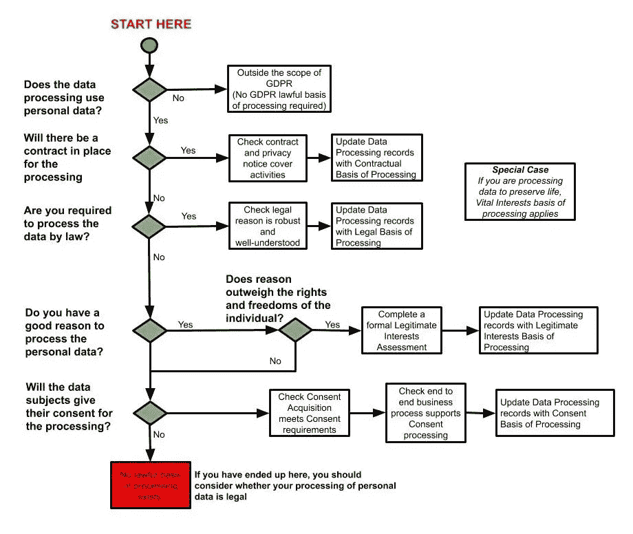

# GDPR 基本事实—处理依据

> 原文：<https://medium.com/geekculture/gdpr-the-basic-facts-basis-of-processing-a7a024b6f0c4?source=collection_archive---------74----------------------->

这一电子书章节来自我创建的一个完整的 GDPR 课程，该课程已经有超过 11，000 名学生注册。我认为在媒体上提供一个版本会很有用。数据保护法可能很复杂，电子书不能确保涵盖您组织的情况，因此，如果您在处理个人数据时有任何疑问，请务必寻求专业建议。

*在本章中，我将介绍处理个人数据的合法理由。*

GDPR 基于一个基本理念，即任何涉及使用个人数据的组织都必须有合法的基础来处理其开展的每项活动。这意味着一个组织处理数据的理由必须是合法的。

该条例界定了可用的合法处理基础。任何使用个人数据的处理活动必须属于法规允许的类别之一。这些类别中的每一个都被称为“加工基础”。

在进行加工之前，必须了解加工的基础。在进行处理之前，应将其传达给个人，通常作为公平处理隐私声明的一部分。组织不能“匆忙”决定处理的基础，因为这表明事先不了解处理的基础。

任何处理属于欧盟公民的个人数据的组织都需要考虑三个问题；

1.正在处理哪些个人数据？

2.为什么要处理个人数据？

3.适用哪种合法的处理依据？

最后一个问题是最基本的，组织知道他们为什么处理个人数据是不够的，他们还必须确定这些原因有合法的基础。

在处理之前必须考虑这些问题，并记录结果。在本书中，期望看到更多关于需要记录决策的参考；这有助于满足问责要求。

在我们解释这些基础的含义之前，重要的是要注意，有一个称为特殊类别个人数据的个人数据子集，其中包括诸如某人健康状况的详细信息。除非该组织属于豁免范围，否则不能处理这些数据。我们稍后将讨论这一点。

# 合法的理由是什么？

GDPR 定义了六种不同的处理基础，可用于显示数据处理的合法性。

合法的

合同的

合法利益

同意

切身利益

公共任务

这些都是处理个人数据的正当理由。对于组织执行的每种类型的个人数据处理，它必须选择最合适的基础。没有更好的基础，一个并不比另一个更好；这完全取决于组织正在处理什么数据以及处理的原因。

处理个人数据需要合法依据的要求并不新鲜。在英国，它取代并反映了以前的要求，以满足 1998 年数据保护法中的“处理条件”之一。然而，GDPR 更强调对你的合法处理基础负责和透明。

责任原则要求您能够证明您遵守了 GDPR，并拥有适当的数据处理治理。这意味着您需要能够表明您已经适当考虑了适用于每个处理目的的合法依据，并且能够证明您的决定是合理的。

组织的每一项处理活动都必须包含一个或多个处理原因。如果您负责该任务，您将需要审查您现有的处理和任何计划的新处理，确定最合适的合法依据，并检查其是否适用。在许多情况下，它可能与现有的加工条件相同。

如果没有合法依据适用于您的处理，您的处理将是不合法的，并违反了第一个原则。个人也有权删除被非法处理的个人数据。

为了选择正确的处理基础，理解每个基础的用途是很重要的，所以让我们更详细地研究它们。

**法律**

这些数据用于履行组织根据法律承担的义务。例如，在英国，健康和安全法规要求必须保存事故记录，从而为处理提供了法律依据。

**合同约定**

该数据用于履行个人已经签订的合同。例如，当客户在线购买商品时，卖方必须处理客户的个人数据，以便将商品交付给他们。

**合法利益**

数据用于组织的利益，这种利益是合理的。例如，一个仓库可能会记录人们经过其装货区的闭路电视图像。仓库的所有者可以证明他们的数据收集(包括可识别的雇员和供应商的图像)是一种犯罪预防措施，并且可以记录处理的合法利益基础。处理的合法利益基础是人们可能会对组织决策的合法性提出质疑的领域。每个合法利益决策必须平衡组织的权利和数据主体的权利，并且该决策必须记录在案。对处理基础的任何质疑都应检查平衡练习是否已正确执行。

**同意**

可以处理数据，因为数据主体已经同意进行处理。社交媒体平台是在数据主体许可下处理个人数据的组织的一个很好的例子。处理的同意基础伴随着对组织的额外义务和对数据主体的额外保护。

GDPR 提高了构成“适当”同意的标准，确保同意是在数据主体完全知情的情况下自由作出的。这意味着，如果寻求同意，组织过去使用的某些常见做法，如选择退出框，将不再被允许。

**切身利益**

为了保护生命，必须对数据进行处理。例如，可能需要为某个正在接受医疗急救的人处理个人数据。在这种情况下，这些条例并不意味着成为保护生命这一压倒一切的需要的障碍。

**公共任务**

一些组织有义务处理数据，以便在公共生活中履行其分配角色。警察是一个很好的例子，说明一个组织必须处理数据才能履行职责。

# “必要加工”的要求

加工的许多合法基础取决于加工对其合法性是“必要的”。在依靠“正当利益”的时候当然是这样。这并不意味着处理总是必不可少的。然而，它必须是实现目标的有针对性和相称的方式。

如果你可以通过一些其他侵入性较小的手段合理地达到目的，则法律依据将不适用。例如，您可以通过在年度大会上向所有客户散发传单来实现营销目标，而不是持有单独的营销数据库并邮寄传单。

测试是这个过程是否是所述目的的必要部分，*而不是它是否是你为追求那个目的所选择的方法*的必要部分。因此，记录为什么它是必要的，而不是简单地理解它或假设它，是实现法规遵从性的重要一步。

回答以下问题将有助于您确定您的处理是否必要；

你是否已经确定了你的加工目的是什么，你想要达到什么？

您是否检查过该处理对于相关目的是必要的，并且确信没有其他合理的方式来实现该目的？

你是否考虑过是否可以选择处理这些数据？这对于评估你是否有一个或多个选择作为处理的基础是很重要的。

# 如何选择合适的加工基础

确定适用哪种法律依据取决于处理的具体目的和背景。你应该考虑哪种法律依据最适合这种情况。如前所述，不应将任何基础视为总是比其他基础更好、更安全或更重要，在 GDPR 的清单中也没有优先顺序。英国信息专员已经明确表示，没有哪种处理基础比其他基础更好，组织可以自由使用任何合适的基础。在现实中，合同、法律、公共任务和重大利益处理是最容易确定的。当查看这些活动时，很明显它们属于这些处理选项的基础。

这一点很重要，因为媒体对“同意”的必要性进行了大量报道，人们开始认为这是最重要的处理基础。

在 GDPR 体制下，每个企业在处理个人数据之前都应该考虑这些原则。把它当作决策过程的一部分。显然，绝大多数通过 GDPR 合规部工作的人可能已经在处理个人数据了。在这种情况下，作为建立合规头寸的一部分，现有处理应接受相同的分析。

无论您即将处理个人数据还是已经在处理数据(无论是根据旧的数据保护法还是根据新的制度)，后退一步，考虑如果您第一次处理数据，您将如何遵守这些原则，这仍然是一个好主意。这个思考过程可以帮助你对你的处理过程所包含的风险有一个清晰的认识。

当一个组织在考虑他们活动的处理基础时，选择最适合活动的选项是很重要的。当不存在法律义务时，他们选择法律义务作为处理的合法基础是没有意义的。

我们来举个例子；如果一个组织处理个人数据是为了履行合同，也许是为了履行客户的订单，那么他们可以合理地假设他们是在处理合同的基础上处理的，前提是他们处理的数据不会超过履行合同所需的数据。

如果处理的基础似乎都不适合该活动，则组织应考虑该处理是否通过合法利益测试，或者它正在进行的处理活动是否合法。

您可能会认为不止一个基础适用，在这种情况下，您应该从一开始就确定并记录所有的基础，但您不能采用“一刀切”的方法。

以下流程可以帮助您确定适当的处理基础。请将此视为对充分理解的处理进行分类的“浏览”方式。完成这些问题通常会让您对处理活动有一个清晰的了解。

***图 1 —处理基础就绪计算器***

如果您有难以分类的处理，我们建议您咨询 ICO 网站及其指导问卷，这将帮助您缩小适当的处理基础。

# 记录你的处理基础

为了满足记录您的加工基础的要求，您需要记录您进行的每个加工活动所依赖的基础。您还应该记录您认为该基准适用的理由或原因。**您有责任确保您能够证明哪种合法依据适用于特定的处理目的。**

没有记录这个的标准形式。您只需要确保您记录的内容足以证明适用合法依据。伴随任何证据的简单叙述可能是合适的。如果你使用了 ICO 处理交互式问卷的基础，那么结果将成为一个很好的证据！

正如在关于处理记录的部分中提到的，您的处理记录或数据资产寄存器是保存这些信息的逻辑位置。记录这些信息将有助于您履行责任义务，也有助于您撰写隐私声明。

这里有很重要的一点。您的处理记录和您给数据主体的隐私声明必须同步，否则您将被指控在处理数据主体时不透明。通过将相关信息保存在一个位置，您可能会降低意外引入差异的风险。

如前所述，GDPR 对处理记录的格式没有具体要求，但对大多数组织来说，某种电子记录是最好的方法。虽然许多供应商已经将特定的工具推向市场，但是对于大多数组织来说，像电子表格这样的东西就已经足够了。

如果您使用标准的 office 产品来创建和存储处理记录，您应该确保对这些重要的法规记录进行适当的版本控制和保护。您应该确保保留备份，以防原件损坏或丢失。

# 告诉你的数据对象

一旦您确定并记录了您的处理依据，您必须告知数据主体您处理其个人数据的合法依据。如果这是现有的处理，应在 2018 年 5 月 25 日之前传达给个人，并且您应确保该信息包含在所有当前和未来的隐私声明中。

根据问责制原则，应保留处理决定的法律依据的书面记录。这将有助于创建隐私声明，并在处理的合法基础受到质疑时作为参考点。

如果您没有从处理开始就清楚地确定适当的合法处理依据，您将违反 GDPR。

如果您未能在 5 月 25 日 GDPR 实施之前向您的数据主体提供适当的隐私信息，那么这将使您违反法规，最佳行动方案是通过创建合规的隐私声明来尽快补救违反行为。这应该提供给你处理个人数据的所有人。

# 其他需要考虑的事情

处理选项的不同基础可能要求您考虑处理的各个方面。不同的因素可能适用于您的合法利益或同意下的处理，所以让我们具体看看你可能需要考虑的一些事情。

**合法利益**

你知道你的处理过程对谁有利吗(如果依赖合法利益并平衡你和个人的利益，这一点很重要)？

你是否考虑过个人是否期望这一过程发生？例如，咖啡店里的顾客会希望他们站在柜台前时被拍照吗？

你和个人是什么关系？一个客户可能期望处理发生，一个完全陌生的人可能不会。

您知道处理对个人的影响吗(对于合法利益处理，对个人的影响不得超过您组织的合法利益)？

您是否已确定某些个人是否可能反对处理(如果是，合法利益可能不是处理的适当基础)？

您是否能够根据请求随时停止处理(这对于依赖合法利益以及向数据主体提供增强权利的能力可能很重要)？

**同意**

你是否考虑过你是否处于对个人的权力地位(如果是这样，同意可能不合适，因为人们可能觉得有义务给予同意，违反了“自由给予”的要素)？例如，征求员工的同意可能是人为的，因为他们可能会觉得如果他们不合作，他们未来的职业生涯可能会受到威胁。

您是否已确定该个人是否易受攻击(可能很难获得易受攻击个人的同意)？例如，有学习困难的人是否足够理解你在问什么？

您是否能够根据请求随时停止处理(如果您依赖同意，这可能很重要，因为同意可以随时撤销)？

请记住，完全有可能不止一个基础适用于“适合”您的处理活动的处理；如果是这种情况，那么你应该从一开始就明确这一点。

# 改变你选择的加工基础

你必须小心选择正确的基础，因为解除一个错误的决定可能会很尴尬。这样做的原因是，追溯性地改变法律依据可能对个人不公平，并导致违反问责制和透明度要求，因为数据主体可能允许您在错误的借口下处理他们的个人数据。

一旦 GDPR 生效，如果你做错了，如果你发现你原来的基础是无效的，在合法基础之间转换将比在数据保护法案下更难。如果对个人没有损害，送达更新的隐私声明可能就足够了，但是如果有任何确定的损害，您可能需要考虑寻求新的协议来执行数据处理。

也就是说，一旦加工开始，有时可能需要调整你的加工基础。如果情况发生了真正的变化，或者您有了新的、意想不到的目的，这意味着有充分的理由审查您的合法依据并做出更改，您需要通知个人并提供更新您的隐私声明。您还应该记录变更以及变更变得必要的原因。

一般来说，如果您对现有数据有新的目的，并且如果新的目的不同于原始目的，将是意想不到的或者将对个人产生不合理的影响，那么它不太可能与您收集数据的原始目的相一致。在这种情况下，您需要确定并记录新的合法依据，以便为新的目的处理数据。您还需要考虑新流程是否公平透明，并确保向个人提供有关新目的的信息。这是一些公司，尤其是初创公司，如果改变商业模式或寻求进一步的收入来源，可能会陷入困境的领域。

例如，如果您出于提供网上银行服务的目的从个人处收集个人数据，则不适合向客户销售管道供应品，因为这是一个完全不同的目的，具有不同的法律处理基础。

但是，您可能希望使用他们的数据进行研究，以改进网上银行产品，如果他们在注册服务时没有向他们解释这一点，那么在他们下次使用该服务时，只需提供进一步的处理通知，以确认将进行产品改进研究，并确认他们同意使用该服务。

# 特殊个人数据的处理基础

某些被认为比较敏感的个人数据受到 GDPR 的特别保护。想象一下，这类数据被称为“特殊个人数据”。它类似于旧的英国数据保护法中的“敏感个人数据”的概念。

作为一般规则，该条例禁止处理“特殊个人数据”，除非该组织的活动属于允许进行处理的豁免范围。

个人数据的特殊类别如下:

种族和民族血统

政治、宗教和工会成员等从属信息

识别标记，如遗传学和生物统计学

健康信息、性活动和性取向

除非组织符合 GDPR 或英国《数据法案》的豁免条件，否则明确禁止这些类别中的任何处理。

对大多数组织来说，处理“特殊个人数据”最有可能适用的豁免是:

明确同意的处理

遵循雇佣义务的处理

因为这个人已经公开了数据

完成从事犯罪预防活动的职责，例如防止欺诈

组织不应处理任何特殊类别的数据，除非他们有明确的证据表明豁免适用于他们的特殊情况。如果您处理特殊的个人数据，您可能需要寻求专家的建议，因为非法处理这些数据的处罚可能会比处理其他类型的数据更重。

如果你喜欢看这样的故事，并且想支持我成为一名作家，考虑注册成为一名媒体会员。一个月 5 美元，你可以无限制地阅读《灵媒故事》。如果你用我的 [*链接*](https://absorb.medium.com/membership) *注册，我会赚一小笔佣金。*

这是这本书其余部分的链接。

[第 1 章—前言和简介](https://absorb.medium.com/gdpr-the-basic-facts-preface-and-introduction-a3ea0402e465)

[第二章— GDPR 处理原则](https://absorb.medium.com/gdpr-the-basic-facts-gdpr-processing-principles-9774b80a0791)

[第 3 章—处理基础](https://absorb.medium.com/gdpr-the-basic-facts-basis-of-processing-a7a024b6f0c4)

[第 4 章—增强的权利](https://absorb.medium.com/gdpr-the-basic-facts-enhanced-rights-f2f29c96d3b6)

[第 5 章—数据泄露](https://absorb.medium.com/gdpr-the-basic-facts-data-breaches-4d610b78ae22)

[第 6 章——隐私设计](https://absorb.medium.com/gdpr-the-basic-facts-privacy-by-design-56551e7b1d3d)

[第 7 章—数据保护官](https://absorb.medium.com/gdpr-the-basic-facts-data-protection-officers-6fc483594bfa)