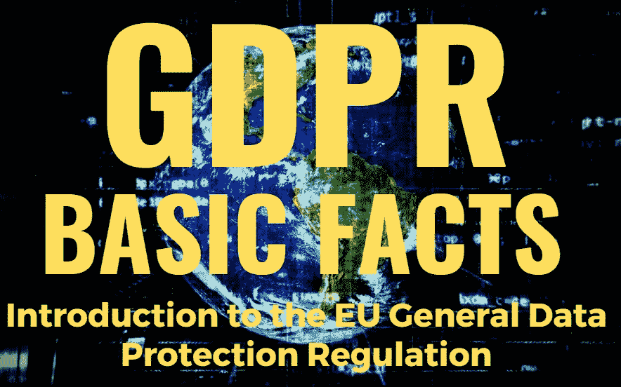

# GDPR 基本事实— GDPR 处理原则

> 原文：<https://medium.com/geekculture/gdpr-the-basic-facts-gdpr-processing-principles-9774b80a0791?source=collection_archive---------65----------------------->

这本电子书源自我创建的一门完整的 GDPR 课程，该课程已有超过 11，000 名学生注册。我认为在媒体上提供一个版本会很有用。数据保护法可能很复杂，电子书不能确保涵盖您组织的情况，因此，如果您在处理个人数据时有任何疑问，请务必寻求专业建议。

*在这一章中，我将介绍处理个人数据的方式。*

数据保护法传统上确立了管理所有个人数据处理的核心原则；GDPR 对此也不例外。在本节中，我们将介绍支撑法律的 GDPR 数据原则。如果你熟悉英国数据保护法案的旧版本，你可能已经熟悉这些概念的大部分，因为 GDPR 原则大体上是相同的。

这些原则决定了应该如何处理数据。为了合规地处理个人数据，组织必须证明他们遵守了这些原则。一个例外是责任原则，因为这涉及处理组织的行为，而不是处理活动本身。

## 那么，原理是什么呢？

GDPR 核心原则如下:

合法、公平、透明

目的限制

数据最小化

准确(性)

存储限制

完整性和保密性

除了核心原则之外，还有一个全新的“责任”原则，这意味着如果组织处理个人数据，他们必须能够证明他们遵守了法规。这意味着重点是**所有**数据用户理解他们的流程，并有足够的政策、程序和支持文件来表明他们理解并遵守法规。这同样适用于数据处理器和数据控制器。

原则是正确的最重要的一点；如果你按照这些去做，那么你就不会错得太多，所以我们会更详细地看看这些。

## 合法、公平、透明

必须以合法、公平和透明的方式处理数据。你必须开诚布公地说明你收集了哪些数据，为什么要处理这些数据，以及这些数据与法律有何关联。您必须向其数据正在被处理的人传达您的合法处理依据。

透明度是通过让个人了解信息来实现的，这应该在收集数据和进行任何后续更改之前完成。《GDPR》要求数据控制者以简明、透明和可理解的方式向数据主体提供有关个人数据处理的信息，并使用清晰明了的语言使其易于获取。

重要的是要记住，数据并不总是直接从个人那里收集，而是可能从其他人那里收集，从其他数据集导出，通过跟踪观察或使用算法创建。GDPR 有一份必须提供给个人的强制性信息清单，其中包括直接从个人处获得的数据，也包括间接获得的数据。你如何让人们知道你在做什么取决于沟通的方法和目标受众。

英国信息专员办公室(ICO)制定了“[隐私声明、透明度和控制行为准则](https://ico.org.uk/for-organisations/guide-to-data-protection/privacy-notices-transparency-and-control/)”，可以帮助准备符合 GDPR 的声明。ICO 建议创建目标受众易于理解和使用的宣传材料。他们建议你利用诸如信息分层、引导用户到“隐私仪表板”、使用弹出窗口、勾选框和“及时”通知或图标等技术来突出特殊问题。每次访问新网站时，弹出通知都会打断您，并警告您有关数据收集和互联网 cookies，这是“及时”隐私通知的一个很好的例子。

一般来说，您对数据的使用越不寻常，或者对个人的风险越大，您就越有义务努力让数据主体注意到您的活动。

## 目的限制

组织必须仅将个人数据用于收集目的，不得用于其他未申报的目的。

这意味着，只有在您坚持收集数据的最初目的的情况下，才允许处理个人数据。以后“用于其他目的”的处理需要进一步的法律许可或同意。这一要求的唯一例外是“其他目的”与最初目的“兼容”。

审查是否允许额外目的将包括以下因素，如与原始目的的明确联系、收集个人数据的背景、个人数据的性质、计划对数据主体进行进一步处理的可能后果以及是否存在适当的保护措施。

美国最近的一个例子是，一项服务允许公众上传照片进行存储和共享，然后使用这些图像来训练人工智能面部识别系统，这项服务的用户似乎对额外的使用感到惊讶。在这种情况下，如果该公司为欧盟公民处理数据，该公司发布的隐私声明可能不符合 GDPR 目的限制原则(和透明度要求)，可能会受到质疑。

## 数据最小化

组织收集的任何个人数据必须与处理相关，并且仅限于处理所必需的数据。

组织必须确保只处理为特定目的所必需的个人数据。这意味着收集的个人数据的数量、处理的范围以及存储和使用的时间必须是该组织声明的目的所需的最低限度。根据《GDPR 》,数据必须“充分、相关，并且仅限于与处理数据的目的相关的必要内容”。这一原则也与目的限制原则相关联。

组织不仅必须将他们收集的数据限制在需要的范围内，还必须确保他们收集了足够的数据来实现他们的目标。这里的理由是，如果你没有收集到足够的数据来实现你的目的，那么你持有的数据就变得毫无用处，你可能会无缘无故地持有个人数据；这显然不符合数据最小化原则。

数据最小化原则旨在通过限制收集的个人数据量来最小化数据主体的风险；丢失有限数量的数据最好是丢失更广泛的数据集。

## 准确(性)

组织必须保持个人数据最新，并在必要时进行维护。不准确的数据必须纠正、停止使用或删除。

不准确的数据会给数据主体的权利带来风险，因为可能会出现不正确的决策和结果。准确性原则在很大程度上与 GDPR 之前的现有数据保护法没有变化。数据控制者需要采取“每一个合理的步骤”来遵守这一原则。

# 存储限制

## 个人数据的存储时间不得超过必要的时间。

一旦您不再需要用于收集目的的个人数据，就不再有合法的处理基础。在这种情况下，数据应该被删除、匿名化或不再使用。这意味着应该有一个定期的审查过程，定期的“内务”过程来清理数据库。

当您不再需要这些数据时，应该将其删除。许多组织为其各种数据类型预定义了保留策略，以帮助定义何时可以删除数据。组织需要确保他们了解数据应该保留多长时间。例如，可能需要在合同期间保留数据，然后在遇到法律挑战时保留更长时间；在这种情况下，组织保留数据更长时间是合法的，因为存在合法的处理基础。

## 完整性和保密性

组织处理个人数据的方式必须确保数据保密，防止非法访问，并防止恶意或意外手段造成的数据丢失或损坏。

根据 GDPR，必须使用适当的“组织和技术措施”来保护个人数据。这涉及到保护个人隐私的核心问题。这意味着数据控制者和处理者都必须评估其数据处理(或建议的数据处理)带来的风险，然后在考虑这些风险的情况下为相关数据实施适当的安全措施，最重要的是，定期检查这些措施是否保持最新且有效。

这一原则旨在为组织创造一种义务，即采取一切必要措施保护个人数据免遭丢失或未经授权的披露。

## 原则是什么？

GDPR 原则是组织应该努力遵循的基本标准。它们作为比较一个组织活动的准则。除了概述这些原则，GDPR 还增加了一项要求，要求组织证明其合规性，从而标志着保护个人个人数据的方法发生了根本性转变。

## 问责制原则

GDPR 的责任原则要求数据控制者证明他们遵守 GDPR 原则。该条例明确规定，每个数据控制者都有责任无一例外地证明他们的合规性。

这意味着，除了遵守法规中的数据保护原则和规则之外，您还必须能够通过维护适当的文档来表明您已经遵守了这些原则和规则。把这看作是在考试中“展示你的工作”的要求！

在本课程中，我们将介绍一些您可能用来证明合规性的文档(如处理记录和内部流程手册)。这一点很重要，因为如果没有一个适当的责任结构，你是否以正确的方式处理就没有意义；如果你受到审查，你必须能够证明你的合规性。

值得注意的是，根据旧的《1998 年英国数据保护法》,数据原则是相似的，但在应用时不需要能够证明合规性。每个处理个人个人数据的组织都必须遵守该法案的要求，以确保数据的安全和个人数据的公平使用。

这条法律大部分是在数字时代之前制定的，当时数据处理正朝着更加计算机化并最终走向在线活动的方向发展。组织可以通过提供隐私通知来遵守法律，确保人们可以行使他们的权利，并保护他们的数据安全，而无需演示如何做到这一点。一般来说，一个组织只需要证明它的合规性，如果它真的被调查数据违规。

如果你喜欢看这样的故事，并且想支持我成为一名作家，考虑注册成为一名媒体会员。一个月 5 美元，你可以无限制地阅读《灵媒故事》。如果你用我的 [*链接*](https://absorb.medium.com/membership) *注册，我会赚一小笔佣金。*

这是这本书其余部分的链接。

[第 1 章—前言和简介](https://absorb.medium.com/gdpr-the-basic-facts-preface-and-introduction-a3ea0402e465)

[第二章— GDPR 处理原则](https://absorb.medium.com/gdpr-the-basic-facts-gdpr-processing-principles-9774b80a0791)

[第 3 章—处理基础](https://absorb.medium.com/gdpr-the-basic-facts-basis-of-processing-a7a024b6f0c4)

[第 4 章—增强的权利](https://absorb.medium.com/gdpr-the-basic-facts-enhanced-rights-f2f29c96d3b6)

[第 5 章—数据泄露](https://absorb.medium.com/gdpr-the-basic-facts-data-breaches-4d610b78ae22)

[第 6 章——隐私设计](https://absorb.medium.com/gdpr-the-basic-facts-privacy-by-design-56551e7b1d3d)

[第 7 章—数据保护官员](https://absorb.medium.com/gdpr-the-basic-facts-data-protection-officers-6fc483594bfa)