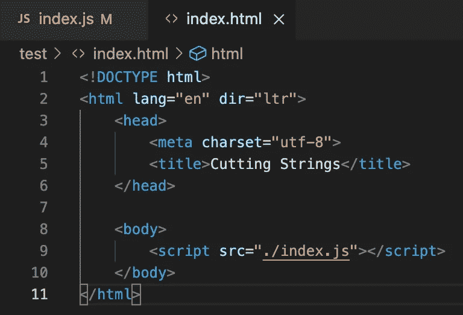
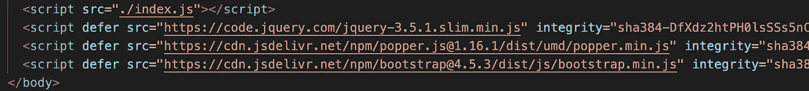

# 通用编码和脚本

> 原文：<https://medium.com/geekculture/general-coding-scripting-2c83f70890dd?source=collection_archive---------38----------------------->

Photo by [Markus Winkler](https://unsplash.com/@markuswinkler?utm_source=medium&utm_medium=referral) on [Unsplash](https://unsplash.com?utm_source=medium&utm_medium=referral)

一些软件工程师/开发人员的工作描述将“脚本”知识列为一项要求。那到底是什么意思？我可以推断出脚本意味着写一些东西，在这个上下文中，代码。但是什么样的代码呢？

我唯一一次看到“脚本”出现在我的编码项目中是在 HTML 文件的中，以包含其他源(如 JavaScript 文件或引导程序)。

<script> in the <body>

<script> and bootstrap sources in <body>

我想，我也可以承认‘Script’是 JavaScript 和 TypeScript 名称的一部分。意义何在？

## 工作描述示例

请记住，我主要关注的是软件工程师和前端开发角色。脚本超越了这一点，成为 DevOps 工程师、质量保证工程师等等。

* **bash 脚本**

* **脚本语言**——比如 Ruby/Ruby on Rails/Java

*了解一种或多种**脚本语言**(例如，Shell、Bash、Perl、Python、JavaScript 或 Ruby)

*熟悉**基于 Linux 的 shell 脚本和 CLI**

*使用**自动化脚本工具(如‘gulp’**)的经验，利用 NPM 或 Yarn、Node.js 和其他现代开发技术构建自动化开发流程

*成熟的**外壳脚本** (Windows 和/或 Linux)

*精通**客户端脚本**和 JavaScript (ES6)

*有编写 Python 或 Ruby 等脚本语言的经验(Ruby 或 Clojure 优先)

所以，它绝对是语言的一个范畴。这与基于 Windows/Linux 的 shell 脚本相同吗？还有自动化的脚本工具。嗯…

## 脚本与非脚本

> “脚本语言是一种被解释的编程语言。当代码运行时，它被翻译成机器代码，而不是事先。脚本语言通常用于完整计算机程序的简短脚本。JavaScript、Python 和 Ruby 都是脚本语言的例子。”—金伯利·福赛思@ [职业因缘](https://careerkarma.com/blog/what-is-a-scripting-language/)

所有的脚本语言都是编程语言。

但是，并不是所有的编程语言都是脚本语言。

脚本语言在代码运行时被解释。

非脚本语言被编译成可执行的机器代码(二进制)。

脚本语言的例子:JavaScript、PHP、Python、Ruby、Groovy、Perl、Lua、Bash、PowerShell、R、VBA、Emacs Lisp、GML

 [## 2021 年你应该关注的 13 大脚本语言

### 脚本语言是一种特殊的计算机语言，你可以用它来向其他软件发出指令…

kinsta.com](https://kinsta.com/blog/scripting-languages/) 

编译的非脚本语言的例子:C，C++，Java，Erlang，Haskell，Rust，Go，Scala

 [## 解释编程语言与编译编程语言:有什么区别？

### 每个程序都是一组指令，无论是将两个数字相加还是通过互联网发送请求。编译器…

www.freecodecamp.org](https://www.freecodecamp.org/news/compiled-versus-interpreted-languages/) 

## 外壳脚本

“外壳”是解释脚本/命令以访问操作系统的命令行界面。

外壳脚本是包含一系列命令的文件；类似于 Bash 脚本。

Shell 脚本可以在任何 shell 中完成。

Stephen Bourne 开发了最初的 Unix shell

大多数 shell 命令都可以在 bash 中工作。

 [## Shell 脚本教程

### 本教程旨在帮助人们理解 shell 脚本编程的一些基础知识(又名 shell…

www.shellscript.sh](https://www.shellscript.sh/)  [## LinuxCommand.org:编写 shell 脚本。

### Bash shell 脚本教程:简介

linuxcommand.org](https://linuxcommand.org/lc3_writing_shell_scripts.php) 

## Bash 脚本

Bash 脚本是一系列命令的纯文本文件。这些命令正是那些可以在命令行上键入的命令。因此，如果您想要执行一系列命令，这可以节省大量的时间和精力。脚本甚至可以调用和执行其他脚本！

Bash 脚本文件以'结尾。嘘

example.sh

Bash 的意思是“Bourne Again SHell ”,因为它是 Brian Fox 对最初的 Bourne shell (sh)的改进..

Bash 是几个 Unix shells 之一，也是大多数 Linux 系统的默认 shell。

Bash 脚本是特定于 Bash 的。

并不是所有的 bash 命令都适用于“shell”解释器。

使用 Bash 来利用更多的特性。

 [## 什么是 Bash 脚本？- Bash 脚本教程

### 让我们进入这一页，主要是基础信息。这有点无聊，但却是必不可少的东西，可以帮助你…

ryanstutorials.net](https://ryanstutorials.net/bash-scripting-tutorial/bash-script.php) 

## 贝壳

Unix: Bash，Fish，Ksh，Tcsh，Zsh

 [## 超聚乙二醇

### 语法|引用和转义|字符变量|变量扩展|大括号、波浪号、命令和路径名…

hyperpolyglot.org](https://hyperpolyglot.org/unix-shells) 

Linux: Shell、Bash、C Shell (csh)、Korn Shell (ksh)、Zsh、Tcsh、Fish、Ion、Dash、Eshell、rc、Scsh、Xonsh、Oh、Elvish

 [## Linux Shell 综述:15 个最流行的开源 Linux Shell

### 自 70 年代问世以来，Unix 系统就吸引了全世界的目光。有助于……

www.ubuntupit.com](https://www.ubuntupit.com/linux-shell-roundup-15-most-popular-open-source-linux-shells/) 

windows:cmd.exe(又名命令提示符)，PowerShell，Git Bash(我个人使用的)

 [## Git bash:定义、命令和入门

### 在其核心，Git 是一组命令行实用程序，设计用于在 Unix 风格的命令行上执行…

www.atlassian.com](https://www.atlassian.com/git/tutorials/git-bash) 

## 服务器端脚本

这些语言运行在网络服务器/后端。可以处理数据。

例子:PHP，ASP.NET，Node.js，Java，Ruby，Perl，Python

## 客户端脚本

这些语言运行在客户端/网络浏览器上。

基本上，这是一种引用 HTML、CSS 和 JavaScript 的奇特方式。

## 结论

我没有意识到脚本中有如此多的变化！HTML 标签和其他的无关，我不这么认为。那将是下一次的深度潜水。为什么叫‘剧本’呢？除了引入其他资源以便访问之外，它在幕后还做了什么？

根据您运行的系统，可以使用多种 shells。

脚本语言与可以从 shell 执行的命令脚本无关。

## 其他来源

 [## 什么是脚本语言？:完整指南|职业因缘

### 脚本语言是一种被解释的编程语言。当代码被…时，它被翻译成机器代码

careerkarma.com](https://careerkarma.com/blog/what-is-a-scripting-language/)  [## 编码和脚本有什么区别？- Skillcrush

### 揭开技术术语神秘面纱的下一步是编码和脚本之间的区别。你可能听说过…

skillcrush.com](https://skillcrush.com/blog/coding-vs-scripting/#:~:text=Where%20different%20kinds%20of%20coding,are%20running%20on%20a%20computer)  [## 编程与脚本|找出 8 个最棒的区别

### 编程与脚本指南。在这里，我们讨论了直接比较、关键差异以及…

www.educba.com](https://www.educba.com/programming-vs-scripting/)  [## bash 脚本和 shell 脚本一样吗？

### Shell 脚本和 Bash 脚本不是一回事，因为存在其他 shell，如 sh，可以用来执行…

askubuntu.com](https://askubuntu.com/questions/172481/is-bash-scripting-the-same-as-shell-scripting)  [## 什么是脚本语言？:完整指南|职业因缘

### 脚本语言是一种被解释的编程语言。当代码被…时，它被翻译成机器代码

careerkarma.com](https://careerkarma.com/blog/what-is-a-scripting-language/#h-server-side-scripting-vs-client-side-scripting)