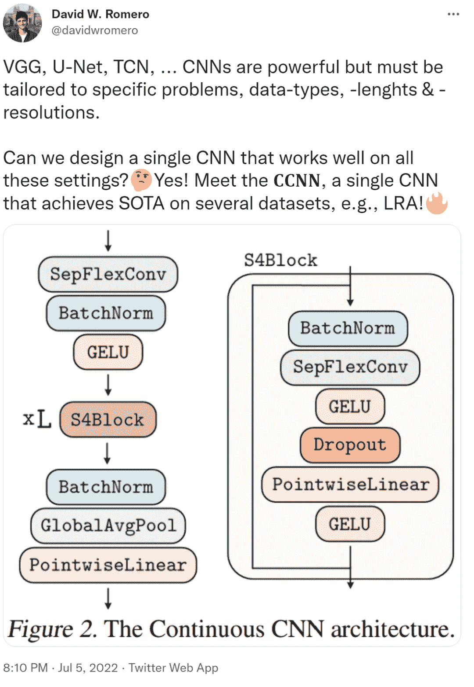

# 通用卷积神经网络 CCNN

> 原文：<https://medium.com/geekculture/general-convolutional-neural-network-ccnn-e1255526de68?source=collection_archive---------12----------------------->

在 VGG，U-Net，TCN 网络……CNN 是强大的，但必须针对具体问题、数据类型、长度和分辨率进行定制才能发挥作用。我们不禁要问，能不能设计出一个能在所有这些网络中很好工作的 CNN？

在这篇论文中，来自阿姆斯特丹自由大学(Vrije Universiteit Amsterdam)、阿姆斯特丹大学(University of Amsterdam)、斯坦福大学(Stanford University)的研究人员提出了 CCNN，单个 CNN 可以在多个数据集(如 LRA)上实现 SOTA！

