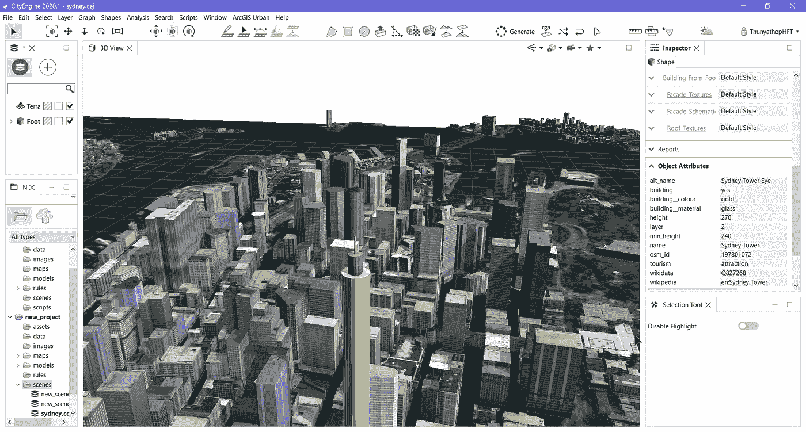

# 使用 CityEngine 生成 3D 建筑模型

> 原文：<https://medium.com/geekculture/generate-3d-building-models-with-cityengine-ae8411856f30?source=collection_archive---------19----------------------->

## 在世界任何地方获得您自己的纹理建筑模型。

**Generate 3D Building Models With Textures By CityEngine.** (by Author)

## 为什么是 3D 建筑模型？🏨

如今，三维纹理建筑模型在游戏开发、城市规划、智能城市、室内/室外行人导航、环境模拟、真实场景等应用领域发挥着重要作用