# 在 Swift 中生成和测试 RESTful APIs

> 原文：<https://medium.com/geekculture/generate-and-test-restful-apis-in-swift-767a0bd7ea48?source=collection_archive---------14----------------------->

不要花几个小时为客户端 API 编写代码来与服务器交互。如果您支持使用不同编程语言的各种客户端，编写这样的代码是单调乏味和重复的。

不要等着开始开发一个可能还不存在的服务，或者你正在等待访问的服务。

借助一些优秀的开源工具，您可以在几分钟内创建一个全功能的客户端 API，并用一个模拟的后端进行测试！

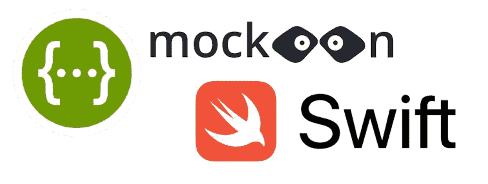

Swagger and Mockoon

基于一个真实的例子，使用现有的 [IP 地理定位 API](https://www.abstractapi.com/ip-geolocation-api#docs) ，我将解释并向您展示如何

1.  获取后端的 RESTful API 定义
2.  嘲笑后端
3.  生成 Swift 客户库
4.  在应用程序中使用 Swift 客户端库

# 获取后端的 RESTful API 定义

RESTful APIs 可以用一种标准的、与语言无关的方式来描述。这允许人类和计算机在不访问源代码、文档或通过网络流量检查的情况下发现和理解服务的能力。这个标准叫做 [OpenAPI 规范](https://swagger.io/specification/)，以前叫做 **Swagger** 。今天，术语 Swagger 仍然存在，但是它描述了一组实现 OpenAPI 规范的工具，例如

*   [Swagger Editor](https://swagger.io/swagger-editor/) :让你在浏览器中编辑 YAML 的 OpenAPI 规范，并实时预览文档。
*   [Swagger Codegen](https://swagger.io/swagger-codegen/) :允许基于 OpenAPI 规范生成 API 客户端库(SDK 生成)、服务器存根和文档。

[浏览](https://apis.guru/)现有 RESTful API 定义的存储库。你也可以为这个“Web APIs 维基百科”做贡献，因为 API 大师们把它发表在了 GitHub 上。

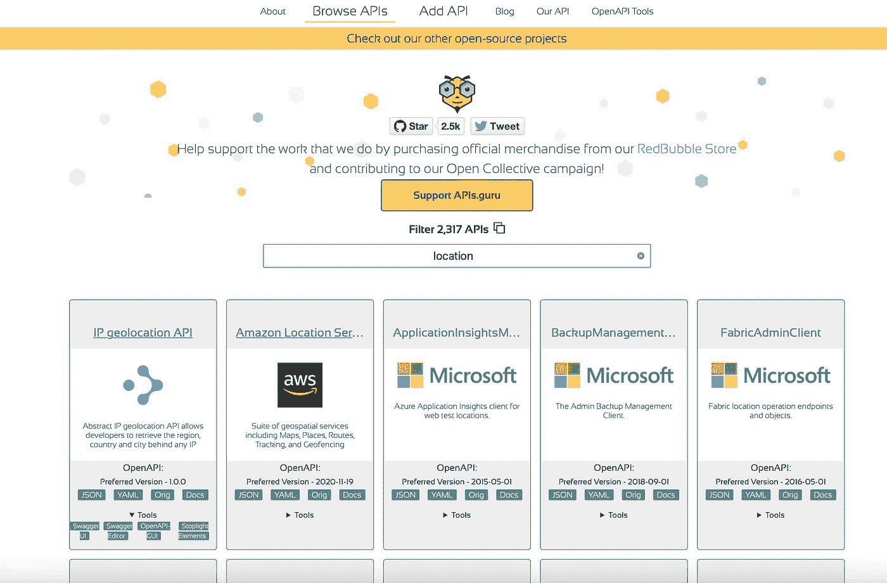

OpenAPI directory of apigurus.com

作为一个例子，我将以[IP 地理定位 API](https://api.apis.guru/v2/specs/abstractapi.com/geolocation/1.0.0/openapi.yaml) 的这个特定规范为例。来自 [AbstractAPI](https://www.abstractapi.com) 的人们允许开发者检索全球任何 IP 背后的地区、国家和城市。尚不存在 Swift 客户库。

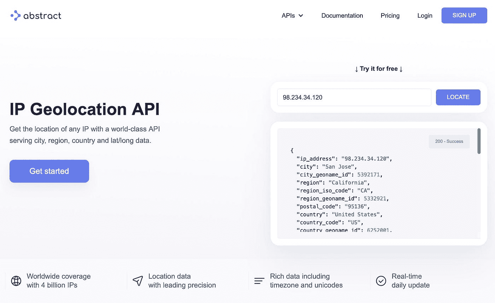

IP Geolocation API

让我们通过 Swagger 编辑器在浏览器中打开规范。

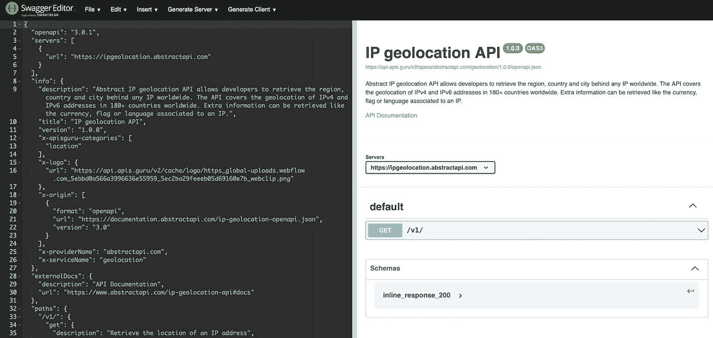

Swagger Editor

对`v1`端点的一个 HTTP GET 请求允许我们基于 IP 地址检索大量地理位置信息。

我没有注册，所以我不能访问后端。

# 嘲笑后端

Mockoon 是一个很好的应用程序，可以很容易地在本地运行模拟 API。不需要远程部署，没有帐户管理的麻烦。而且是[开源](https://github.com/mockoon/mockoon)多平台支持:

你可以从 mockoon.com[下载。Mockoon 也可以通过家酿`brew install --cask mockoon`获得。](https://mockoon.com/)

安装后，您可以导入一个 OpenAPI 规范。

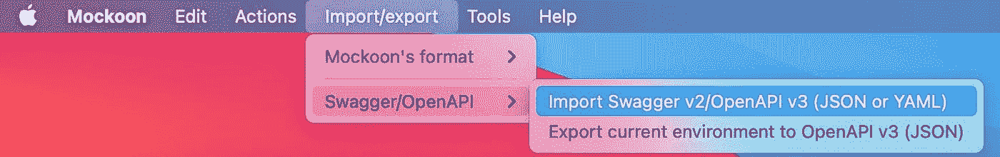

Import specification into Mockoon

默认情况下，被模仿的服务使用 Mokoon 的模板系统来创建动态响应。

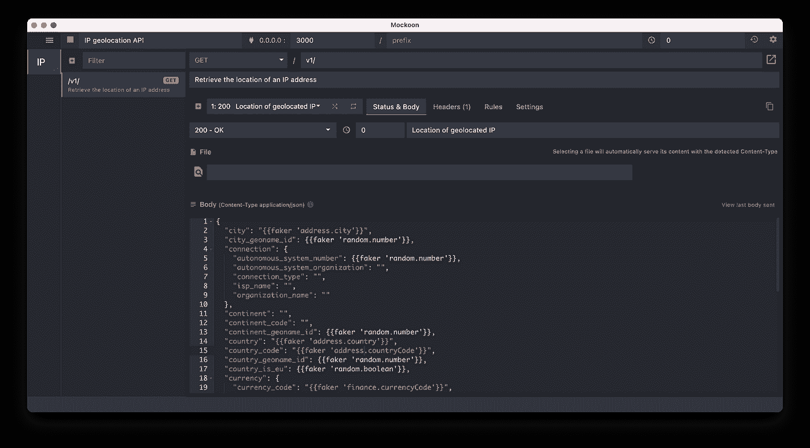

Running a mock server with Mockoon

因此您可以启动您的服务器并立即测试它。对于简单的 HTTP 请求，可以使用 curl。对于更复杂的 HTTP 请求，我推荐像 [Postman](https://www.postman.com/downloads/) 或 [Paw](https://paw.cloud/) 这样的应用

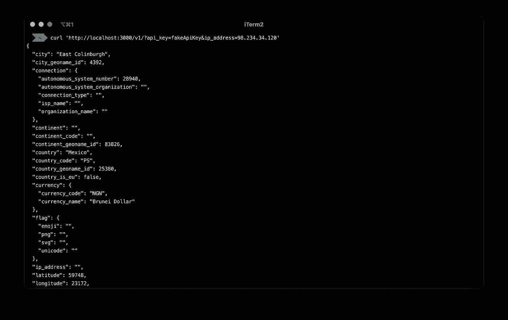

Testing mock server with curl

在这个特殊的例子中，我手动做了一个小改动来改善模拟响应。我利用 [Faker.js](https://github.com/Marak/faker.js) 和[手柄](https://handlebarsjs.com/)来伪造地址相关信息，例如`"city": "{{faker 'address.city'}}"`

# 生成 Swift 客户库

有多种选择可以方便地为后端服务生成客户端库。

*   [Swagger Codegen](https://github.com/swagger-api/swagger-codegen) :从 Swagger 2.0 或 OpenAPI 3.0 spec 生成模型和 API。依赖流行的网络库 [Alamofire](https://github.com/Alamofire/Alamofire)
*   [SwagGen](https://github.com/yonaskolb/SwagGen) :从 OpenAPI/Swagger 3.0 规范生成代码的命令行工具。它是官方的 Swagger-Codegen Java 代码生成器的替代品，并“增加了一些改进，如速度、可配置性、简单性、可扩展性和改进的模板语言”。

我将使用 usw Swagger Codegen，因为可以通过浏览器中的 Swagger 编辑器生成代码。在我的本地机器上不需要安装任何工具:)

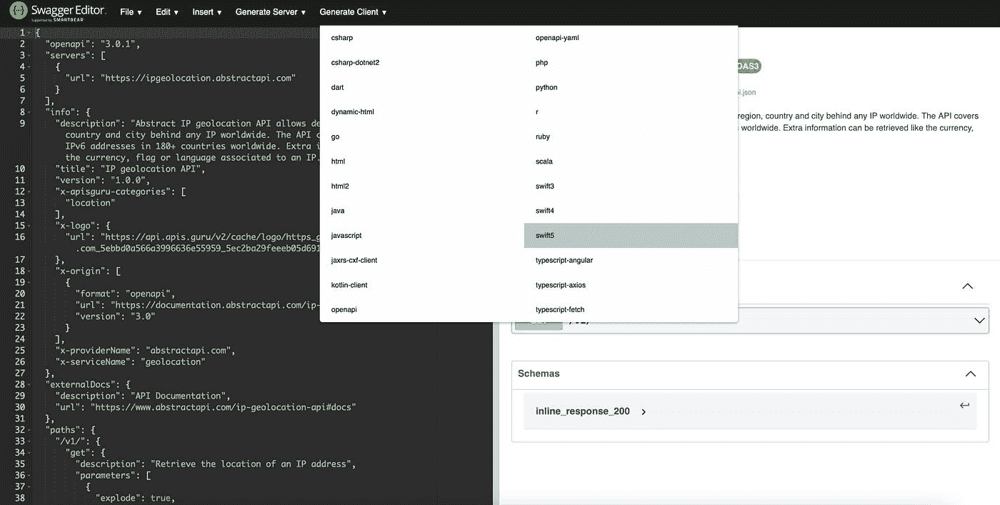

Generate Swift code straight out of the browser

即使你不是一个 Swift 开发人员，Swagger Codegen 也很有可能加速你的开发过程。因为 API 客户端库和服务器存根的生成可能使用多种语言，例如 C#、C++、Go、Java、Python 等等。

但是我知道由于对 Alamofire 的依赖，Swagger Codegen 可能不适合你的需要。事实上，在撰写本文时，Swagger Codegen 依赖于 Alamofire 4.x，而使用 Alamofire 5.x(2020 年 2 月发布)将需要您修复生成的代码，使其与 alamo fire 5 . x 兼容。

如果你没有一个开放的 API 规范，只有一个代表 HTTP 响应模型的 JSON，那么使用 [quicktype](https://quicktype.io/) 。在浏览器中或作为命令行工具尝试一下，它会在 Swift 中为您生成强类型模型和序列化程序。此外，这里支持多种目标语言。

# 在应用程序中使用 Swift 客户端库

使用这样一个由 Swagger Codegen 生成的客户端库需要以下步骤:

*   将 Alamofire 4.x 添加到您的 Xcode 项目中，例如通过 Swift Package Manager
*   解压、复制并添加`Swagger Client`文件夹到你的 Xcode 项目
*   使用位于`APIs`和`Models`文件夹中的所需 API 及其模型

对于 IP 地理位置 API，生成的 API 代码如下所示

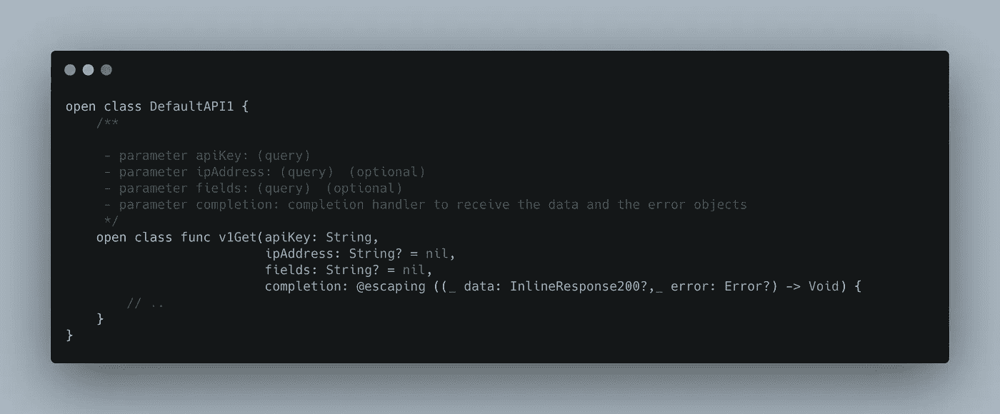

API model to initiate a URL request to v1 endpoint

这是反应模型:

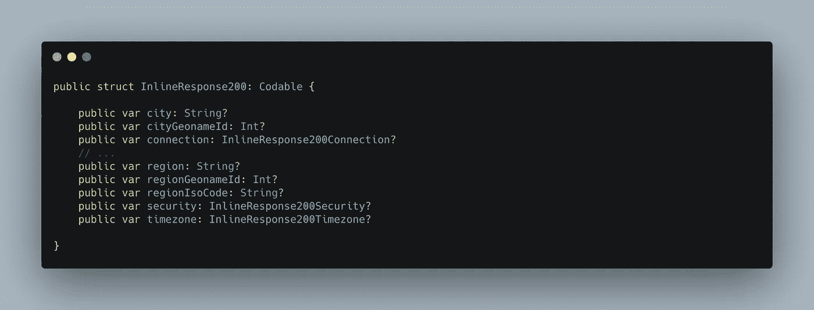

Response model for v1 endpoint

要连接到由 Mockoon 支持的模拟服务器，您必须替换`SwaggerClientAPI`中的 basePath。

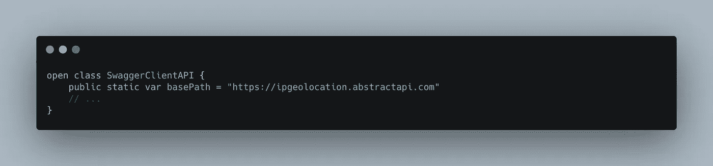

SwaggerClientAPI with basePath

最后一个例子是如何调用客户端 API 来触发对被模仿的后端的 HTTP 请求并接收响应。

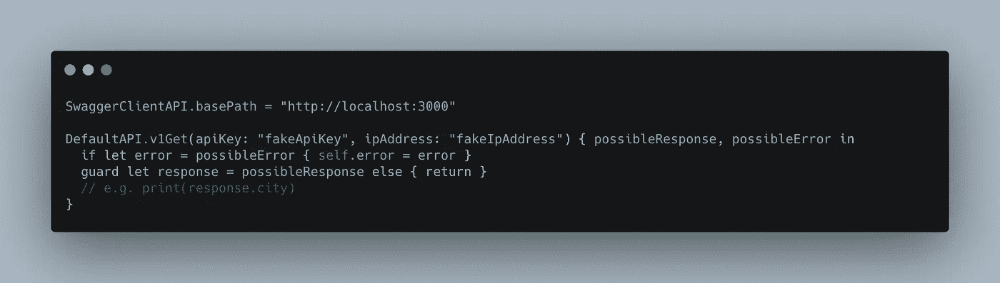

How to send a URL request to mock server

包含在 SwiftUI 应用程序中的所有源代码都可以在 [GitHub](https://github.com/MarcoEidinger/swift-swagger-mockoon-tutorial) 上找到。

*最初发布于*[*https://blog . ei dinger . info*](https://blog.eidinger.info/generate-and-test-restful-apis-in-swift)*。*