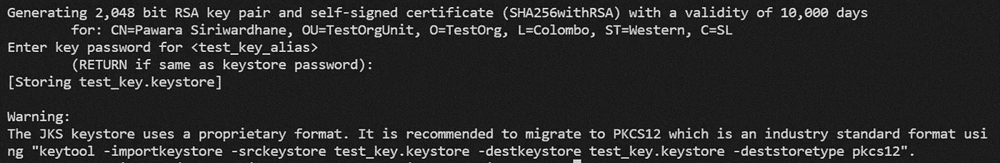
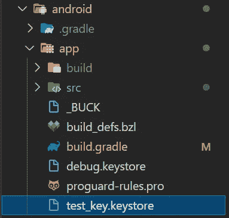
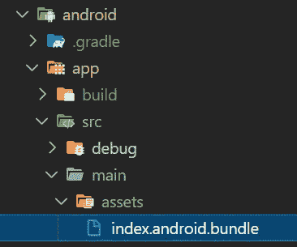
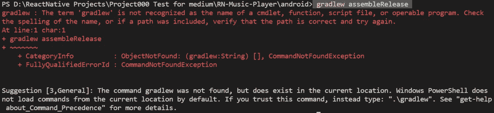
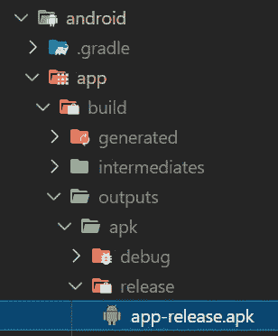
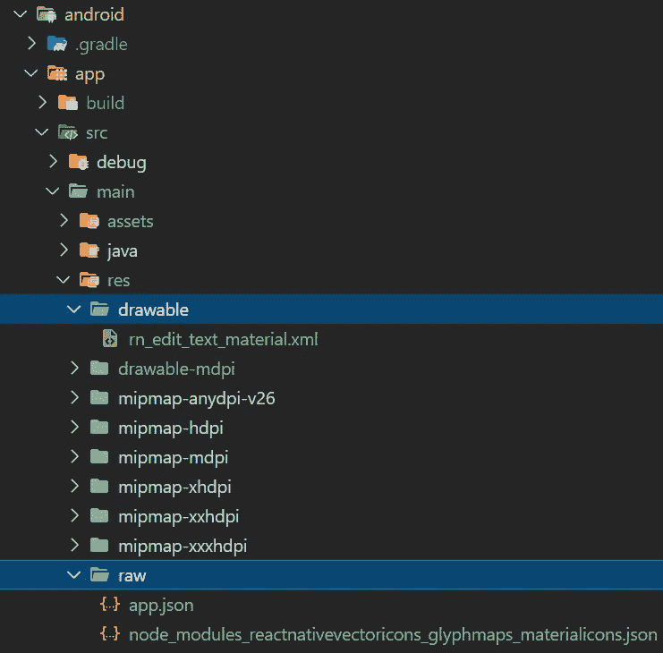

# 使用反应式 CLI 生成发布 APK(错误已修复)

> 原文：<https://medium.com/geekculture/generate-apk-with-reactnative-cli-errors-fixed-db00375d9bce?source=collection_archive---------2----------------------->

## 如何在 React Native CLI 中为 android 移动应用程序生成 android APK 文件


Figure 01: Artwork by [Author](https://pawara73.medium.com/) (Image source: [https://www.canva.com/](https://www.canva.com/), [https://unsplash.com/](https://unsplash.com/))

在 android 移动应用程序开发中，在真实设备上测试应用程序是开发人员的基本职责。对于使用 [React-Native-CLI](https://reactnative.dev/) 开发的应用程序，在真实设备上测试应用程序的最佳方法之一是生成 APK 文件，在任何 android 移动设备上安装并运行它。由于各种错误和 bug，有时 APK 生成会相当忙乱。本文是一个全方位的指南，将帮助任何不熟悉 React-Native-CLI 移动应用程序开发的人快速构建 APK 文件，同时轻松解决可能的错误。

但是，在遵循本文中的过程之前，请确保您的项目运行正常，没有任何错误或缺陷。

为了便于参考，我将 04 小节下的内容介绍如下:

1.  [生成密钥库](#bbe8)
2.  [将 Keystore 添加到项目中并构建 App Bundle](#7b3a)
3.  [发布 APK 一代](#53b9)
4.  [可能错误的一般解决方案](#51b6)
5.  [总结](#bf31)
6.  [参考文献](#1f5d)

# 1.生成密钥库

第一步是生成一个 Keystore 文件，它是 Java 生成的签名密钥。它将用于为 Android 创建反应性可执行二进制文件。要生成 Keystore，请在项目中打开 PowerShell 终端(VS 代码)并运行以下命令。将字段' *key_name* '和' *key-alias* '替换为您希望的名称。

```
keytool -genkey -v -keystore key_name.keystore -alias key_alias -keyalg RSA -keysize 2048 -validity 10000
```

然后会要求您提供密钥库的密码，并在生成密钥库之前填写一些字段[图 2]。(记住密码字段是隐藏的。因此您可能无法查看您键入的内容。并保存好您的'*键名*'、*键名别名*'和'*密码*，因为以后您还会用到它们。)


Figure 02: Screenshot of the VS Code PowerShell

您可以为上述字段添加一些虚拟值。



Figure 03: Screenshot of the VS Code PowerShell

您可以为*‘test-key-alias’*添加另一个密码，或者直接按 enter 键来生成密钥库文件[图 03]。Keystore 文件将在根目录下创建，但是您必须将它复制并粘贴到路径:' *android/app/'* ,如图 04 所示。



Figure 04: Screenshot of the project directories

# 2.将密钥库添加到项目中并构建应用程序包

接下来，您必须用 Keystore 配置项目。为此，在路径: *'/android/app'* (与您之前保存密钥库的路径相同)中打开 *'build.gradle'* 文件。将*‘发布’*添加到*‘签名配置’*块中，并将*‘构建类型’*块中的*‘发布’*修改如下。

用您的密码替换*密钥库名称*、*别名*和*密码*(记得我在第 01 节告诉您保存它们吗🙂).你可以看到上面的方法很容易配置，但是你的密码被直接放入代码库，这是不可接受的。为了避免这种情况，您可以使用以下替代方法来配置*‘build . gradle’*字段，如下所示。这样更安全，以后运行命令构建包时，会提示您输入密码。您可以使用上述方法或以下方式将密钥库配置到项目中。

**注意:**始终将*‘signing configs’*放在*‘buildType’*模块之前，以避免可能的错误。

在构建包之前，你必须检查在路径*‘Android/app/src/main’中是否有一个名为‘assets’的目录。*如果没有 assets 文件夹，那么在上面的路径中创建一个名为‘assets’的文件夹[图 5]。这是保存应用程序包的目录。

要创建 app bundle，请在同一终端上运行以下命令。

**注意:**该命令是单行代码。因此，您可以复制以下内容并粘贴到记事本中，然后在直接粘贴到终端之前删除任何换行符。

```
react-native bundle --platform android --dev false --entry-file index.js --bundle-output android/app/src/main/assets/index.android.bundle --assets-dest android/app/src/main/res/
```

**注意:**上述命令中的文件名*‘index . js’*是项目中的入口文件。在您的项目中，如果您有一个不同的条目文件(例如: *'index.android.js'* )，那么用相关的文件名替换它。

如果构建成功，您可以在资产目录中看到新创建的名为*‘index . Android . bundle’*的包文件[图 05]。



Figure 05: Screenshot of the project directories

# 3.发布 APK 一代

这是生成 APK 文件的最后一道关卡。请仔细遵循下面给出的步骤，以避免任何可能的错误:

首先，转到项目中的 android 目录。您可以手动转到目录并打开终端，或者运行以下命令(如果您在根目录中)。

```
cd android
```

接下来，运行以下命令来生成 APK 文件。

```
./gradlew assembleRelease
```

在某些地方，我注意到建议在 Windows 上使用'*grad Lew assembler release*'，但是上面的命令在所有 03 平台 Windows、Mac 和 Linux 上都有效。如果它在 Windows 中抛出如下所示的错误[图 06],您可以使用 bash 终端，而不是 PowerShell 或命令提示符。



Figure 06: Screenshot of the error thrown in Windows PowerShell terminal in VS Code

如果上面的命令运行成功，那么做得很好👏，那么它将在路径:'*Android/app/build/outputs/apk/release '*'中创建名为' *app-release.apk* '的 APK 文件[图 07]。您可以将生成的 APK 文件复制并安装到您的 android 手机上并运行它。



Figure 07: Path of the generated APK file

但不幸的是，APK 的产生并不总是一蹴而就的。在尝试运行上述命令时，您可能至少会遇到一次“构建失败”。接下来，我们将讨论一些可以避免此类错误的解决方案。

# 4.可能错误的一般解决方案

如果您在第 1 步和第 2 步中创建 app bundle 时遇到任何错误/问题，很可能是由于使用了错误的终端或您运行的命令输入错误。因此，再次仔细阅读说明，尤其是“注意事项”，以避免这种小错误。

## 错误 01:应用:validateSigningRelease 失败

以下错误是由于缺少密钥库文件造成的。当然，您可能将密钥库放在了不同的位置，或者文件名不同于在*‘build . gradle’中配置的文件名。*有可能在构建 apk 时抛出这个错误。

```
Task :app:validateSigningRelease FAILED
…
BUILD FAILED
```

## 错误 02 & 03:应用程序:mergeReleaseResources &应用程序:mergereleasesources

大多数构建错误发生在最后一步:释放 APK。构建 APK 时，某些任务的执行可能会失败，从而导致整个 APK 构建失败。

```
Execution failed for task ‘:app:processReleaseResources’.
...
BUILD FAILED
```

或者

```
Execution failed for task ‘:app:mergeReleaseResources’.
… 
BUILD FAILED
```

有两种方法可以解决此类错误:

**1。清理“可绘制”和“原始”目录。**

您可以运行以下命令来删除它们:

```
rm -rf android/app/src/main/res/drawable-* 
rm -rf android/app/src/main/raw
```

或者手动删除，分别到路径:'*Android \ app \ src \ main \ RES \ drawable*'和'*Android \ app \ src \ main \ raw*'中的目录 *'drawable* '和 *'raw'* 。并删除**所有**每个目录中的内容【图 08】。



Figure 08: Screenshot of the ‘drawable’ and ‘raw’ directories

**2。重新配置包发布**

您可以通过运行以下命令来重新配置条目文件名、所创建的包输出的路径以及 APK 资产的目的地。打开根目录(项目文件夹)中的 bash 终端并运行以下命令。

```
react-native bundle --platform android --dev false --entry-file index.js --bundle-output android/app/src/main/assets/index.android.bundle --assets-dest android/app/build/intermediates/res/merged/release/
```

之后，再次移动到 android 目录并运行。/gredlew assembler 请再次使用'命令。它将成功生成 APK 文件。

# 5.摘要

在为一个反应性项目生成 APK 文件之前，第一步也是最重要的一步是确保代码库没有错误，并且在 Android 模拟器中正常工作。除此之外，为一个反应性项目生成 APK 文件的基本步骤包括 03 个主要步骤:生成密钥库文件，用项目配置密钥库并构建 app bundle，最后发布 APK 版本。这个过程中可能会有一些错误，但是通过对项目进行一些修改和一些额外的命令就可以很容易地解决这些错误。

# 6.参考

[](https://reactnative.dev/docs/signed-apk-android) [## 出版到谷歌 Play 商店反应本土

### Android 要求所有应用程序在安装前都要用证书进行数字签名。为了…

反应性发展](https://reactnative.dev/docs/signed-apk-android)