# 使用比特币改进提案生成比特币钱包地址 44

> 原文：<https://medium.com/geekculture/generate-bitcoin-wallet-address-using-bitcoin-improvement-proposal-44-4672e5057bb?source=collection_archive---------1----------------------->


**比特币改进提案 44** 或 **BIP-44** 基于 BIP-32 中描述的算法和 BIP-43 中描述的目的方案定义了确定性钱包的逻辑层次。

我们将通过用 python 实现一个多账户分层确定性钱包地址来学习 BIP-32、BIP-39 和 BIP-44 的应用。让我们不要再多费周折了，开始吧。

本文的源代码可以在我的 github repo 上找到。

[](https://github.com/tionx3na/BIP_implementations) [## GitHub-tion x3na/BIP _ 实现:各种比特币改进的 Python 实现…

github.com](https://github.com/tionx3na/BIP_implementations) 

# 记忆生成

我们将遵循比特币改进提案 39 中的程序来生成助记符。如果你不知道它背后的理论，请阅读我关于 BIP-39 的文章。

[](/geekculture/what-is-bitcoin-improvement-proposal-39-bip-39-9a95ed07cb03) [## 什么是比特币改进提案 39 (BIP-39)？

### 比特币改进提案或 BIP 是一个设计文件，为比特币社区提供信息或描述一个…

medium.com](/geekculture/what-is-bitcoin-improvement-proposal-39-bip-39-9a95ed07cb03) 

在助记符生成部分，我们的目标是将熵转化为助记符。

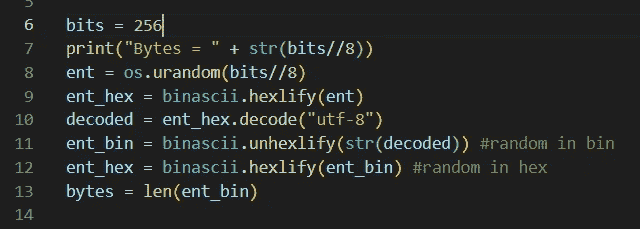

Generating Entropy

这里，我们定义熵的长度为 **256** 。根据 BIP-39，它可以从 128 到 256，但应该是 32 的倍数。我们使用操作系统库的“urandom”函数生成了**熵**,并将其转换为十六进制和二进制，以便将来操作。

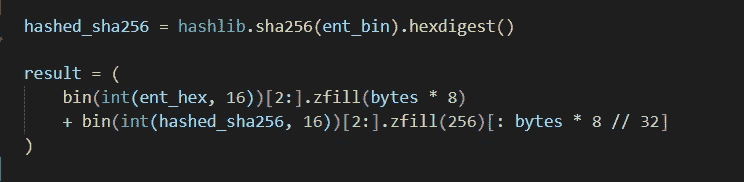

Appending checksum to entropy

我们将熵的 hash256 的前 **ENT / 32** 位作为**校验和**并将其附加到初始熵上。

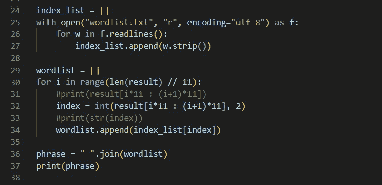

Converting Entropy to Mnemonic Phrase

现在，我们将手头的最终熵转化为助记短语，这要借助下面链接中的标准化单词表。为了兼容性，请使用此单词表。

[](https://github.com/bitcoin/bips/blob/master/bip-0039/english.txt) [## 比特币大师 bips/english.txt

### 此时您不能执行该操作。您已使用另一个标签页或窗口登录。您已在另一个选项卡中注销，或者…

github.com](https://github.com/bitcoin/bips/blob/master/bip-0039/english.txt) 

我们将单词列表中的每个单词存储到一个列表中。然后，我们将最终熵分成 11 位组，每组 11 位，每组编码一个从 0 到 20147 的索引号。然后，我们将与索引相对应的单词组合成一个短语，得到我们最终的**助记短语。**

# Seed 助记符

为了从助记符创建二进制种子，我们使用 **PBKDF2 函数**，其中一个助记符句子(在 UTF-8 NFKD 中)用作密码，字符串**“助记符”+密码短语**(同样在 UTF-8 NFKD 中)用作 **salt** 。

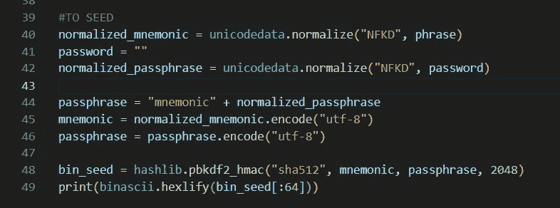

迭代计数被设置为 **2048** 并且 **HMAC-SHA512** 被用作伪随机函数。用户可以提供一个密码，如果没有，则留空。

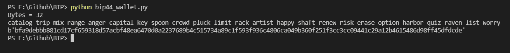

Output

正如你所看到的，我们得到了一个助记短语及其对应的种子。您可以在下面的链接中检查种子和生成的助记符是否符合 BIP-39。

 [## BIP39 -助记码

### 阅读更多 BIP39 官方规范阅读更多 BIP32 官方规范查看 BIP32 演示阅读更多…

iancoleman.io](https://iancoleman.io/bip39/) 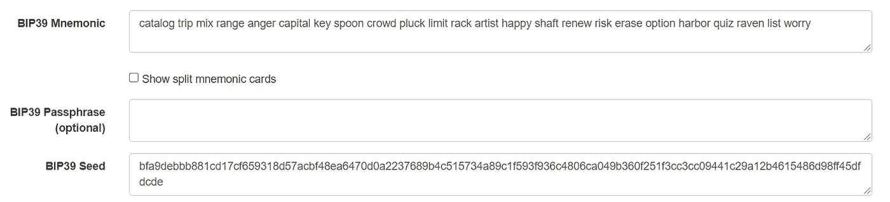

bip-39 menmonic and bip-39 seed

如您所见，我们生成的助记短语和种子都符合 BIP-39 标准。

# BIP-32 密钥派生

BIP-32 描述了分级确定性钱包(或“HD 钱包”):可以与不同系统部分或全部共享的钱包，每个系统都有或没有花硬币的能力。要了解更多关于 BIP-32 的信息，请阅读我的相关文章。

[](/geekculture/what-is-bitcoin-improvement-proposal-32-bip-32-586a3f36a95c) [## 什么是比特币改进提案 32 (BIP-32)？

### 比特币改进提案-32 或 BIP-32 是一种信息 BIP，描述了等级确定性…

medium.com](/geekculture/what-is-bitcoin-improvement-proposal-32-bip-32-586a3f36a95c) 

对于主私钥生成，我们需要计算

> I = HMAC-SHA512(Key = "比特币种子"，Data = S)

根据 BIP-32 的说法，我们需要用密钥**“比特币种子”**获取 BIP-39 种子的 sha512 摘要。

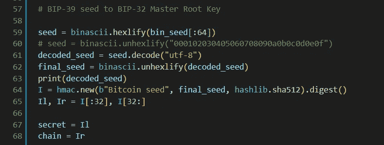

BIP-39 seed to I, Ir and Il

我们将摘要**【我】**拆分成**【伊尔】**和**【伊尔】**，两者都是 32 字节。Il 给出了**密钥**，而 Ir 给出了**链码**。

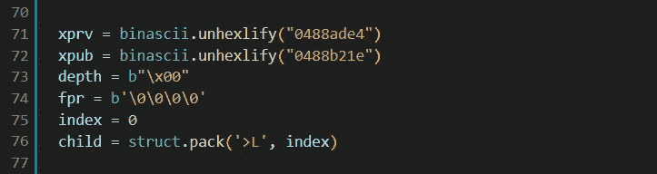

xprv, xpub, depth, fpr and index

为了序列化**扩展私钥(xprv)** 和**扩展公钥(xpub)** ，我们使用 BIP-32 序列化格式中描述的标准化。

> **Mainnet** : 0x0488B21E 公有，0x0488ADE4 私有用于**比特币**
> 
> **深度**:主节点 0x00
> 
> **父密钥的指纹** t(如果是主密钥，则为 0x00000000)

struct.pack()中的 **" > L"** 意味着我们以 Big Endian 格式存储孩子。

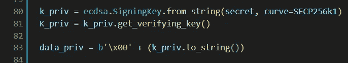

parse256(secret)

我们通过向 **SECP256k1** 曲线提供我们的秘密密钥来创建**签名密钥**。这在 BIP-32 中被定义为 **parse256(p)** ，它将一个 32 字节的序列解释为一个 256 位数，最高有效字节优先。

根据 BIP-32 的序列号，

> 公钥或私钥数据( **serP(K)** 为公钥，0x00 || **ser256(k)** 为私钥)

因此，我们必须将 0x00 连接到 ser256(签名密钥)。

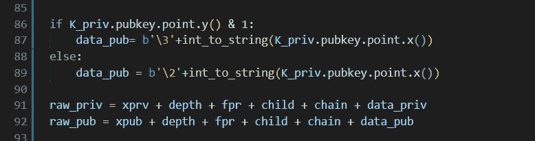

对于公钥生成，BIP-39 定义了一个约定， **serP(P)** ，其中使用 SEC1 的压缩形式将坐标对 P = (x，y)序列化为字节序列: **(0x02 或 0x03) || ser256(x)** ，其中头字节取决于省略的 y 坐标的奇偶性。

然后，我们计算原始私钥和公钥。

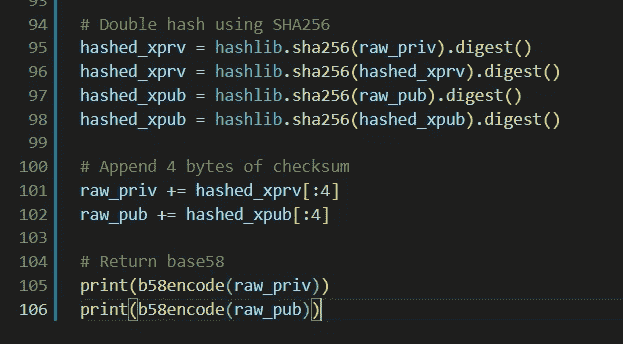

Generating Master Private Key and Public Key

我们通过采用**双 sha256 散列**并将**的前 4 个字节**附加到相应的密钥来找到私钥和公钥的校验和。然后，我们将原始的私有和公共密钥编码为 **base 58** ，这是比特币网络中使用的密钥的兼容版本。

## 输出

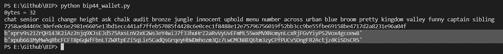

我们生成了我们的**扩展私有根密钥**以及扩展的**公共根密钥**。我们可以在 iancoleman.io 上查看它的兼容性。

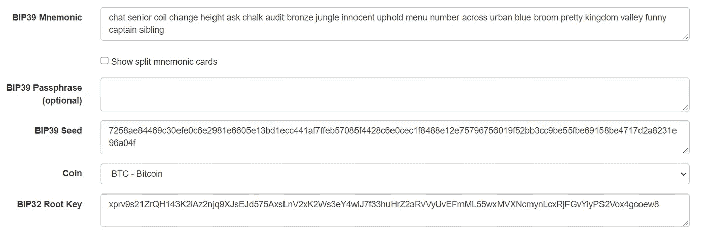

compatibility check


Extended Keys Compatibility Check

# BIP-44 地址生成

BIP-44 基于 BIP-0032 中描述的算法和 BIP-0043 中描述的目的方案为确定性钱包定义了一个**逻辑层次。**

更多关于 BIP-44 的信息，

[](https://github.com/bitcoin/bips/blob/master/bip-0044.mediawiki) [## bips/bip-0044 . mediawiki at master bit coin/bips

### BIP: 44 层:应用程序标题:确定性钱包的多帐户层次结构作者:马雷克·帕拉蒂纳斯·帕沃尔…

github.co](https://github.com/bitcoin/bips/blob/master/bip-0044.mediawiki) 

BIP-44 在 BIP32 路径中定义了以下 5 个级别:

```
m / purpose' / coin_type' / account' / change / address_index
```

路径中的撇号表示使用了 BIP32 **硬化派生**。查看 BIP-32 文章，了解更多关于硬化衍生的内容。

## 目的

目的是遵循 BIP43 建议设置为**44’(或 0x8000002C)** 的常量。**在这个级别使用硬化派生。**

## 硬币类型

硬币类型是一个常数，为每个加密硬币设置。在这一级使用了强化派生。对于比特币，币别为 0。你可以在这里看到其他硬币的注册硬币类型。**在这个级别使用硬化派生。**

[](https://github.com/satoshilabs/slips/blob/master/slip-0044.md) [## master satoshilabs 的 slips/slips-0044 . MD

### 编号:SLIP-0044 标题:BIP 注册硬币类型-0044 类型:标准状态:活跃作者:Pavol Rusnak Marek…

github.com](https://github.com/satoshilabs/slips/blob/master/slip-0044.md) 

## 账户

这个级别将密钥空间分割成独立的用户身份，因此钱包不会将不同账户的硬币混在一起。帐户从索引 0 开始按顺序递增的方式编号。该数字用作 BIP32 派生中的子索引。**这一级用的是硬化衍生。**

## 变化

常数 0 用于外部链，常数 1 用于内部链(也称为更改地址)。外部链用于在钱包外部可见的地址(例如，用于接收付款)。内部链用于在钱包外不可见的地址，并用于退货交易变更。**公共派生在这一级使用。**

## 索引

地址从索引 0 开始按顺序递增的方式编号。该数字用作 BIP32 派生中的子索引。**公共派生在这一级使用。**

> 我们将在另一篇文章中从头开始实现 BIP-32 算法。现在，我们将使用 pypi 中可用的 bip32 python 包。

[](https://pypi.org/project/bip32/) [## bip32

### bip-0032 的基本实现。>>>从 bip32 导入 BIP32，HARDENED_INDEX >>> bip32 = BIP32。来自种子(…

pypi.org](https://pypi.org/project/bip32/) 

在上一节中，我们导出了帐户扩展的私有和公共根密钥。现在我们必须生成 bip32 扩展密钥。

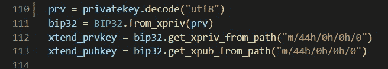

Generating BIP-32 extended private and public keys.

我们向 BIP32 类中的函数 *from_xpriv()* 提供帐户私有根密钥。如果你在包中检查这个函数的代码，你可以看到这个函数提取像网络，深度，指纹，链码等信息。从扩展根密钥创建一个 BIP32 钱包。

然后，我们通过提供 BIP-32 路径， **m/44h/0h/0h/0** 来生成 BIP-32 扩展公钥和私钥，其中 *h* 代表硬化密钥。

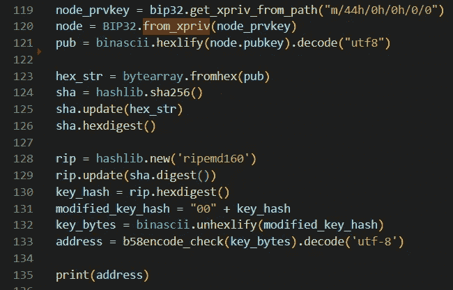

Generating BIP-44 Bitcoin Address.

要生成地址，我们需要从 BIP-32 扩展私钥中导出私钥，然后从私钥中导出公钥。

要将这个公钥转换成比特币地址，首先我们需要对公钥执行 sha-256 哈希，然后对 **SHA-256** 的结果执行 ripemd-160 哈希。版本字节加在 **RIPEMD-160 hash** (主网 0x00)前面。

然后，我们使用 base58encode 将 ripemd160 结果编码为比特币地址。点击此处查看有关 base58 编码的更多信息。

 [## Base58Check 检查编码

### 一种改进的 Base 58 二进制到文本编码被称为 Base58Check，用于编码比特币地址。更多…

en .比特币. it](https://en.bitcoin.it/wiki/Base58Check_encoding) 

简而言之，base58 编码对之前的结果执行另一个 sha256 两次，并获取第二个 SHA-256 哈希的前 4 个字节，将其添加到我们之前计算的扩展 RIPEMD-160 结果的末尾。

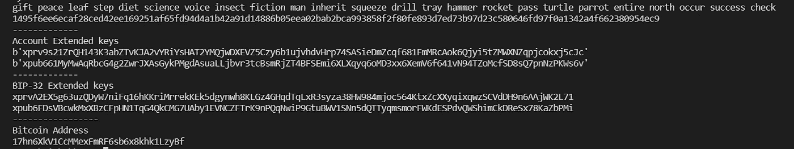

Bitcoin address and extended keys.

现在，我们可以检查我们的输出是否正确。

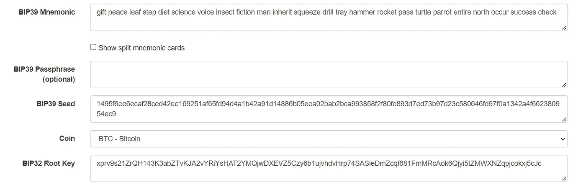

BIP32 Root Key

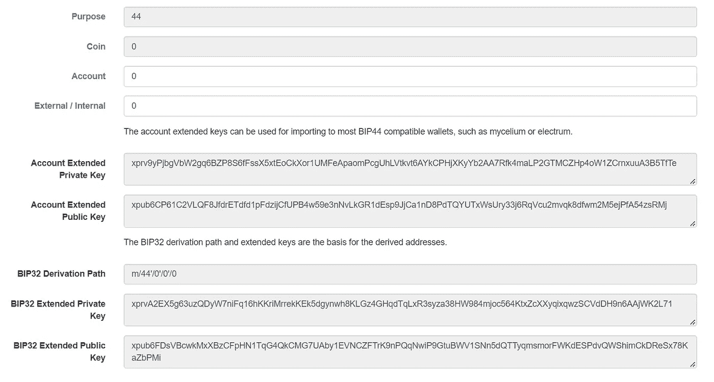

BIP32 Extended Keys

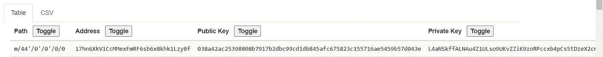

Bitcoin Address

正如我们所看到的，我们生成的地址和扩展密钥是正确且兼容的。

# 结论

注意，我们的比特币地址以一个**‘1’**开头。这意味着我们的比特币地址是一个**遗留地址。2009 年比特币推出时，这是创建地址的唯一方式。现在还有其他的地址格式，比如 **segwit** 和 **native segwit。我们将在下一篇文章中看到如何对这些地址进行编码。****

# 参考

[](https://github.com/bitcoin/bips) [## GitHub -比特币/bips:比特币改进建议

### 希望提交 bip 的人，首先应该将他们的想法或文档提交到 bit coin-dev @ lists . Linux foundation . org…

github.com](https://github.com/bitcoin/bips) 

> 加入 Coinmonks [电报频道](https://t.me/coincodecap)和 [Youtube 频道](https://www.youtube.com/c/coinmonks/videos)了解加密交易和投资

# 另外，阅读

*   [5 款最佳加密交易终端](https://coincodecap.com/crypto-trading-terminals) | [最佳 DeFi 应用](https://coincodecap.com/best-defi-apps)
*   [比特币基地 vs 瓦济克斯](https://coincodecap.com/coinbase-vs-wazirx) | [比特鲁点评](https://coincodecap.com/bitrue-review) | [波洛涅克斯 vs 比特鲁](https://coincodecap.com/poloniex-vs-bittrex)
*   [德国最佳加密交易所](https://coincodecap.com/crypto-exchanges-in-germany) | [Arbitrum:第二层解决方案](https://coincodecap.com/arbitrum)
*   [币安交易机器人](/coinmonks/binance-trading-bots-d0d57bb62c4c) | [OKEx 评论](/coinmonks/okex-review-6b369304110f) | [Atani 评论](https://coincodecap.com/atani-review)
*   [最佳加密交易信号电报](/coinmonks/best-crypto-signals-telegram-5785cdbc4b2b) | [MoonXBT 评论](/coinmonks/moonxbt-review-6e4ab26d037)
*   [如何在 Bitbns 上购买柴犬(SHIB)币？](https://coincodecap.com/buy-shiba-bitbns) | [买弗洛基](https://coincodecap.com/buy-floki-inu-token)
*   [CoinFLEX 评论](https://coincodecap.com/coinflex-review) | [AEX 交易所评论](https://coincodecap.com/aex-exchange-review) | [UPbit 评论](https://coincodecap.com/upbit-review)
*   [十大最佳加密货币博客](https://coincodecap.com/best-cryptocurrency-blogs) | [YouHodler 评论](https://coincodecap.com/youhodler-review)