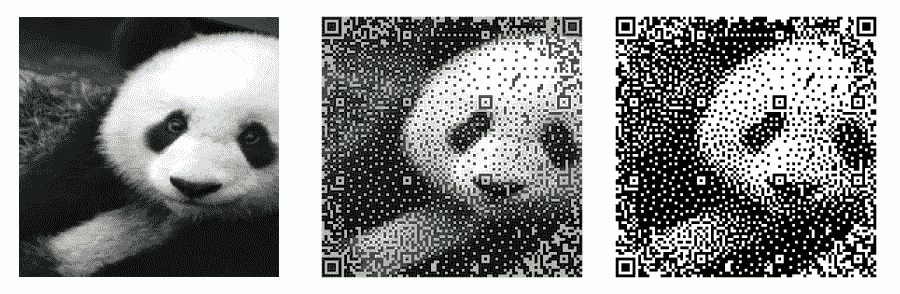
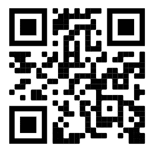

# 使用 Python 从图像生成 QR 码

> 原文：<https://medium.com/geekculture/generate-qr-codes-from-images-using-python-60e669653440?source=collection_archive---------1----------------------->

Photo by Sheilalau from [Wikimedia Commons](https://commons.wikimedia.org/wiki/Main_Page)

快速响应码(简称 QR)的起源可以追溯到 90 年代，但直到最近才被主流采用。由于智能手机、社交距离和[比特币基地广告](https://www.theverge.com/2022/2/13/22932397/coinbases-qr-code-super-bowl-ad-app-crash)，二维码现在已经成为我们生活中的一部分。

二维码非常有用——它们可以存储各种数据，如文本、身份证号、二进制数据和 URL 地址。然而，从视觉上看，大多数二维码都很单调。它们最终看起来像这样:

QR code to deepnote.com. Image by author.

但是 QR 码具有强大的内置纠错机制，具有冗余性。这让我们可以通过添加视觉元素来增加一些趣味:

QR code with logo. Image by author.

虽然这两个二维码做同样的事情(都带你去 deepnote.com 的)，但带图片的二维码有趣多了！

上面带有标志的二维码是在一个 [Deepnote 笔记本](https://deepnote.com/workspace/deepnote-8b0ebf6d-5672-4a8b-a488-2dd220383dd3/project/QR-generator-940ac870-252d-4038-a563-d8d661f7931a/notebook/Notebook%201-c11d1019c1c54385aff431caa1503e9a)中用几行 Python 代码创建的。你也可以这样做:

# 如何从图像生成二维码

## 第一步:选择一张图片

我们可以为这一步找到任何图像，但我们发现最好使用大小接近 1:1 纵横比(相同的宽度和高度)的图像，因为我们必须调整它的大小以适应正方形。

## 第二步:选择一个网址

我们的 QR 码文本限于 100 个字符。如果需要使用较长的 URL，可以使用 URL 缩写。(顺便说一句，我们在这里不需要使用 URL，任何文本都可以编码成结果二维码。)

## 第三步:下载并处理你的图像

对于这一步，我们将使用 Python 的请求库从 URL 下载图像，并在 PIL 中打开它进行进一步处理。我们需要把它调整成两种尺寸:93x93px 和 186x186px。我们将在后面的过程中使用这两种尺寸。

## 第四步:生成二维码

我们使用[https://github.com/xyzzy/qrpicture](https://github.com/xyzzy/qrpicture)来生成代码。创建照片 QR 是一个两部分的过程。

首先，我们需要创建一个 93x93 像素抖动的单色图像。该图像覆盖有强制 QR 像素，以确保生成的图像是有效的 QR 码。

输出作为文件直接保存在文件系统中。它看起来是这样的:

## 第五步:加点颜色

现在，我们使用空间颜色量化在 QR 码上应用 186x186 抖动彩色图像。我们可以选择使用多少种颜色。如果我们想保持结果简单或者想节省打印成本，这是很有帮助的。

瞧啊。我们有一个图像背景的二维码。

# 信用

这项工作是基于[https://github.com/xyzzy/qrpicture.](https://github.com/xyzzy/qrpicture.)如果你想修改源代码或重新编译二进制文件，你可以使用这些命令: