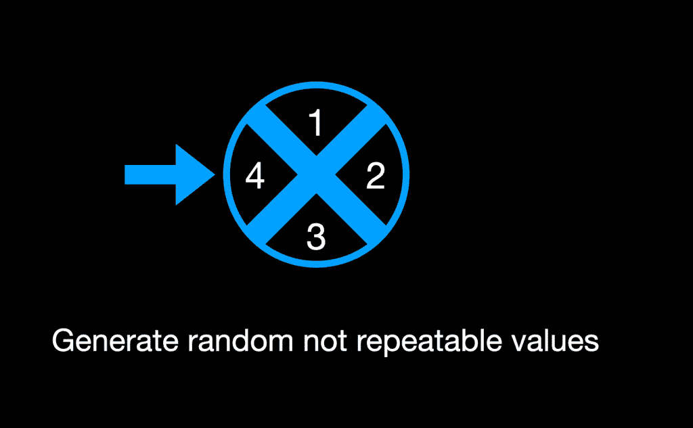
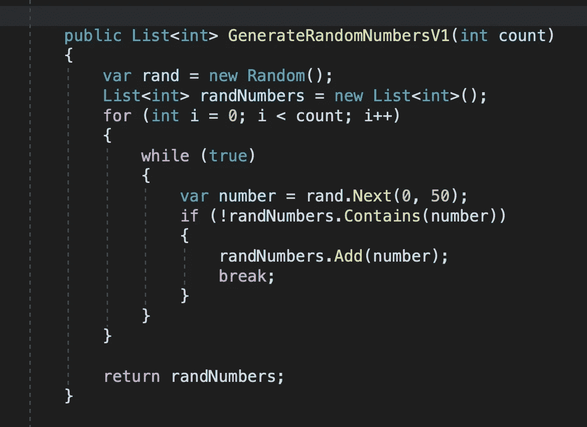
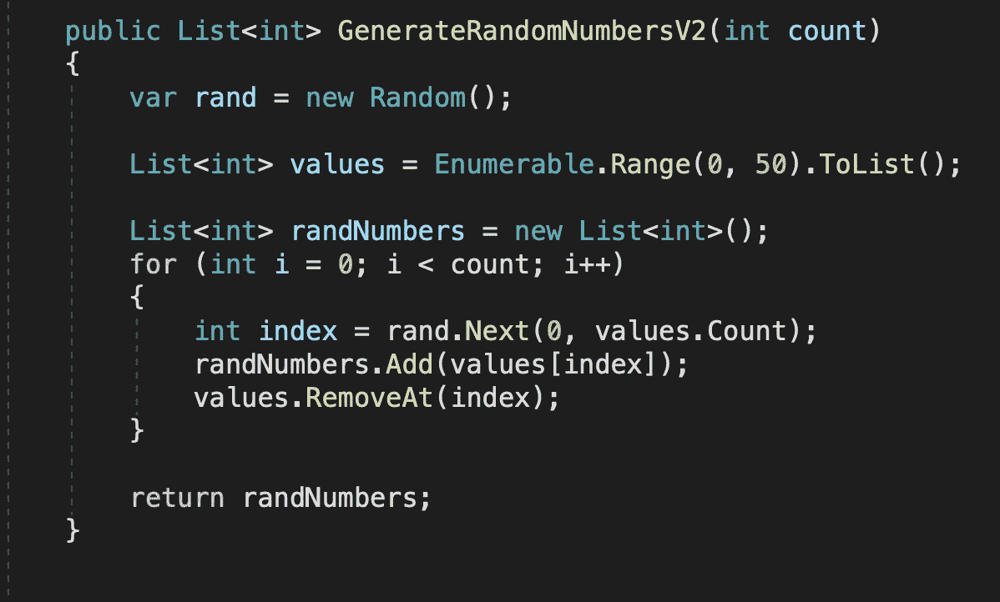
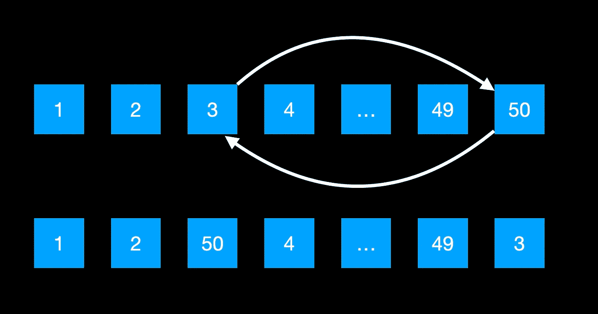
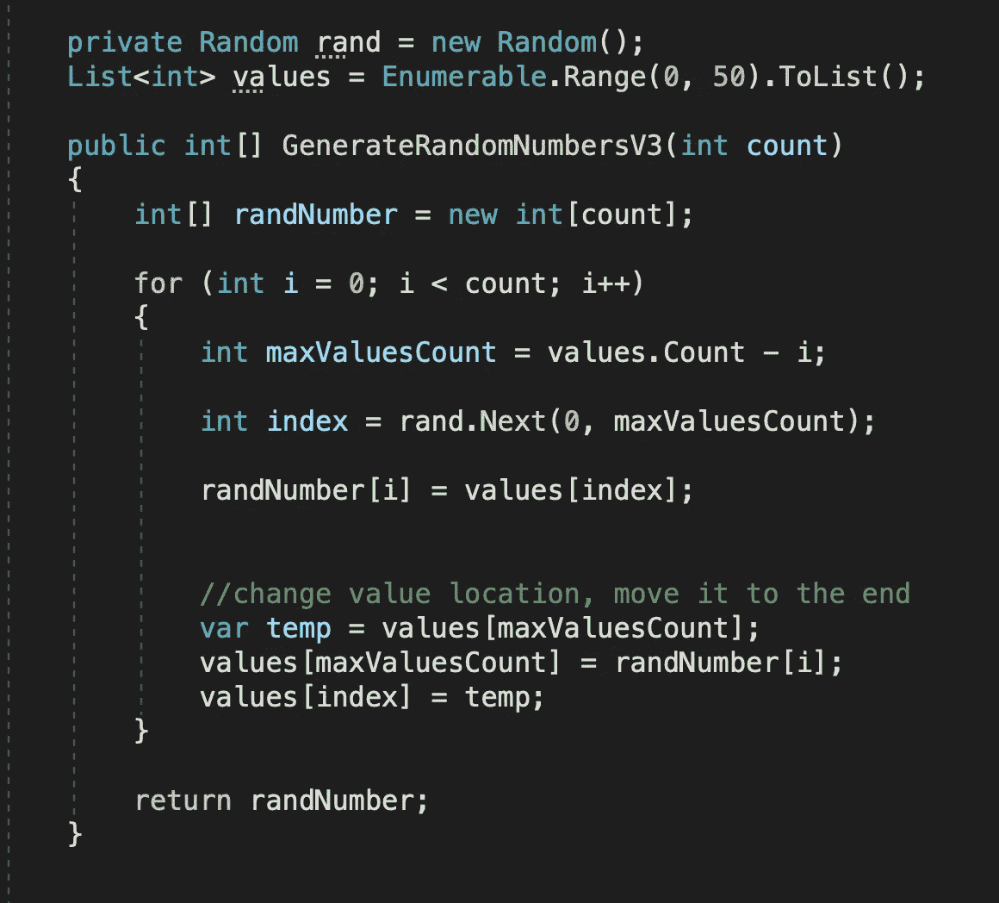

# 生成随机的不可重复的值

> 原文：<https://medium.com/geekculture/generate-random-not-repeatable-values-a085176f8389?source=collection_archive---------0----------------------->

## 编程算法

寻找具有最佳性能的算法

生成随机值听起来像一个简单的任务，如果我们深入研究，我们会发现它并不那么简单。

**解决方案 1**

这个问题的简单解决方案是创建随机数。之后，我们总是需要检查新的号码，如果号码是唯一的，我们添加，如果没有产生新的，并再次检查。

在这种情况下，最多可以生成 50 个随机数，如果我们需要生成大约 40 个随机数，我们就有问题了。我们的算法只是猜测我们没有的数字。我们将反复生成集合中已经存在的相同数字。

**方案二**

另一种方法是创建一个可能数字的列表，并从列表中删除您选择的数字:

这个算法更好，因为我们不是在猜测。我们将获得一个唯一的数字，并从集合中删除该数字。

在每次调用中，我们都会生成一个新的值集合。如果我们不需要这样做呢？如果我们只能一次生成一个值集合会怎么样？

**方案二**

我们可以改变它们在集合中的位置，而不是移除它们。

这个想法很简单:我们生成一个随机索引，我们通过索引获取一个条目，然后我们改变这个条目的位置。当前项目成为最后一个，最后一个成为当前项目。我们只是稍微整理了一下我们的收藏。

我们还需要缩小生成随机索引的范围。

最后一种方法将显示出最佳性能，因为我们不创建新的集合，也不改变其大小。

如果你需要仔细看看这个项目[，这里有链接。](https://github.com/8Tesla8/random-values-generator)

*原载于 2020 年 9 月 3 日 http://tomorrowmeannever.com**的* [*。*](https://tomorrowmeannever.com/2020/09/03/generate-random-not-repeatable-values/)