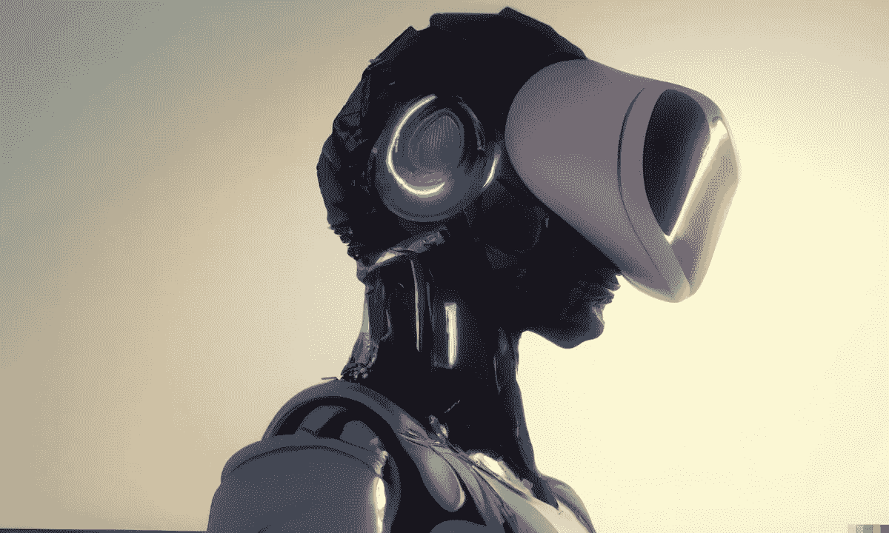

# 在几秒钟内生成您自己的个人元宇宙

> 原文：<https://medium.com/geekculture/generate-your-own-personal-metaverse-in-seconds-ea4f1250095f?source=collection_archive---------2----------------------->

A humanoid robot wearing VR headset, digital art, DALL-E 2

## 附加:如何在不到一分钟的时间内将一个想法变成 2D 动画。

W elcome to [**风口浪尖**](https://nicksaraev.com/#/portal/signup) :前沿 AI 新闻(及其含义)用简单的英语讲解。

在本周的杂志中:

*   使用人工智能在几秒钟内生成风格化的 3d 元宇宙环境。
*   如何把一个想法变成一个角色，然后把那个角色动画化，*免费，*不到一分钟。
*   未来一瞥:用人工智能叠加到增强现实上。

让我们开始吧。

# 人工智能风格化的 3D 环境

CGI 的人工智能在很短的时间内有了很大的提高。

几年间，我们从模糊的点云(T8)到基本的 3D 形状(T11)，再到照片般逼真的物体(T13)。现在我们可以用人工智能生成整个环境。

几天前，空间数据公司的创始人 Katsuaki Sato 创造了一整个城市:

这座城市——曼哈顿的复制品——是由一系列卫星照片在几分钟内建成的。

然后，Katsuaki 将 3D 城市景观与稳定的扩散结合起来，将布局从照片般的逼真转变为他所说的“漫画风格”

# 怎么才能利用呢？

就在最近几周，业余爱好者已经使用稳定的扩散文本提示生成了 3D 车辆、建筑物，甚至人。很快(< 3 years), we’ll be generating 3D worlds on the fly with nothing more than a text prompt.

The specific model Katsuaki created is closed-source. But open-source alternatives exist, and they’re catching up quickly.

You could:

*   Pick your favorite video game (must be moddable or have openly accessible 3D assets — alternatively, you could use a library like [Quixel Megascans](https://quixel.com/megascans) )。
*   微调一组关于资产类型的稳定扩散模型；想想[药剂](https://twitter.com/stale2000/status/1590584090381942786/photo/1)，剑，箱子，[载具](https://twitter.com/AiPromptr/status/1559756770880651264)，环境等等。
*   为游戏和电影生成几乎无限种类的高质量模型。

从逻辑上讲，您可以创建一个服务，将过程化的资产生成作为前提。你也可以与一家更大、更稳固的公司合作，优化他们的资产创造，利用现有的现金流。

但是我在之前已经谈论过这种事情，这已经有点老生常谈了。毫无疑问，这些都是价值数十亿美元的机会——但利润不那么丰厚(可能更有趣)的东西呢？

*   开始你自己的元宇宙工作室，提供“数字体验”
*   利用上述环境模型快速创建热门地点的 3D 版本，然后用稳定的扩散将它们风格化。
*   创建卡通环境、黑色电影环境、“《我的世界》”风格的环境等等，利用 3D 资产创建在竞争中获得巨大优势。
*   让任何人进入他们选择的虚拟世界，并单独出售或出售给希望利用下一个营销平台的广告商。

我认为 3D 是广告商的下一步。广告从文本开始，发展到图像，*上升到视频——互动阶梯上唯一剩下的就是互动的 3D 体验。*

随着消费级虚拟现实硬件的出现，以及稳定扩散等技术大大降低了进入门槛，这只是时间问题。

# 在几秒钟内将想法变成动画角色

除了环境创造，另一种方法是自动角色设计和动画。

使用像 [Sketch](https://sketch.metademolab.com/) 这样的模型结合稳定扩散，你现在可以生成高质量的人形角色，自动识别他们的关节，然后使用生物力学来猜测他们在 2D 的运动。

结果通常是准确的、真实的，并且*快速*(生成只需要几秒钟)。

# 我们如何利用这一点呢？

动画的东西，并出售它！更具体地说:

*   儿童书籍，
*   漫画，
*   漫画书，
*   轻小说，
*   DeviantArt 或 ArtStation 图纸，
*   稳定的扩散世代，

# 这对商业艺术家来说意味着什么？

最后一点引出了以下问题:

> 如果你们都可以产生图像，然后将图像动画化…那么商业艺术家和动画师还能做些什么呢？

这里有一个我经常看到的善意的回答:

> 嗯，像这样的技术将使新职业能够适应他们。他们会学到更好的技能，从而改善他们的财务状况和经济。

这里有一个更清醒、更现实的答案:

> 所有的商业艺术家都会失业。不会有替代职业。任何人类可以绘制、设计或制作动画的东西，人工智能都会做得更好、更便宜。

如果你从事上述行业，请将此视为一记警钟。商业艺术将不会步工业革命的后尘——对你这一行的人来说，不会有更多的经济机会，只会更少。

19 世纪 50 年代的动力织布机必须手动操作，这最终导致人类经济机会的增加。人工智能驱动的媒体创作不会。

几年之内，人工智能将能够创作*和*并判断其作品的质量，商业艺术家将被归入与“手工陶罐制作者”相同的经济领域

# 对增强现实未来的一瞥

bjrn Karmann 最近创建了一个简洁的概念证明，它位于几项爆炸性技术的交汇点:稳定扩散、增强现实和语音转文本。他称之为“我们看见了”:

简而言之，它支持对您的环境进行实时选择性编辑。这是即将到来的一个小前兆。

# 我们如何利用这一点呢？

目前，增强现实硬件体积庞大，价格昂贵，而且漏洞百出。但是很快，他们就被打败了。政治两极分化的程度和我们集体心理的脆弱性可能会增加，这无疑会产生下游社会影响。

广告定位的粒度将会爆炸。公司将能够根据特定用户的眼球运动、微表情、面部血流量的增加等来迎合他们。

*   最后一点很重要。尽管监管者可能很可爱，但他们通常年纪较大，与技术进步的指数速度脱节。
*   即使是几年不受限制地访问面部元数据，也足以让公司一飞冲天。先发优势将非常真实。
*   这是一个总结！

喜欢这个吗？考虑和你认识的人分享。如果你读这篇文章是因为你认识的某个人给你发了这封信，请点击[在这里注册](https://nicksaraev.com/#/portal/signup)获取下一期时事通讯。

下周见。

尼克

Enjoyed this? Consider sharing with someone you know. And if you’re reading this because someone you know sent you this, get the next newsletter by [signing up here](https://nicksaraev.com/#/portal/signup).

See you next week.

– Nick