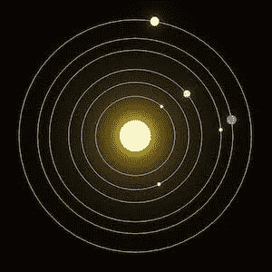

# 用 Blender 的 Python API 生成程序化太阳系

> 原文：<https://medium.com/geekculture/generating-a-procedural-solar-system-with-blenders-python-api-9754ece0cf03?source=collection_archive---------10----------------------->

## 你知道你可以在 Blender 中编程来自动创建 3D 对象和动画吗？

*本文原载于* [*德曼多的博客*](https://demando.se/blogg/post/dev-generating-a-procedural-solar-system-with-blenders-python-api/) *:)*

[**Blender**](https://www.blender.org/) 是一款知名的**软件，用于 3D 建模、雕刻、纹理、动画等等！**随着…