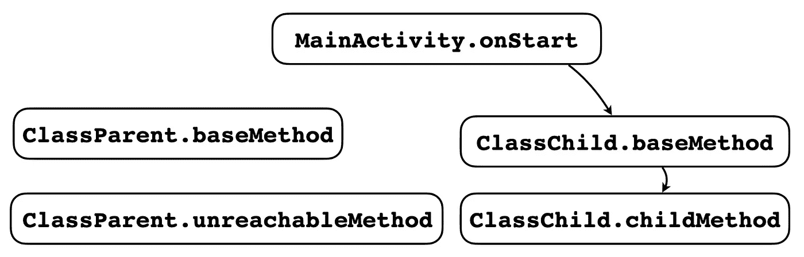
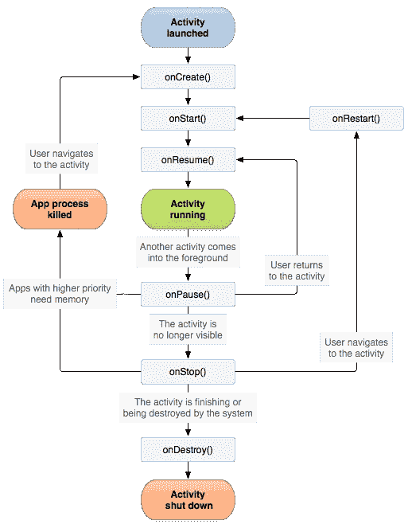
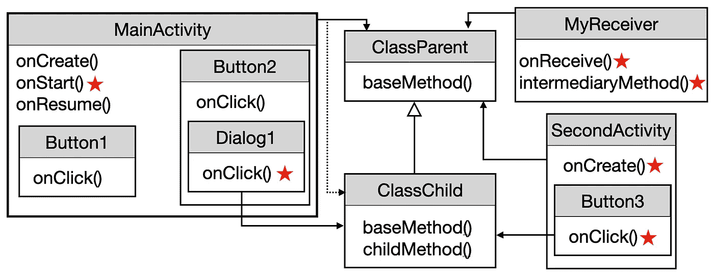
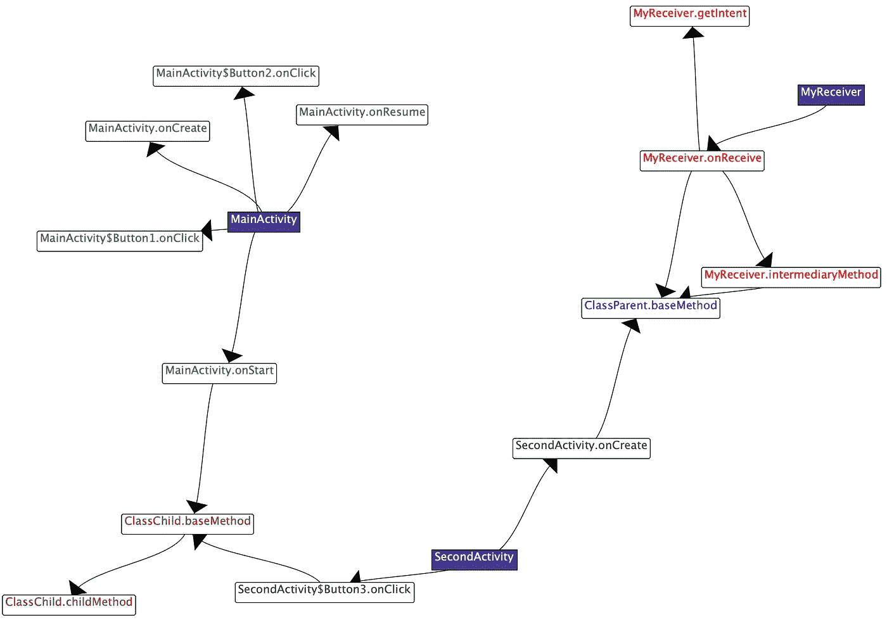
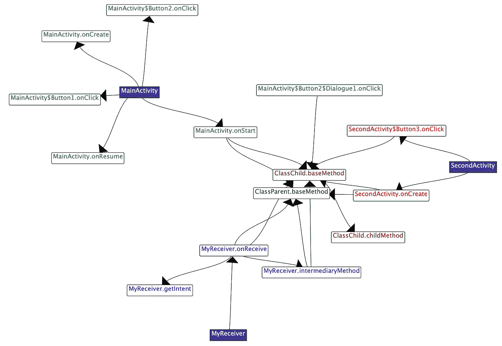

# 使用 FlowDroid + PointsTo 分析在 Android 中生成调用图

> 原文：<https://medium.com/geekculture/generating-call-graphs-in-android-using-flowdroid-pointsto-analysis-7b2e296e6697?source=collection_archive---------2----------------------->

如果你想静态地分析一个程序，你可能需要使用调用图。"调用图是一个控制流图，它表示计算机程序中子程序之间的调用关系."根据[维基百科](https://en.wikipedia.org/wiki/Call_graph)。对于 Java，调用图的节点是方法，边代表方法调用。调用图有各种应用，从安全分析，如恶意软件检测，或最简单的应用，如寻找未使用的方法-如果没有从应用程序的入口点到方法的路径，则该方法是未使用的。你可能在 IntelliJ 这样的 IDE 中见过这个特性。为了创建这样的应用程序，甚至是构建更酷的东西，在这篇博文中，我简单解释了一下

*   调用图算法如何工作
*   为 Android 应用创建调用图的挑战是什么
*   如何使用 FlowDroid 为 Android 应用程序创建调用图
*   最后，如何使用指向分析烟灰中的 API

如果你已经了解了调用图或者只是对创建调用图感兴趣，可以跳到 **FlowDroid** 部分，甚至直接查看源代码([调用图](https://github.com/noidsirius/SootTutorial/blob/master/src/main/java/dev/navids/soottutorial/android/AndroidCallgraph.java)，[指向](https://github.com/noidsirius/SootTutorial/blob/master/src/main/java/dev/navids/soottutorial/android/AndroidPointsToAnalysis.java))。无论哪种方式，我建议你在阅读这篇文章的时候，克隆一下[soot tutorial 库](https://github.com/noidsirius/SootTutorial)并运行代码。

我写这篇博客的主要原因之一是帮助其他不熟悉 FlowDroid 实现细节的研究学者。为了我的研究目的，我花了很多时间来计算正确的配置；所以，如果别人浪费他们的时间，那将是一种耻辱。顺便说一句，如果你的研究涉及调用图，你可能想看看我的论文或工具，我在其中介绍了调用图的扩展，称为并发和上下文感知调用图(C3G ),捕获 Android 应用程序中的临时过程间信息。我很乐意讨论这篇论文或其他研究主题，所以请在 [Twitter](https://www.twitter.com/nsalehna) 上关注我或给我发[电子邮件](mailto:nsalehna@uci.edu)。

现在，让我们继续工作…

# 调用图生成算法

静态精确地创建调用图不是一件容易的事情。虽然静态调用图生成有各种算法，但我并没有深入讨论所有算法的细节。相反，我用下面的例子简单解释了其中的两个，稍后，用 Android 中的一个扩展例子，我将它们可视化。现在，考虑下面的代码及其实际调用图。注意，为了清楚起见，我在这篇博文的所有可视化中删除了构造函数方法`<init>`和静态初始化器`<clinit>`。



The accurate call graph of the snippet code above

创建调用图的节点很简单，因为它们代表代码中的所有方法。对于提取边缘，有多种技术。一个简单的算法会创建从一个方法到所有方法的边，这些方法的签名已经在它的主体中使用。在这种情况下，平凡算法将创建从`main`方法到对应于第 20 行的`ClassParent.baseMethod`的边。然而，由于 Java 中的虚拟调用和反射，该算法非常不准确，可能会错过真正的边缘，如`main`到`ClassChild.baseMethod`。

更高级的算法，如[类层次分析](https://dl.acm.org/doi/10.5555/646153.679523) (CHA)通过为所有被覆盖的方法创建多条边来更保守地处理这种情况；因此，CHA 创建了从`main`到`ClassParent.baseMethod`和`ClassChild.baseMethod`的两条边。然而，由于字段`childInstance`被实例化为`ClassChild`(第 18 行)并且没有在任何其他地方被实例化，所以从`main`到`ClassParent.baseMethod`的边是虚假的。虽然这个算法不是很精确，但是它很快，不会错过任何显式调用。

最后，像 [SPARK](https://link.springer.com/chapter/10.1007/3-540-36579-6_12) 这样更复杂的算法通过使用 PointsTo 分析找到变量的实际类型来准确处理这种情况。与 CHA 相比，SPARK 消除了许多杂散边缘；然而，它慢得多，可能会错误地过滤掉一些真实的边缘。Soot 实现了 CHA 和 SPARK 算法，在之前的博客文章中，我解释了如何使用它们(对于 Java 程序)。

# Android 中的调用图

虽然 Android 应用程序是建立在 Java 之上的，但是静态创建它们的调用图要困难得多，因为它们的控制流与简单的单一入口点 Java 应用程序有很大不同。Android 应用程序由具有复杂生命周期的组件(活动、服务、广播接收器和内容提供器)组成。例如，下图显示了活动的生命周期。请注意，所有灰色框都是回调方法，将由 Android 框架隐式调用。换句话说，箭头不是*显式调用*，例如，方法`onCreate`不直接调用`onStart`*。关于生命周期的更多信息，你可以阅读这篇文章。*



The lifecycle of an Activity in Android ([link](https://developer.android.com/guide/components/activities/activity-lifecycle))

除了生命周期回调，还有开发人员定义的 GUI 回调。例如，活动中的每个按钮都应该与一个具有回调方法`onClick`的`OnClickListener`对象相关联。每当用户点击一个按钮，相应的`onClick`回调方法就会被调用。因此，这些 GUI 回调方法是如何被调用的以及它们与代码的其余部分有什么关系并不明显。

正如你可能猜到的，由“Soot neat”创建的 Android 应用程序的调用图没有可靠和有用的信息。然而， [FlowDroid](https://github.com/secure-software-engineering/FlowDroid) ，另一个建立在 Soot 之上的研究工具，可以(几乎)准确地为 Android 应用生成调用图。

# FlowDroid

FlowDroid 是一个“精确的上下文、流、字段、对象敏感的和生命周期感知的【Android 应用程序污点分析，正如它的[标题](https://www.bodden.de/pubs/far+14flowdroid.pdf)所暗示的。污点分析用于安全分析中，以检测来自源方法(例如，地理定位)的一些信息是否会泄漏到接收器方法(例如，因特网)。为了做到这一点，FlowDroid 为 Android 应用程序创建了一个精确的调用图作为副产品。为了减轻 Android 中的复杂性(正如我前面提到的)，FlowDroid 合成了一些人工方法，称为`dummy`方法。这些方法通过以适当的顺序调用生命周期和 GUI 回调来处理隐式调用。

现在来看看如何使用 FlowDroid 创建调用图(创建调用图对应的代码是[这里是](https://github.com/noidsirius/SootTutorial/blob/master/src/main/java/dev/navids/soottutorial/android/AndroidCallgraph.java))。假设我们有一个简单的 Android 应用程序，它有三个组件:`MainActivity`、`SecondActivity`和`MyReceiver`。这个应用的源代码可以在[这里](https://github.com/noidsirius/SootTutorial/tree/master/demo/Android/STDemoApp)找到。此外，还有另一个类`ChildClass`，它扩展了`ParentClass`。`MainActivity`和`SecondActivity`有对应于它们的 GUI 元素的内部类。例如，当用户点击按钮 2 时，调用方法`Button2.onClick`，弹出一个对话框，其中有一个按钮连接到`Dialog1.onClick`。其中一些类有类型为`ParentClass`和`ChildClass`的字段，如下所示(实线箭头)。注意，与上面的代码片段类似，MainActivity 有一个类型为`ClassParent`的字段，它被实例化为`ClassCihld`(如下图中的虚线箭头所示)。最后，所有带红星的方法通过它们类的字段调用`baseMethod`；例如，`onStart`调用`childInstance.baseMethod()`。



The pseudo-UML of our app

首先，我们需要配置 FlowDroid。在下面代码片段的第 1 行到第 5 行，我创建了一个`InfoflowAndroidConfiguration`对象，并提供了基本信息，比如 APK 和 Android 平台目录的路径(第 2 行和第 3 行)。为了获得更好的性能，FlowDroid 可以消除未使用的代码。然而，为了形象化，我禁用了这个特性(第 4 行)。请注意，如果您想要检测应用程序或使用 PointsToAnalysis，您必须禁用 CodeElimination。第 5 行定义了调用图算法，可以是 CHA、SPARK 或其他算法。

在第 6 行到第 8 行，我分别创建了 SetupApplication (FlowDroid 的控制器)、构造了调用图并检索了它。首先，让我们看看 SPARK 生成的调用图(下图)。你可以通过克隆 [SootTutorial](https://github.com/noidsirius/SootTutorial) 并执行`./gradlew run — args="AndroidCallGraph SPARK draw"`来看到这个可视化



A subset of the call graph generated by SPARK

紫色背景的方框是由 FlowDroid 创建的虚拟方法。可以看出，它们调用所有的生命周期和 GUI 回调方法，例如，`MainActivity`有到`onCreate`和`Button2.onClick`的边。此外，它为所有调用站点正确地找到了到`baseMethod`的正确边，例如，尽管`childInstance`的类型是`ClassParent`，但是`MainActivity.onStart`有到`ClassChild.baseMethod`的边。

尽管 FlowDroid 做得相当不错，但调用图遗漏了一些重要的边缘。例如，从`MainActivity`到`Dialog1.onClick`或从`Dialog1.onClick` 到`ClassChild.baseMethod`没有边(因为节点`Dialog1.onClick`没有任何边，所以图中没有显示)。这个错误背后的原因是 FlowDroid 对隐式调用的处理不当，在这个例子中，从`Button2.onClick`到`Dialog1.onClick`。因此，从入口点到`Dialog1.onClick`没有路径，SPARK 完全删除了这个节点。

现在，让我们看看 CHA 算法生成的调用图(执行`./gradlew run — args="AndroidCallGraph CHA draw"`)



A subset of the call graph generated by CHA

正如所见，这个调用图比 SPARK 创建的调用图更混乱，因为对于所有类型为`ClassParent`的变量的`baseMethod`调用来说，`ClassParent.baseMethod`和`ClassChild.baseMethod`都有两条边。从好的方面来看，您可以看到`Dialog1.onClick`存在于这个调用图中，并且比`ClassChild.baseMethod`有优势；但是，从`Button2.onClick`到`Dialog1.onClick`的边缘仍然缺失。

你可以在这里找到更多调用图 API[的例子，比如寻找可到达的方法或者迭代调用图。](https://github.com/noidsirius/SootTutorial/blob/master/src/main/java/dev/navids/soottutorial/android/AndroidCallgraph.java)

# 奖励:分析要点

正如我在“调用图生成算法”一节中解释的，SPARK 使用 PointsTo 分析来过滤虚假边。简单地说，PointsTo 分析为每个变量提取一组分配位置。换句话说，这个分析可以静态地告诉我们，每个变量可能的内存位置。例如，在下面的代码片段中，对象`o`的值可能指向方法`b`或`c`中的分配站点

```
class A{
    Object o;
    void b(){ o = new Object(); }
    void c(){ o = new Object(); }
    void d(){ o.toString(); }
}
```

您可以通过`pta = Scene.*v*().getPointsToAnalysis()`访问 Soot 中的 PointsToAnalysis 管理器对象。同样，为了检索一个局部变量或字段的分配位置，你可以使用`pta.reachingObjects(var)`。除了创建更精确的调用图之外，PointsTo 分析还可以用于别名分析，在别名分析中，您有兴趣发现两个变量*是否可能*或*必须*具有相同的值。你可以在这里找到一个带有 PointsToAnalysis API [的代码示例。](https://github.com/noidsirius/SootTutorial/blob/master/src/main/java/dev/navids/soottutorial/android/AndroidPointsToAnalysis.java)

# 结论

在这篇文章中，我解释了一些调用图算法，隐式调用和组件生命周期对创建调用图的影响，如何使用 FlowDroid 创建调用图，以及一些关于 PointsTo 分析的内容。

如果你对这个话题感兴趣，请关注[我的媒体账户](/@noidsirius)以获取关于静态分析的未来文章，关注[我的 Twitter 账户](https://twitter.com/nsalehna)以了解我的最新出版物。

**烟尘教程系列**

*   1- [使用 Soot 进行静态程序分析的初学者指南](/@noidsirius/a-beginners-guide-to-static-program-analysis-using-soot-5aee14a878d)
*   2- [了解煤烟的基本工具](/@noidsirius/know-the-basic-tools-in-soot-18f394318a9c)
*   3- [使用烟灰检测 Android 应用](/@noidsirius/instrumenting-android-apps-with-soot-dd6f146ff4d2)
*   4- [使用 FlowDroid + PointsTo 分析在 Android 中生成调用图](/geekculture/generating-call-graphs-in-android-using-flowdroid-pointsto-analysis-7b2e296e6697)