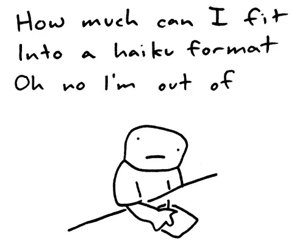
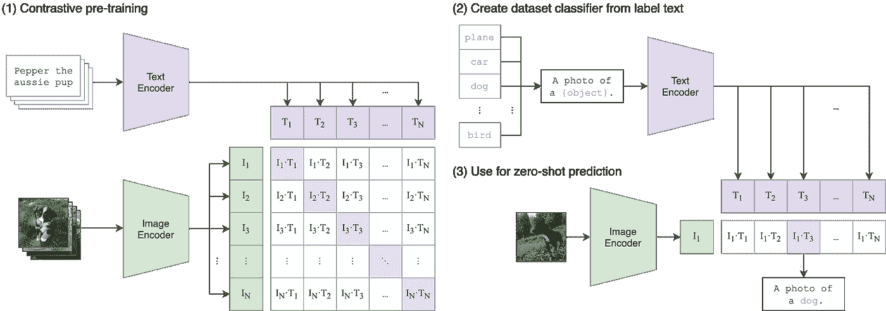
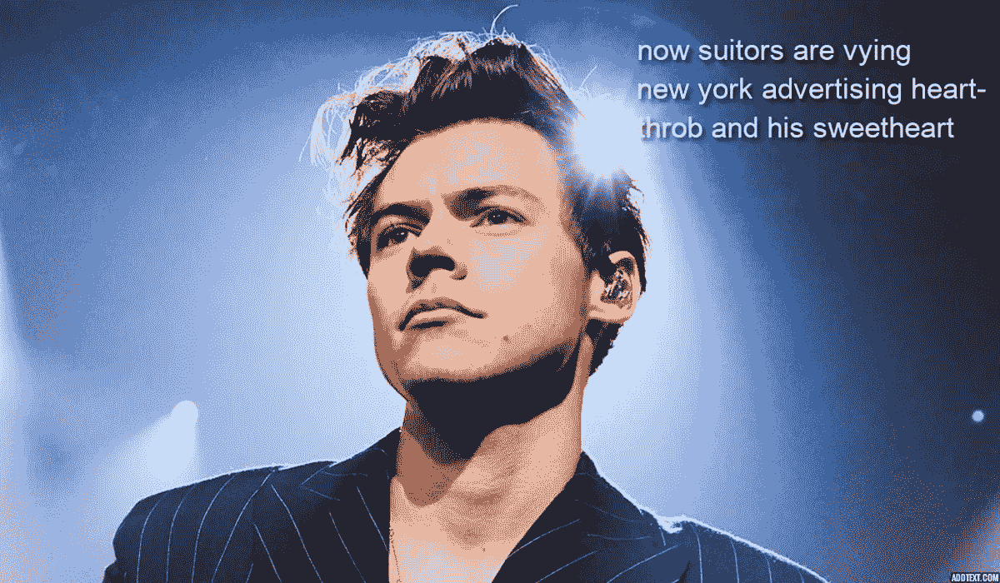
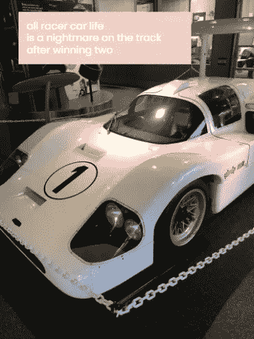
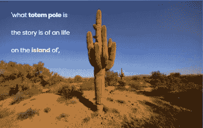
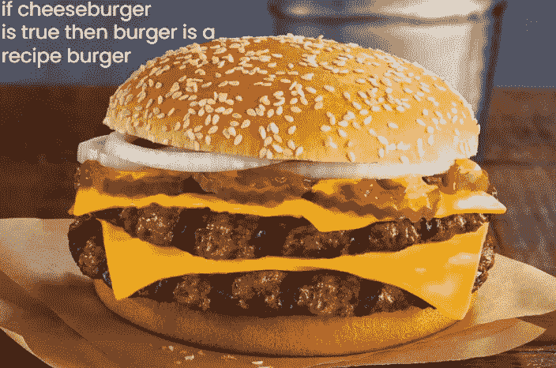

# 从图像中生成俳句

> 原文：<https://medium.com/geekculture/generating-haikus-from-images-c0d35c2470ce?source=collection_archive---------13----------------------->

作者:[皮特·戴维斯](https://www.linkedin.com/in/petermdavis/)，[拉姆·卡皮斯塔姆](https://www.linkedin.com/in/ramkapistalam/)，[英迪亚·林赛](https://www.linkedin.com/in/india-lindsay/)，[亚历克斯·麦格劳](https://www.linkedin.com/in/josephalexmcgraw/)，[伊曼纽尔·彭米尼塞里](https://www.linkedin.com/in/immanuel-p/)，[马修·斯特莱希勒](https://www.linkedin.com/in/matthew-streichler/)

俳句是一种受 5-7-5 音节模式限制的日本诗歌的流行形式。传统的俳句倾向于关注自然世界的元素。现代变体通常在坚持音节结构的同时融入独特的文体特征。

我们感兴趣的是确定一种创造性的方法来结合几种 NLP 和机器学习技术，包括卷积神经网络和变压器，来编写俳句。我们开发了一个生成模型，它以一幅图像作为输入，并写出与图像中包含的对象相关的俳句。这个项目的主要挑战是创作与输入图像相关的诗歌，同时遵守英语语法规则和俳句的结构限制。

我们的诗歌生成模型包括以下 3 个步骤:

1.  将图像输入 VGG16，生成代表图像的标签
2.  使用标签产生连贯的，有意义的俳句，遵循 5-7-5 音节结构
3.  通过使用创新的神经网络技术(CLIP)选择最合适的诗歌来提高相关性。

# 相关著作

我们的项目受到了其他几位数据科学家工作的启发。pranav Vadrevu[【1】](https://towardsdatascience.com/generate-fresh-movie-stories-for-your-favorite-genre-with-deep-learning-143da14b29d6)使用预先训练的 GPT-2 模型构建了一个电影故事生成器。他通过用电影剧本数据微调 GPT-2 模型来提高输出故事的连贯性。

丹尼斯·克里维茨基[【2】](https://avoncourt.de/generation-poems-recurrent-neural-network/)创造了一个发电机，输出基于莎士比亚和哥特的诗歌。他使用递归神经网络(RNN)架构来训练生成器。

marmik Pandya[【3】](https://www.researchgate.net/publication/313874773_NLP_based_Poetry_Analysis_and_Generation)发表了一份技术报告，该报告使用了一种基于简单词性(POS)标记的系统来生成诗歌。他们还尝试了一种遗传算法来提高模型的一致性。

# 步骤 1:从图像生成标签

我们的俳句生成的第一步是允许用户上传他们想要的相关俳句的图片。为了识别俳句的主题，我们使用 VGG16 模型来识别图像中包含的对象。

首先，根据 VGG16 模型的要求对图像进行大小调整和归一化。第二，图像被输入 VGG16 模型，该模型从*火炬视觉*包装中导入，并带有预调整的重量。为了获得输入图像的单个标签，从所有可能的 ImageNet 标签中选择具有最高概率的标签。

# 步骤 2:使用 GPT2 生成俳句

在 VGG16 模型返回分配给该图像的第一个标签后，我们使用 NLTK 英语停用词集随机生成第一个单词。然后，我们将这两个单词输入到 GPT2 模型中，以创建一个戏剧性的句子。使用 python 包 Syllapy，我们计算了这个句子中的音节数，并将其限制在 5 个。如果添加由 GPT2 模型生成的下一个单词使音节数超过 5，我们识别下一个单词的同义词或反义词，并随机选择其中一个符合必要音节数的选项。我们继续将第一个句子输入到 GPT2 模型中，以生成下一个 7 个音节的序列作为俳句的第二行。我们以同样的方式调整音节数。类似地，我们将第一行和第二行的组合输入到生成器中，以接收第三行，并限制其音节数为 5。对于每张图片，我们生成了 10 种不同的俳句。

# 步骤 3:使用 CLIP 验证俳句

在 Imagenet 和 GPT2 基于一个图像输入共同制作了 10 个不同的俳句之后，我们使用 CLIP 从为特定图像生成的 10 个俳句中确定最佳俳句。CLIP 将图像和俳句列表作为输入，并为每个俳句分配一个百分比，该百分比对应于与图像输入相关联的每个俳句的相对可能性。这些百分比的总和等于 1，因为模型仅从给定的俳句中进行选择，以确定哪些俳句最有可能与图像相关联。我们的模型选择了从 CLIP 中获得最高概率的俳句作为每个图像输入的最终俳句。

# 模型的简要背景

## VGG16

用于为图像输入生成标签的算法是 VGG16，这是一个提交给 2014 年 ImageNet 挑战赛的模型。VGG16 是在 ImageNet 数据集上训练的卷积神经网络，可用于分类多达 1000 个不同的类别。模型的输入大小是 224 乘 224，模型本身是 16 层深。该模型利用了几个 3×3 核，并且所有隐藏层利用了 ReLU 非线性。整个架构的示意图如下所示:

## GPT2

GPT2 是最先进的大规模无监督语言生成模型。这是一个遵循多头自关注架构的转换器，具有编码器-解码器层堆栈，结合完全连接的前馈网络。这种类型的结构允许模型在给定文档中所有先前单词的情况下预测下一个单词，同时利用并行处理来提高计算速度。GPT2 使用 WebText 进行预训练，WebText 是来自人类创作的互联网页面的超过 800 万个文档的语料库。使用迁移学习，该模型可用于从可能的文本序列生成文本。它可以接收各种输入，从一个单词，到一个句子，到一个段落[4]。

GPT2 已经可以通过 huggingface.co[5]在线获得，这是一个开源的人工智能库。我们使用了 gpt2-流派-故事生成器版本的 GPT 2。这个特殊的变体是由用户 pranavpsv 开发的[1]。它用预先训练好的 GPT2 权重进行初始化，但根据不同类型的故事进行微调。给定一个类型，这个模型专门生成故事。

我们最初尝试生成俳句时使用的是 GPT2 的原始形式。但是，输出的句子在主题中不一致，语法和标点符号使用不正确，导致句子不自然。我们选择使用故事生成器变体，使用戏剧流派输入选项，目的是生成更有意义和连贯的文本。虽然故事生成器 GPT2 并不完美，但它极大地改善了我们的结果。

## 夹子

对比语言-图像预训练(CLIP)是一种模型，它是一种预训练模型，用于找到哪个文本最适合特定图像。为了预训练剪辑，一组图像被馈送到图像编码器，该图像编码器生成 n×1 向量(n 是图像的数量)，然后图像标签的列表被馈送到文本编码器，生成 1×n 向量(n 是标签的数量)。计算两个向量中每个项目之间的点积的软最大值，以给出所有分类的概率。这个概率被解释为图像的最可能标签。在对模型进行预训练之后，可以将一幅单独的图像与一组标签一起输入到 CLIP 中。该模型将计算图像和所有标签之间的点积的 softmax，以输出最能代表图像的文本。剪辑的直观表示如下图所示:

## 结果！

这里是我们的模型生成的一些样本俳句。虽然远非完美，但它们相当有趣。

ImageNet label: ‘suit’. Probability of association: 50.83%

ImageNet label: ‘alp’. Probability of association: 29.17%

ImageNet label: ‘racer’. Probability of association: 47.31%

# 结论和未来工作

通过结合这三个模型，我们能够生成一些与感兴趣的图像相关的有趣的俳句。我们面临的主要挑战是创作有意义的俳句。由于我们的俳句是由 GPT2 的故事体裁变体产生的，它们往往缺乏诗意。更确切地说，它们读起来就像一个被必要音节所限制的故事。为了改善这一点，在俳句语料库上重新训练 GPT2 的最后几层可以帮助产生更多“诗意”的诗歌。

出现的其他问题与生产的标签和 GPT2 模型的质量有关。当描述图片的词不准确或太详细时，其他模型就很难产生和选择连贯的俳句。例如，当输入一只柯基犬的图像时，VGG16 产生了“Pembroke”的标签——指的是一种特定品种的威尔士柯基犬。这个词对于 GPT2 模型来说太具体了，无法识别并产生无意义的文本。

此外，该模型产生了语法使用不准确的句子。如下面的输出所示，重复使用单词“is”是不自然的。第二，VGG16 模型已经将这种仙人掌标记为图腾柱。

由于沙漠很像一个岛屿，这个例子突出了 CLIP 将整个俳句连接到图像的能力。未来的改进可能与改进句子的语法结构有关。

我们面临的最后一个挑战与不自然的话题转换有关。俳句中的每一行都有意义，但是后面的行不会建立在前面的行之上。如前所述，在俳句上微调 GPT2 模型是解决这个问题的另一种方法。

总的来说，我们的模型写的俳句相当有趣。总结这篇文章的最好方式是展示一首不那么平庸的关于美味汉堡的俳句:

**查看我们的代码:** [这里！](https://github.com/indialindsay/Haiku_Generation)

参考资料:

[1]普拉纳夫·瓦德雷沃。[“用深度学习为你喜欢的类型生成新鲜的电影故事”](https://towardsdatascience.com/generate-fresh-movie-stories-for-your-favorite-genre-with-deep-learning-143da14b29d6)

[2]丹尼斯·克里维茨基。[“用递归神经网络生成诗歌”](https://avoncourt.de/generation-poems-recurrent-neural-network/)

[3]马尔米克·潘迪亚。[《诗歌分析与生成》](https://www.researchgate.net/publication/313874773_NLP_based_Poetry_Analysis_and_Generation)

[4] [注意和变压器型号。“注意力是你所需要的全部”是 Helene Kortschak |写给数据科学的一篇文章](https://towardsdatascience.com/attention-and-transformer-models-fe667f958378)

【5】[拥抱脸——在解决 NLP 的任务中，一次一个承诺。](https://huggingface.co/)