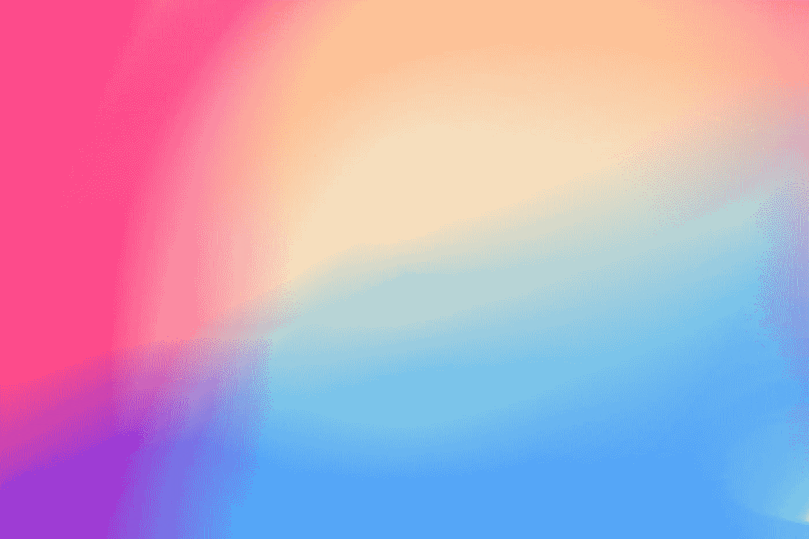

# 使用数学生成无限美丽的图像！

> 原文：<https://medium.com/geekculture/generating-infinite-beautiful-images-using-math-ed9dfbf5dc03?source=collection_archive---------14----------------------->

Photo by [Gradienta](https://unsplash.com/@gradienta?utm_source=medium&utm_medium=referral) on [Unsplash](https://unsplash.com?utm_source=medium&utm_medium=referral)

这一切都是从我编写的一小段 JAVA 代码开始的，这段代码用于为应用程序测试生成无限丑陋、随机和像素化的图像。利用随机性的概念，并加入一点数学、几何和模式，我能够提出一个 JAVA 代码，理论上可以生成无限数量的图像，其中包含随机混合的渐变、随机放置的几何图形…