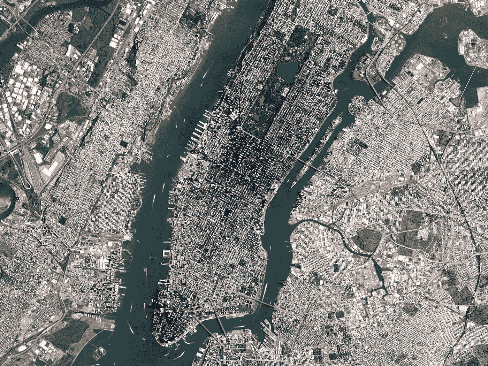
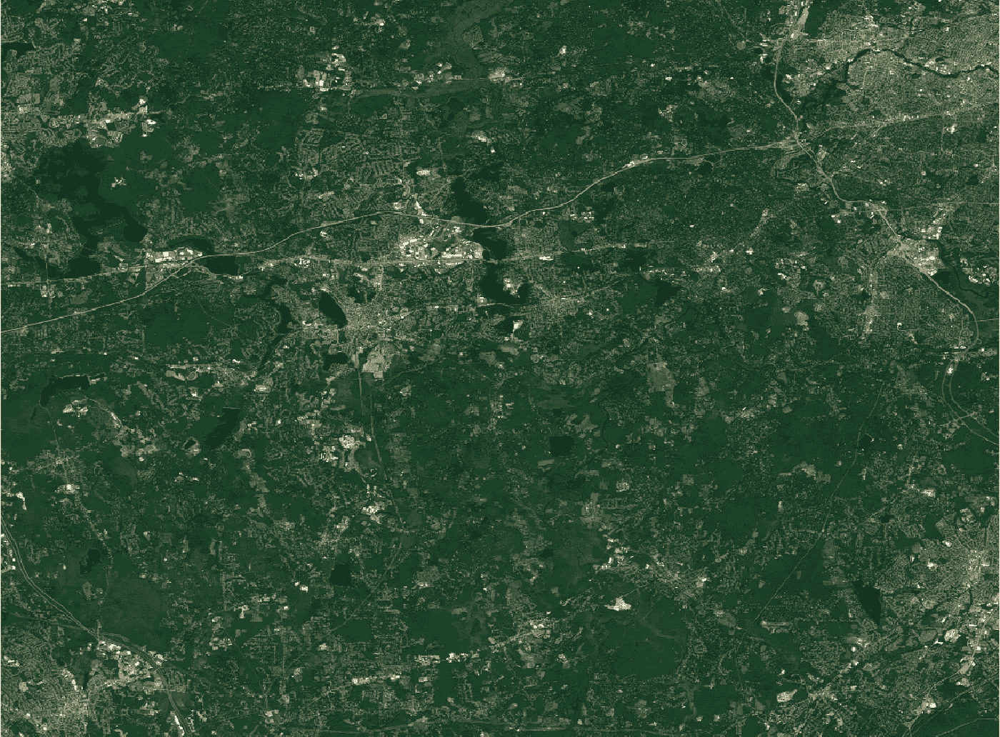
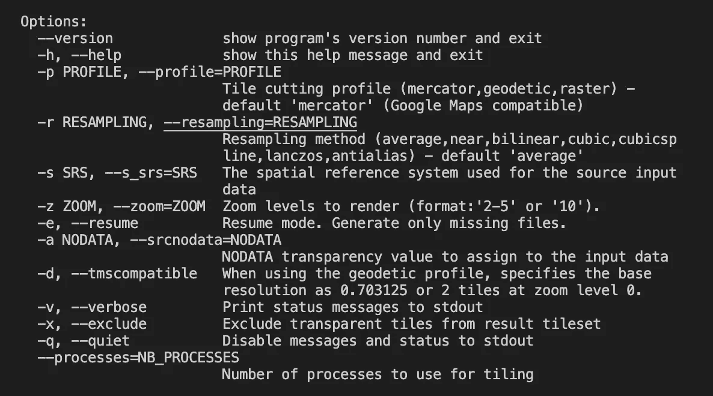
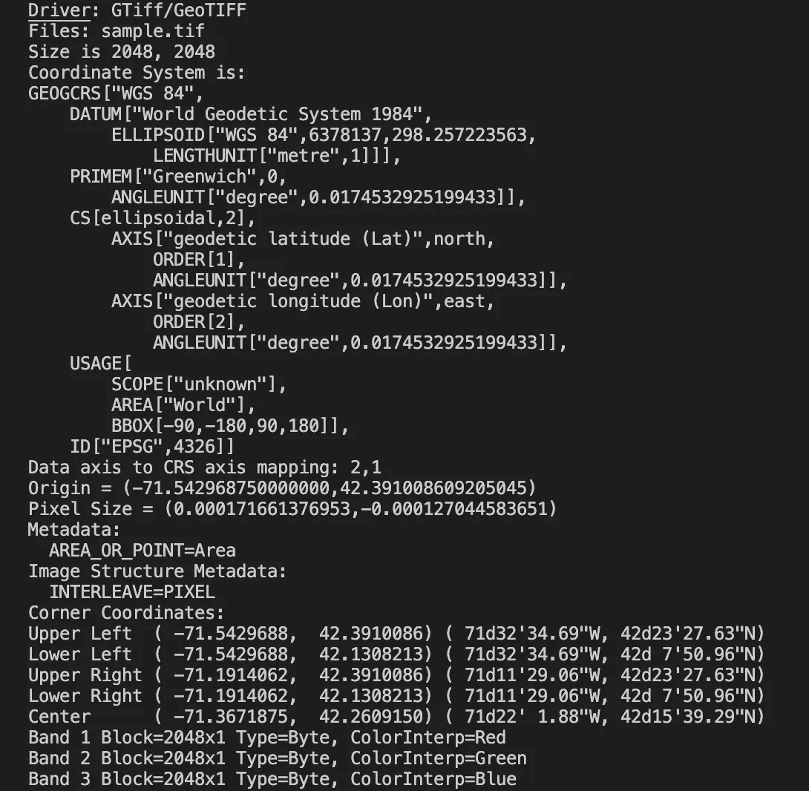
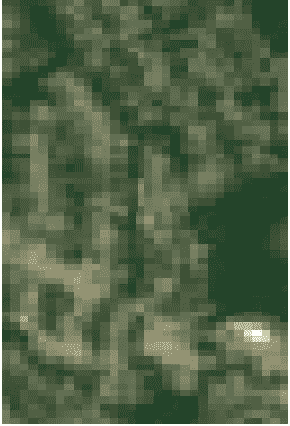
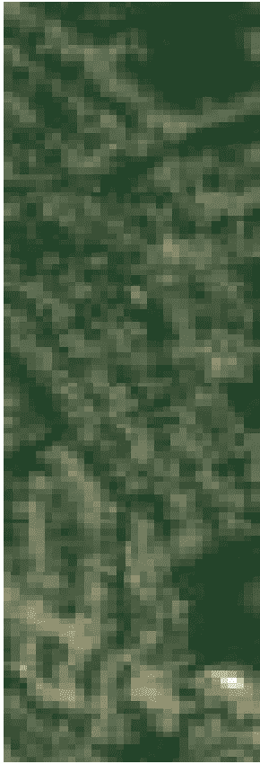

# 使用 Python 中的 Gdal2tiles 生成不同缩放级别的地图切片

> 原文：<https://medium.com/geekculture/generating-map-tiles-at-different-zoom-levels-using-gdal2tiles-in-python-af905eecf954?source=collection_archive---------0----------------------->



Satellite image of New York City captured by the [PlanetScope](https://www.planet.com/) satellite

近年来，我们看到由卫星和航空图像组成的地理空间数据的使用大幅增长。这种增长不仅导致卫星和航空图像成为大数据革命的一部分，还为企业提供了新的探索途径。早些时候，政府和大公司是唯一能够获得用于军事和国防目的的高质量卫星图像的机构。今天，任何人只要有一台电脑和互联网连接就可以获得卫星图像，因为获取卫星图像的价格已经大幅下降。这为数据科学家和机器学习工程师从事不同项目提供了各种机会。

来自卫星的图像只能达到它们的空间分辨率。像素越小，图像越清晰。因此，高分辨率图像的空间分辨率值非常低。像 WorldView-3 和 SkySat 这样的商业卫星的空间分辨率分别接近 31 厘米/像素和 50 厘米/像素。

高分辨率栅格数据有两个主要问题。

*   如果要显示这样高分辨率的栅格数据，就需要很大的内存。
*   如果我们把它放到互联网上，可能会有带宽问题。

为了解决这些问题，最好平铺高分辨率图像，[*gdal 2 tiles*](https://gdal.org/programs/gdal2tiles.html)*可以帮助我们。*

# *数据*

*为了向您展示一个使用 *gdal2tiles* 库的示例，我们将使用一个来自 [OpenMapTiles](https://openmaptiles.org/) 的地理参考图像样本，它位于*中。tif* 文件格式。来自 OpenMapTiles 的图像的空间分辨率为 *20m/px* 。*

**

*Sample geo-referenced image from OpenMapTiles*

# *安装和使用*

*在安装 *gdal2tiles* 库之前，确保 python 和 gdal 已经安装在您的机器上。*GDAL 2 文件需要一些 GDAL 依赖项。因此，最好同时安装 python 和 GDAL。如果你需要帮助安装它们，你可以遵循克里斯托夫·里克的逐步指导。**

*在您的机器上打开一个终端，运行下面的命令来安装 *gdal2tiles* python 库。*

```
*$ pip install gdal2tiles*
```

*您可以通过在终端中编写以下命令来查看不同的可用选项。*

```
*$ gdal2tiles.py -help*
```

*上述命令的输出如下所示:*

**

*List of options available for *gdal2tiles**

*运行以下命令获取源图像的地理空间信息。在我们的例子中，样本图像有一个文件名 *sample.tif.**

```
*$ gdalinfo sample.tif*
```

*您应该得到如下所示的输出:*

**

*gdalinfo command output*

*输出为我们提供了图像的重要地理空间信息，如投影或 srs 值(EPSG:4326) *、*边界框坐标(左上、左下、右上、右下)、基准等。当使用 *gdal2tiles* 库时，我们需要这些信息中的投影代码。*

*让我们使用 *gdal2tiles* 库编写一个小的 python 脚本，使用上面的一些选项来生成图块。*

```
*import gdal2tilessource_path = "Enter Source Path here"
destination_path = "Enter Source Path here" **def create_tiles(source_path, destination_path):**"""Method to generate tiles at different zoom levels using gdal2tiles library.Args:source_path : path for the source file which needs to be tileddestination_path : path for the output directory where the tiles will be generated""" options = {'zoom': 16, 'nb_processes': 4, 'tile_size': 256, 'srs':'EPSG:4326' }
    **gdal2tiles.generate_tiles(source_path, destination_path,
     **options)**create_tiles(source_path, destination_path)*
```

*正如您所看到的，上面选项列表中的一些选项已经在选项字典中使用。对于上述方法，我们尝试生成缩放级别为 *16 的图块，*生成图块的图块大小为 *256，*使用的进程数为 *4* ，srs(投影)值为 *EPSG:4326。*可根据您的要求修改选项。*

*使用以下命令运行上述脚本。根据您的 python 文件的名称替换" *gdal2tiles_test"* 。*

```
*$ python3 gdal2tiles_test.py*
```

*以下是运行上述命令后的示例(4 个平铺)输出。这是如何在缩放级别 16 下生成拼贴以形成样本图像的一部分的逐步显示。*

**

*1*

**

*2*

**

*3*

**

*4*

# *结论*

*这篇文章提供了为什么需要 gdal2tiles 以及如何使用它在 python 中生成不同缩放级别的切片的基本知识。您也可以使用 Adobe Photoshop 或 GIMP 之类的工具手动完成这项工作，但这很容易出错，而且很繁琐。将影像叠加到地图上或托管/提供地图时，切片生成是必不可少的。*