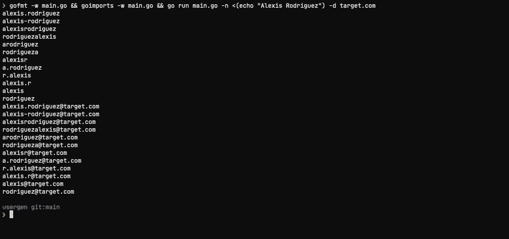

# 生成用户名单词列表

> 原文：<https://medium.com/geekculture/generating-username-wordlists-3bf15c68eef9?source=collection_archive---------3----------------------->

## 使用常见的公司用户名惯例



H ello，🌎！在这篇博客中，我将提供一个我编写的名为`usergen`的工具的演示，该工具接受一个姓名列表，并使用最常见的用户名/电子邮件命名约定生成用户名/电子邮件，例如:

```
firstName.lastName
firstInitial.lastName
firstName.lastName@target.com
```