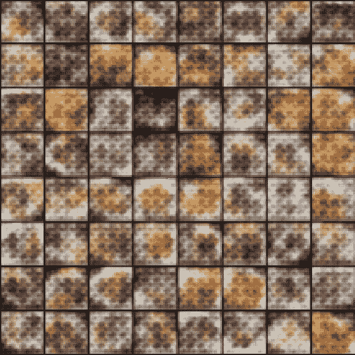
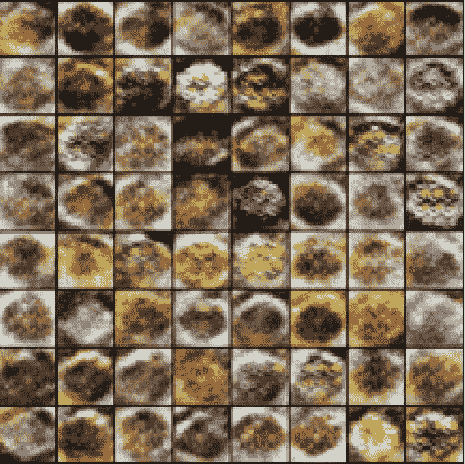
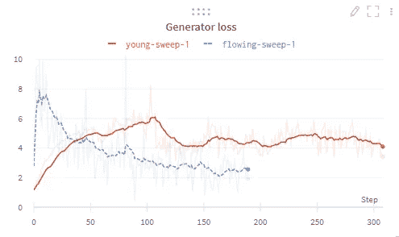
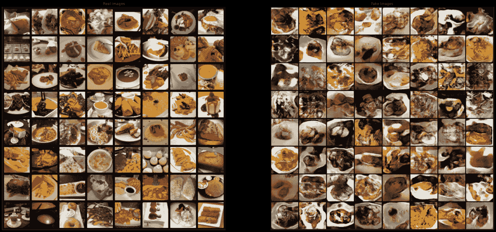

# 带有权重和偏差的生成性敌对网络超参数扫描

> 原文：<https://medium.com/geekculture/generative-adversarial-network-hyperparameter-sweeps-with-weights-and-biases-580b437028a2?source=collection_archive---------31----------------------->

*恭喜看完标题不吐不快！*



Early stages of a neural network learning what food is

生成敌对网络(GANs)很难理解，因为对于许多超参数值来说，没有什么有趣的事情发生。您可以快速观察鉴别器了解哪些图像是假的，而生成器根本不知道如何在训练数据的分布中生成新图像。此外，设置指标以更好地了解网络性能可能很困难，因为有太多的变量可能是获得良好性能的一个关键*，但是找到那个变量可能很困难。*

找到好的 GAN 超参数的潜在解决方案是使用权重和偏差来跟踪您的实验。虽然图像生成的技术水平一直在不断变化，但我们可以看看一种最新的 GAN 架构，看看变化的超参数如何影响模型的输出。具体来说，我们将在 ArXiv 上使用[这篇论文，并尝试使用](https://arxiv.org/pdf/1511.06434.pdf)[这个食物图片数据集](https://www.semanticscholar.org/paper/Food-101-Mining-Discriminative-Components-with-Bossard-Guillaumin/8e3f12804882b60ad5f59aad92755c5edb34860e?p2df)来看看我们能否生成看起来真实的食物。对于神经网络来说，这将是一个非常困难的问题，因为食物非常复杂。食物通常放在方形或圆形的盘子里，但也可以放在柜台上。一些颜色搭配一些食物，尽管各种各样的颜色和形状可以制作出真正的食物。一般来说，从事物非常相似的数据集得到好的结果，但是让我们来看看更有挑战性的东西。

(如果你想看甘斯真的做得很好，就去查[这个人不存在](https://thispersondoesnotexist.com/))

在我们开始之前，我们需要让自己不要失败。神经网络的一个主要问题是获得了非常好的结果，但是无法复制它们，因为我们不知道我们做了什么工作。同样，当事情出错时(这种情况经常发生)，我们希望确保不会重复这个实验。虽然“不重复失败的事情”*听起来*显而易见，但实际上这样做是繁琐且容易被遗忘的。我们可以使用更系统的方法，而不是依赖我们的记忆，或者在记事本上写下一些东西

Weights and Biases 是一个 Python 库，可以帮助我们在神经网络中取得更快、更有效的进展。通过几行额外的代码，我们可以以任意精确的粒度存储实验信息。我特别喜欢以这种方式存储数据的一点是，函数很少，所以很难搞砸(不是说我会犯错误或什么的……)。另一个原因是，你可以在 Twitter、T2、LinkedIn 和 T3 中找到一个工作面板

```
# Log key metrics about your model
wandb.log({"Discriminator loss": errD.item(), 
           "Generator loss": errG.item(),
           "epoch": epoch})
```

**其他材质:**

```
wandb.log({"grid_image": plt.imshow(np.transpose(vutil_grid,(1,2,0)), animated=True)})
```

注册，这样你就可以使用权重和偏见:[https://wandb.ai/site](https://wandb.ai/site)

```
wandb.log({"improvement lapse": wandb.Html(HTML(animation.to_jshtml()))})
```

文本到图像生成方面的出色工作:[https://openai.com/blog/dall-e/](https://openai.com/blog/dall-e/)



Weights and Biases display of generator output images. Still not realistic, but we can see improvement!

权重和偏差测井教程:[https://www.youtube.com/watch?v=96MxRvx15Ts](https://www.youtube.com/watch?v=96MxRvx15Ts)



我们系统地无法精确计划，所以系统化更好:[https://en.wikipedia.org/wiki/Planning_fallacy](https://en.wikipedia.org/wiki/Planning_fallacy)



Bone Apple Tea!

Say hi: [Twitter](https://twitter.com/Steven_B_Lee), [LinkedIn](https://www.linkedin.com/in/stevenbrlee/)

**Other material:**

Sign up so you can use Weights and Biases: [https://wandb.ai/site](https://wandb.ai/site)

Cool work on text-to-image generation: [https://openai.com/blog/dall-e/](https://openai.com/blog/dall-e/)

Tutorial on Logging with Weights and Biases: [https://www.youtube.com/watch?v=96MxRvx15Ts](https://www.youtube.com/watch?v=96MxRvx15Ts)

We systematically fail to plan accurately, so systematizing is better: [https://en.wikipedia.org/wiki/Planning_fallacy](https://en.wikipedia.org/wiki/Planning_fallacy)