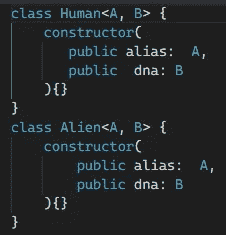
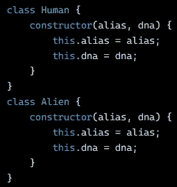
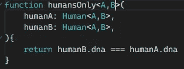
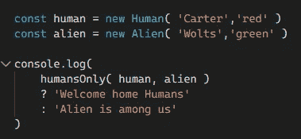
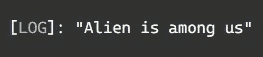
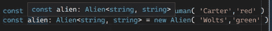
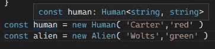
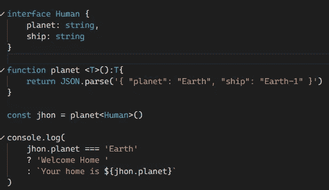
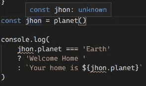
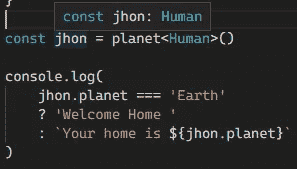

# TypeScript 中的泛型函数

> 原文：<https://medium.com/geekculture/generic-functions-in-typescript-5edf65b80c02?source=collection_archive---------15----------------------->


我们将看到一个函数如何管理多种类型的参数，并且我们将能够过滤异类👽

# 通用函数

这可以帮助你限制你的函数只接受你想要的类型，例如我们需要过滤谁是外星人，谁是人类，因为我们只需要人类！

我们从两个类开始，添加他的类型类 Human 和 Alien 都有 DNA 和别名，都有自己的构造函数，我们在构造函数上设置 A 和 B 泛型类型。



Example class with generics

在编译后的 JavaScript 上，它显示了带有这些变量的构造函数，这是因为它将删除 A、B 单词并替换为声明的类型。



JavaScript Compiled class with generics types

之后，我们可以创建接受参数的函数，但是只有两个泛型类型，参数显示它只接受人类，但是我们要看看这是否正确。



Example generic function

然后我们实例化我们的人类和外星人来检查这是否正确



Example instantiate classes with generics

结果显示“外星人就在我们中间”什么！



Example output

这就是为什么我们的类在属性上是相似的，但是我们的通用函数工作得很好，它接受只有两种类型的参数，我们的 IDE 可以正确地猜测你要共享什么类型，最好的部分是它可以过滤异类👽。



Example instantiate human and alien



Example instantiate human and alien without generics

# 密码

```
class Human<A, B> {
constructor(
public alias:  A,
public  dna: B
){} }class Alien<A, B> {
constructor( public alias:  A,public dna: B){}}
function humansOnly<A,B>( humanA: Human<A,B>,humanB: Human<A,B>, ){return humanB.dna === humanA.dna}const human = new Human( 'Carter','red' )
const alien = new Alien( 'Wolts','green' )
console.log(humansOnly( human, alien ) ? 'Welcome home Humans' : 'Alien is among us')
```

如果你想稍微熟悉或者习惯这个通用函数，我们可以用两种类型的行星和飞船制作一个人类界面，我们的通用函数，让我们继续。



Example generic function with interface

让我们来看看泛型函数，因为它有一个 T 类型，它返回相同的 T 类型，如果我们创建我们的 Jhon human，我们会看到这是否有效，但它有一个未知的类型，这就是为什么我们需要我们的接口。



Example unknown type generic function and errors



Example adding our Human interface to the generic function

这将有助于 Jhon，因为在这种情况下，它会显示这个对象有行星和船，如果我们不这样做，它会显示太多的错误，对 IDE 和我们来说都不清楚。

# 密码

```
interface Human {
planet: string,
ship: string
}function planet <T>():T{
return JSON.parse('{ "planet": "Earth", "ship": "Earth-1" }')
}const jhon = planet<Human>()console.log(
jhon.planet === 'Earth' ? 'Welcome Home ' : `Your home is ${jhon.planet}`)
```

# 结论

这个泛型函数非常有用，如果你想清除你的代码或者在你的参数上接收特定的类型，当我们用接口指定类型的时候，它会帮助我们，它看起来很干净，并且它对 IDE 了解你想用你的代码做什么很有帮助。

# 来源

[](https://www.typescriptlang.org/) [## 带有类型语法的 JavaScript。

### TypeScript 通过向语言中添加类型来扩展 JavaScript。TypeScript 通过以下方式加速您的开发体验…

www.typescriptlang.org](https://www.typescriptlang.org/) [](https://www.typescriptlang.org/docs/handbook/2/generics.html) [## 文档-泛型

### 软件工程的一个主要部分是构建组件，这些组件不仅具有定义良好且一致的 API，而且…

www.typescriptlang.org](https://www.typescriptlang.org/docs/handbook/2/generics.html) [](https://www.amazon.com/Typescript-Quickly-Yakov-Fain/dp/1617295949/ref=sr_1_3?__mk_es_MX=%C3%85M%C3%85%C5%BD%C3%95%C3%91&dchild=1&keywords=typescript&qid=1630082209&sr=8-3) [## 快速打字

### 在 Amazon.com 上快速打字[费恩，雅科夫，莫伊瑟夫，安东]。*符合条件的优惠可享受免费*运输。打字稿…

www.amazon.com](https://www.amazon.com/Typescript-Quickly-Yakov-Fain/dp/1617295949/ref=sr_1_3?__mk_es_MX=%C3%85M%C3%85%C5%BD%C3%95%C3%91&dchild=1&keywords=typescript&qid=1630082209&sr=8-3)