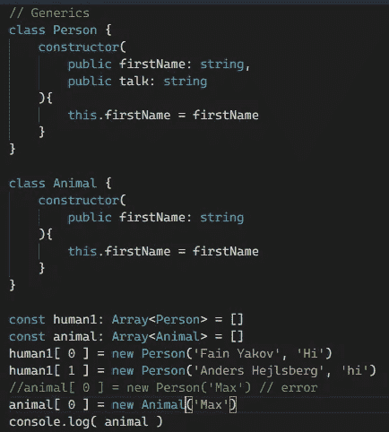
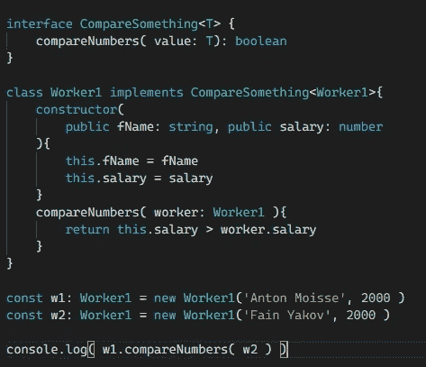

# 泛型和在 TypeScript 中创建您自己的泛型类型

> 原文：<https://medium.com/geekculture/generics-and-creating-your-own-generic-type-in-typescript-213691a42d7f?source=collection_archive---------39----------------------->


TypeScript 中的泛型没问题，但是你自己的 TypeScript 中的泛型更好！

# 无商标消费品

是一段代码，可以处理多种类型的值，这些值是在使用这段代码时指定的，我们可以使用它们

```
let g1: Array<string>let g2: string[]
```

# 示例泛型

如果你想要一个只接受 Person 的数组，你可以在大于和小于<>中指定，你可以设置数组<person>，因为我们只需要一个 Person 数组，但是如果我们使用 animal 类会发生什么呢？它会显示一个错误，反之亦然。</person>

```
// Generics
class Person {
constructor(
public firstName: string,
public talk: string
){
this.firstName = firstName
}
}
class Animal {
constructor(
public firstName: string
){
this.firstName = firstName
}
}
const human1: Array<Person> = []
const animal: Array<Animal> = []
human1[ 0 ] = new Person('Fain Yakov', 'Hi')
human1[ 1 ] = new Person('Anders Hejlsberg', 'hi')
//animal[ 0 ] = new Person('Max') // error
animal[ 0 ] = new Animal('Max')
console.log( animal )
```



Example Generics TypeScript

# 自己的泛型

创建自己的泛型你只需要一个只接受你想要的类的接口，在这个例子中，它只接受 Worker1，这就是 compareNumbers 方法的全部，但是你可以使用你想要的另一个泛型。

```
interface CompareSomething<T> {
compareNumbers( value: T): boolean
}
class Worker1 implements CompareSomething<Worker1>{
constructor(
public fName: string, public salary: number
){
this.fName = fName
this.salary = salary
}
compareNumbers( worker: Worker1 ){
 return this.salary > worker.salary 
}}const w1: Worker1 = new Worker1('Anton Moisse', 2000 )
const w2: Worker1 = new Worker1('Fain Yakov', 2000 )
console.log( w1.compareNumbers( w2 ) )
```



Example Own Generic

# 结论

如果你想使用显式的力量，泛型是一个很好的解决方案，如果你喜欢指定变量类数组等的类型，泛型是一个很好的工具。这很有帮助，例如，如果你只接受类 Worker1，你只需要使用泛型，它使代码变得干净。

# 来源

[](https://www.typescriptlang.org/docs/handbook/2/generics.html) [## 文档-泛型

### 软件工程的一个主要部分是构建组件，这些组件不仅具有定义良好且一致的 API，而且…

www.typescriptlang.org](https://www.typescriptlang.org/docs/handbook/2/generics.html) [](https://www.typescriptlang.org/) [## 带有类型语法的 JavaScript。

### TypeScript 通过向语言中添加类型来扩展 JavaScript。TypeScript 通过以下方式加速您的开发体验…

www.typescriptlang.org](https://www.typescriptlang.org/) [](https://www.amazon.com/TypeScript-Quickly-Yakov-Fain/dp/1617295949/ref=sr_1_1?crid=12GRI7R3V10S0&dchild=1&keywords=typescript+quickly&qid=1629908359&sprefix=TypeScr%2Caps%2C242&sr=8-1) [## 快速打字

### 在 Amazon.com 上快速打字[费恩，雅科夫，莫伊瑟夫，安东]。*符合条件的优惠可享受免费*运输。打字稿…

www.amazon.com](https://www.amazon.com/TypeScript-Quickly-Yakov-Fain/dp/1617295949/ref=sr_1_1?crid=12GRI7R3V10S0&dchild=1&keywords=typescript+quickly&qid=1629908359&sprefix=TypeScr%2Caps%2C242&sr=8-1)