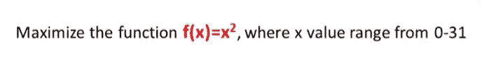
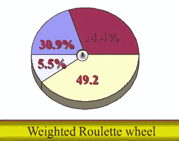
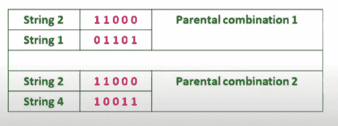
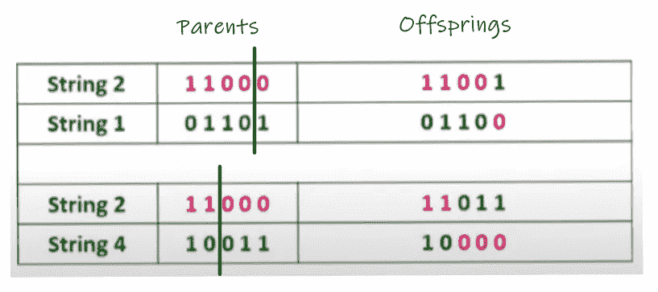
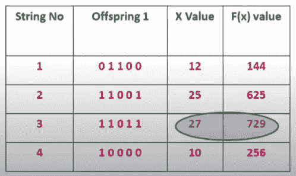

# 遗传算法:一个简单的例子

> 原文：<https://medium.com/geekculture/genetic-algorithm-a-simple-example-161d788f0465?source=collection_archive---------11----------------------->

# 介绍

遗传算法(GA)有时候可能有点难以理解！！:(

在本文中，我将通过一个简单的例子来帮助您理解 GA。所以不用担心。抓紧了。一切很快就会明朗！！:)

下面是在遗传算法的帮助下解决任何优化问题的步骤。

*   **步骤 1-** 选择编码技术、选择算子和交叉算子
*   **第 2 步-** 选择人口规模
*   **第三步-** 随机选择初始种群
*   **第 4 步-** 选择亲代染色体
*   **步骤 5-** 执行交叉(随机交叉点)
*   **步骤 6-** 后代评估
*   **步骤 7-** 重复该过程

现在，我们将看到一个简单的优化问题的例子，并尝试在上述步骤的帮助下解决它。

# 问题

# 回答

## **步骤 1-**

*   **编码技术-** 二进制编码
*   **选择操作符-** 轮盘选择
*   **交叉算子-** 单点交叉

## **步骤 2-**

人口规模(n) = 4

## **步骤 3-**

初始总体(x 值)= 13，24，8，19

## **第四步-**

我们看到，如果轮盘赌旋转四次，我们将得到两次 24 和一次 13 和 19。所以可能的亲本组合是(24，13)和(24，19)。

## **第五步-**

## **第 6 步-**

我们可以看到最大 f(x)值从 576 增加到了 729。

## 第七步-

现在我们将这四个后代作为父母，重复这个过程，直到我们的终止条件不满足。

这就是本文的全部内容。

不要忘记👏如果你喜欢这篇文章。

如果您想了解更多关于 GA 的知识，请查看我的系列文章:

 [## 遗传算法(GA)系列

### 我发表了不少关于遗传算法的文章。虽然这些文章站在自己的立场，它将更多…

apargarg99.medium.com](https://apargarg99.medium.com/genetic-algorithm-ga-series-9cf533b292f) 

如果你有任何问题或者想要澄清什么，你可以在 LinkedIn 上找到我。

~快乐学习。