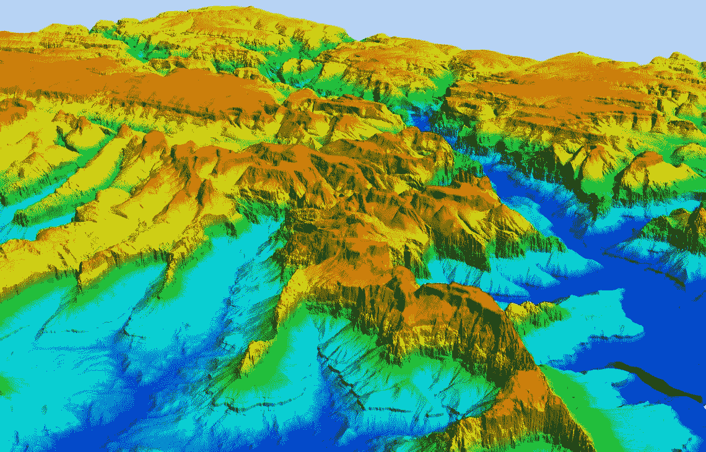

# 地理信息系统建模

> 原文：<https://medium.com/geekculture/geographic-information-system-gis-modeling-5983a0f75ce9?source=collection_archive---------32----------------------->

术语“建模”有多种用法，有多种不同的含义。代表现实世界的一部分可以是建模过程；这是因为生成的模型将具有与真实世界相同的特征，允许我们在模型而不是真实世界上进行研究和工作，以测试如果条件改变和可能性变化会发生什么(1)。