# 逻辑回归的几何解释

> 原文：<https://medium.com/geekculture/geometric-interpretation-of-logistic-regression-8963711e578f?source=collection_archive---------22----------------------->

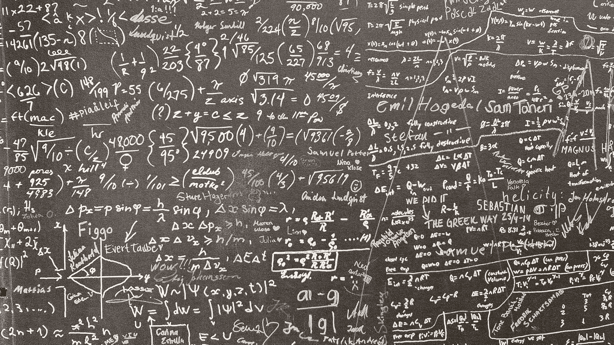

[https://unsplash.com/photos/OPpCbAAKWv8](https://unsplash.com/photos/OPpCbAAKWv8)

逻辑回归是一种统计模型，它使用逻辑函数来模拟二元因变量。虽然名字里有回归，但实际上是一种分类技术。逻辑回归的大假设是类是完全线性可分的或几乎线性可分的。

## *线性可分这个术语是什么意思？*

如果一条线或一个平面可以几乎或完全分离这些类，这样的数据集称为**线性可分离数据集**。

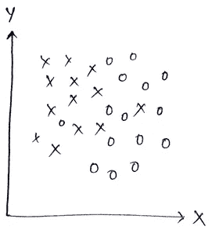

Linearly or almost linearly separable. x -> positive data point , o -> negative data point

## ***几何解释-***

我们知道超平面的方程由 **w x + b = 0** 给出，数据集由正负点组成(二元分类任务)。任务是找到一个最好地分离正负点的超平面，这意味着我们必须找到对应于该平面的最佳 **w** 和 **b** 。


x_i and x_j are correctly classified points, d_iand d_j are distances their respective distances from the hyperplane

现在给定任意点 x_i，正的或负的，该点到平面的距离为 d_i，对于所有的正的点，我们将写为 **y_i = +1** ，对于所有的负的点，我们将写为 **y_i = -1** 。这个区别非常重要。于是 y_i = {-1，+1} 。

点 x_i 和 x_j 到超平面的距离由下式给出，

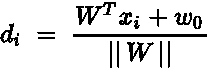

d_i =平面和 x_i 之间的距离，这里 W 垂直于平面。

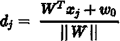

d_j =平面和 x_j 之间的距离，这里 W 垂直于平面。

现在让我们假设 W 是一个单位向量，这意味着||W|| = 1。因此，

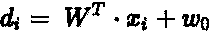

因为 W 和 x_i 在平面的同一侧，

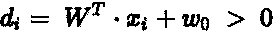

x_j 在平面的对面。因此，

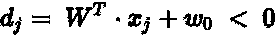

现在，我的分类器如下所示，

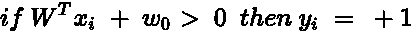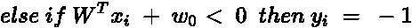

现在让我们看看这个术语，

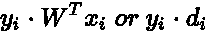

## **为正确分类的点-**

```
Now for a positive class point: **y_i = +1**
**(y_i * d_i) > 0**, since **d_i > 0** and **y_i  = +1**For a negative class point: **y_i = -1**
**(y_i * d_i) > 0,** since **d_i < 0** and **y_i = -1**
```

因此，


## 对于一个错误分类的点-

```
For a positive class point: **y_i = +1**
**(y_i * d_i) < 0**, since **y_i > +1 and d_i < 0 (wrong side of the hyperplane)**For a negative class point: **y_i = -1**
**(y_i * d_i) < 0,** since y**_i > -1** and d**_i < 0 (wrong side of the hyperplane)**
```

因此，

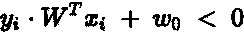

因此，任务是找到一个最佳超平面，使其正确分类最大数量的数据点，如下所示。

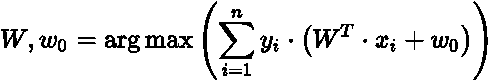

## 挤压和乙状结肠功能-

y_i * d_i 的结果是一个带符号的距离。如果按原样使用带符号的距离，异常值的影响非常大。因此，我们需要一个如下所示的高值递减函数。

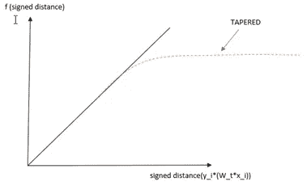

high and low values are tapered off

如果带符号距离的值很大，则 f(带符号距离)逐渐变小，如果 x 的值很小，则它仍然很小。

## Sigmoid 函数-

sigmoid 函数就是这样一个函数，它帮助我们逐渐减少大值。另一个优点是，它给出了模型的概率解释。数学方程由下式给出:

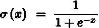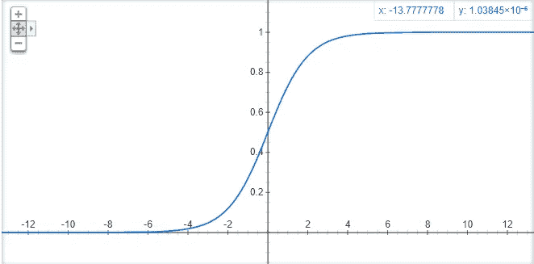

Graph for 1/(1+e^-x)

现在我们的方程看起来像这样，

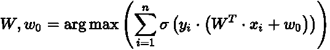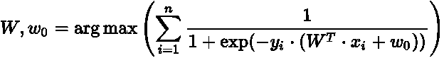

## 目标函数的数学公式

单调函数是一个有趣的想法，可用于优化问题。

如果 G(x)是单调递增函数，那么 G(F(x))也是单调递增函数。因此，

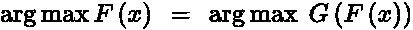

log(x)就是这样一个单调函数，当 x 增加时，log(x)也增加，同样，当 x 减少时，log(x)也减少。因此，我们将在优化问题中使用 log(x)。

这个等式可以归结为:

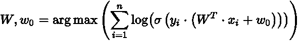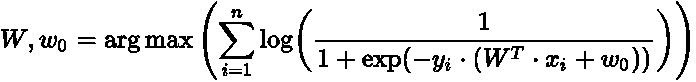

我们知道，

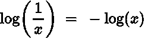

因此，

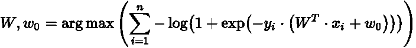

我们也知道，

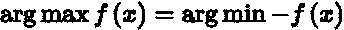

因此，

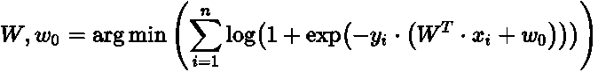

The final optimization problem for logistic regression( from the geometric interpretation and without regularization )

# 正规化

## **需要正规化-**

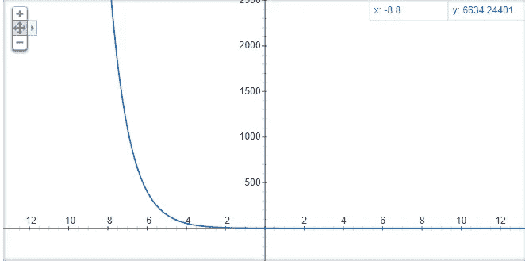

Graph for e^-x

上图是为 e^-x 绘制的，我们可以看到 exp(-x)总是正的。因此，

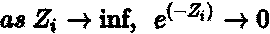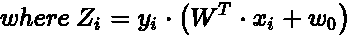

因此，

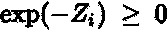

因此，

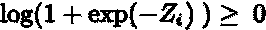

从上面的等式中，我们可以看到最小的可能值是 0。但是什么时候可能发生呢？

如果 **exp(-Z_i) - > 0，就会出现这种情况。**从上图我们可以看出，当 Z_i - > +inf 时 **exp(-Z_i) - > 0。**

因此，这意味着对于' **i** '的所有值来说， **Z_i** 应该变成无穷大。

此外，由于 **Z_i 总是正的，**这意味着我们所有的训练点都被正确分类，这是**过拟合**的情况。

因此，我们添加了**正则项**。

## **添加 L2 正则化-**

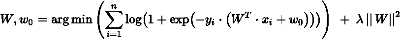

Loss Term + Regularization Term

在上面的等式中，第一项称为对数损失，第二项称为正则化项。“Lamda”在这里是一个超参数。我们也可以用 L1 正则化来代替 L2。

# **偏差-方差权衡**

如果λ= 0，则上述方程将不包含任何将使模型**过拟合**的正则化项。

如果 lambda -> inf，损失项的影响减少，正则化项中没有与训练数据相关的东西，因此我们根本不使用训练数据来确定将使模型**欠拟合**的最优超平面。

*说到这里，我们已经到了这篇文章的结尾。非常感谢你的阅读！。*

## 参考资料:

*   [应用人工智能课程](https://www.appliedaicourse.com/)

## Linkedin 个人资料:

你可以在 [LinkedIn](https://www.linkedin.com/in/srinidhi-karjol-aba072103/) 上和我联系。