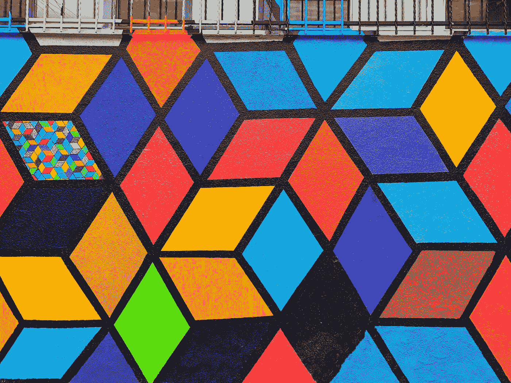
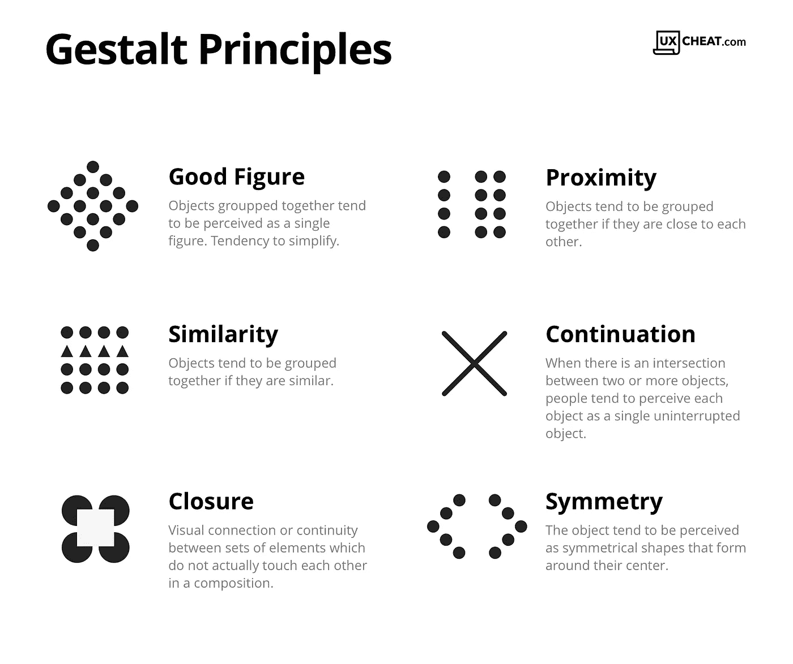
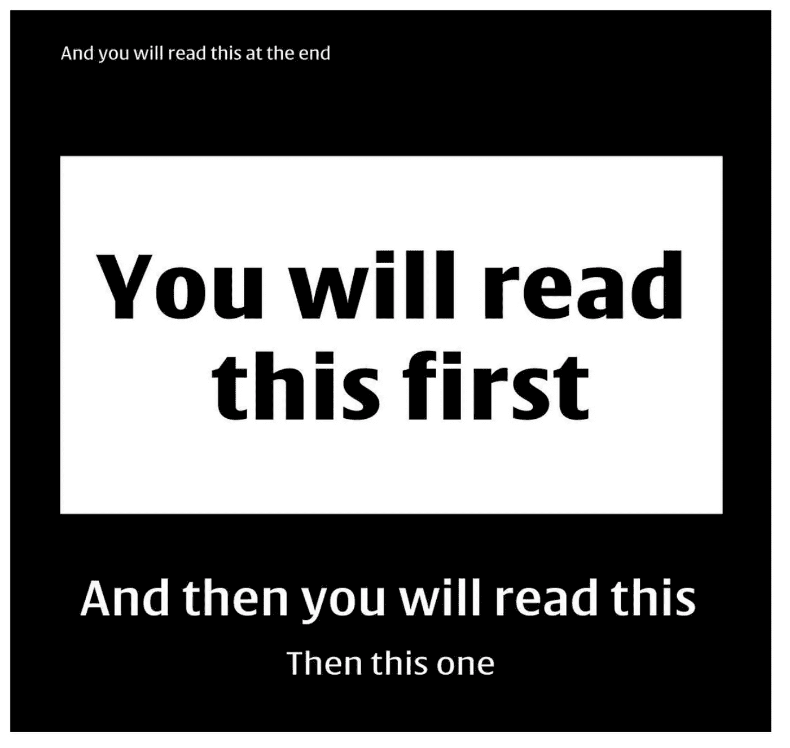
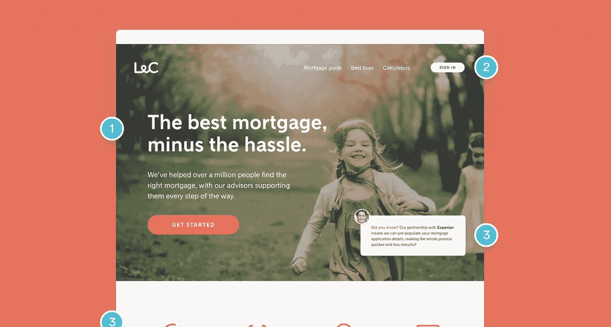
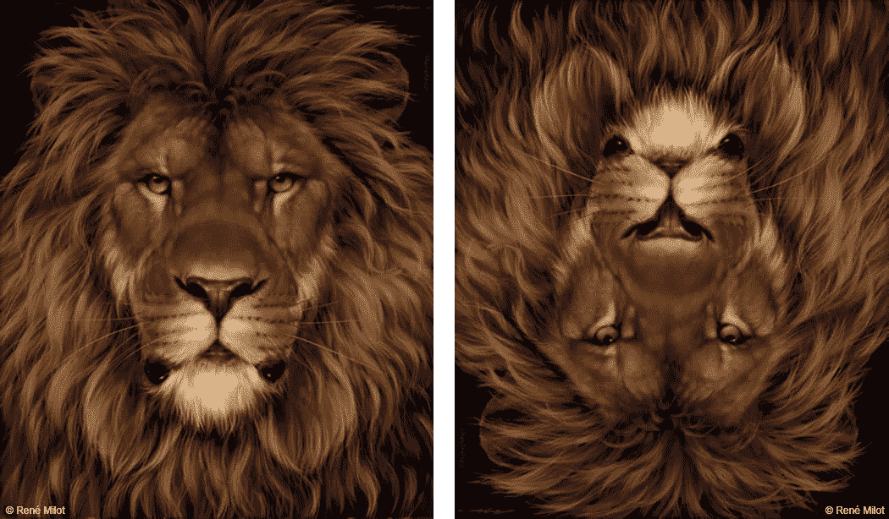
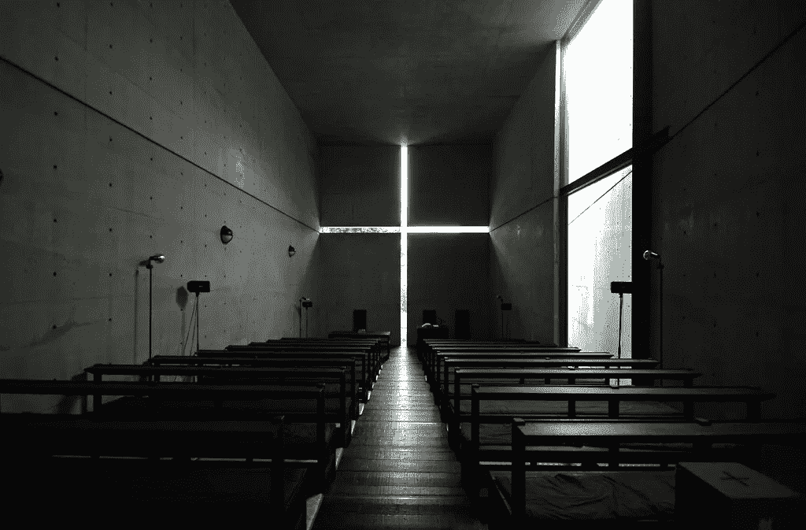

# 格式塔心理学在产品设计中的应用

> 原文：<https://medium.com/geekculture/gestalt-psychology-as-applied-in-product-design-941b87b01218?source=collection_archive---------11----------------------->

支配人类感知的 5 个分组原则

**本文结构如下:**

1.  什么是格式塔心理学
2.  格式塔心理学原理
3.  产品设计中的应用
4.  其他应用领域

# 什么是格式塔心理学

心理学是旨在了解大脑如何工作的科学分支。

格式塔是一个德语单词，大致翻译为“构型、形状、形式或整体”或“事物放在一起形成一个整体对象的方式”。

特别是格式塔心理学，是解释人类大脑如何感知周围环境中的物体的学派。它表明，我们不是把环境中的物体看作单个的组成部分，而是把它们看作一个更大、更复杂的整体的一部分。

> **简单定律或者说普朗尼定律**
> 
> "每个刺激都是以最简单的形式被感知的."
> 
> "整体大于部分之和。"

[这一学派的最早记录最早是由马克斯·韦特海默](https://www.verywellmind.com/what-is-gestalt-psychology-2795808#:~:text=Gestalt%20psychology%20is%20a%20school,and%20behavior%20as%20a%20whole.&text=Instead%2C%20our%20minds%20tend%20to,elements%20of%20more%20complex%20systems.)做出的，他在观察铁路信号上的交替灯时观察到了他称之为*的 phi 现象*。

phi 现象是一种视错觉，如果显示两个静止的物体快速连续地出现和消失，它们似乎会移动。换句话说，我们在没有运动的地方感知运动。

由此他得出结论，我们通过看到整体感知来感知事物，而不是通过理解单个部分。

# 格式塔的原则

## **基础原理:**

**prgnanz**:人类的大脑自然会以最简单的形式或组织来感知事物。

这里面包含了支配人类感知的其他 5 个原则。

Gestalt Principles by UXCheat

1.  相似性:人类的大脑会根据颜色、大小或方向等因素自然地将相似的物品归类在一起。
2.  接近度:彼此靠近的物体倾向于被视为一组。
3.  **连续性/简单性**:排列在线或曲线上的元素被认为是相互关联的，而不在线或曲线上的元素被认为是独立的。
4.  **闭合**:组成一个闭合物体的元素会被感知为一个群体。为了理解一个物体，大脑甚至会填充缺失的信息来创造封闭。
5.  **共同区域/好身材**:如果物体位于同一个大致区域，人类的大脑倾向于将它们组合在一起。

近年来，名单上又增加了其他人，如:

*   对称和秩序
*   共同命运:看起来朝同一个方向前进的物体被认为是相关的

# 产品设计中的格式塔心理学

心理学在用户如何与产品互动中起着重要作用。格式塔原则可以用来确保用户获得清晰愉悦的体验。

自从这些原则在 20 世纪初出现以来，设计师们一直在利用人脑对对比度、颜色、对称、重复和比例等事物的感知来提升他们工作的影响力。

这些原则的使用导致了各种设计概念的结合。这些是；

*   **图形-背景关系**:这就是通常所说的“负空间”焦点对象(如单词、短语或图像)与其周围空白区域之间的对比度。

The “E” and “x” in the FedEx logo create an arrow within the negative space between them. ([Image: Toptal](https://www.toptal.com/designers/ui/gestalt-principles-of-design))

*   **视觉层次**:这是按照重要性顺序组织和展示物品的地方。这确保了最重要的对象(文字或图像)首先吸引用户的注意力。

*   **关联性**:这个概念建立在接近原则的基础上，决定了重要对象的位置，包括像标题、说明和列表这样的文本元素。

On Netflix, related content are placed close to each other under a headline

# 其他应用

## 1.艺术

Apparition of Face and Fruit Dish on a Beach by Salvador Dali

Lion and the Mouse by Rene Milot

**2。摄影**

**3。架构**(闭合定律)

Church of the Light, Ibaraki, Japan. [Photo by Naori Fujii](https://www.archdaily.com/101260/ad-classics-church-of-the-light-tadao-ando)

从上面的图片可以看出，格式塔心理学继续在许多艺术家和设计师的作品中体现出来，创造出令人惊叹的创新体验。