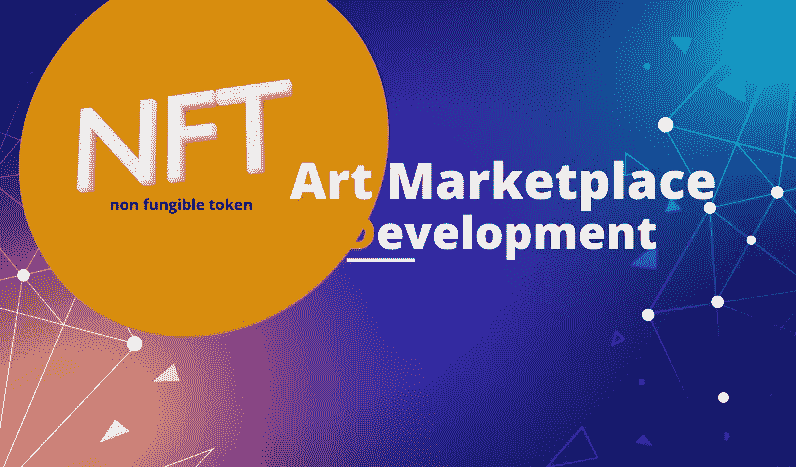

# 获得顶级 NFT 艺术市场的发展，以满足业务需求

> 原文：<https://medium.com/geekculture/get-a-top-tier-nft-art-marketplace-development-for-business-needs-8b0f8bdb9c51?source=collection_archive---------17----------------------->

# NFT 市场是如何运作的？

NFT 市场是唯一的交易平台，用于交易不可替代的代币。在数字空间中有许多不同的市场。

最受欢迎的 NFT 市场是**数字艺术 NFT 市场**。这个市场属于专属 NFT 市场的类别。

NFT Marketplace Development

> 这个市场只交易艺术类的非艺术作品。

因此，这将是一个完美的平台，让每个人都可以浏览数字市场中大量的艺术变体。

NFT 顶级艺术品市场数不胜数，最受欢迎的有**[**俏皮网关**](https://www.niftygateway.com/) 和基金会。**

# **NFT 艺术市场有多受欢迎**

**NFT 艺术市场正成为众多商业平台最青睐的市场发展方向之一。**

**因此，这将是一个为企业开展 [**NFT 艺术市场发展**](https://bit.ly/3c0k30j) 的大好机会。**

**最重要的是，为了启动这项业务，有必要寻找一个坚实的 NFT 市场发展公司。**

**在 NFT 市场开发公司的帮助下，商业平台的一系列特殊功能得以实现。**

**此外，数字艺术 NFT 市场是开始稳固业务的最佳方式。**

**在 NFT 市场开发公司的指导下，商业平台可以根据自己的意愿定制平台，并在很短的时间内实现完全盈利。**