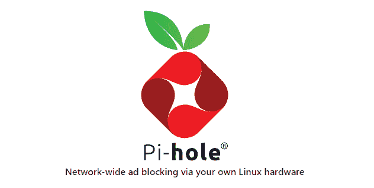

# 获得无广告网页与 Pi-hole

> 原文：<https://medium.com/geekculture/get-ad-free-web-with-pi-hole-4292e4e3ce43?source=collection_archive---------4----------------------->

在这篇文章中，我将向你展示如何设置 pi-hole。Pi-Hole 将允许您阻止应用程序广告，提高您的网络性能和监测统计数据。Pi-hole 还允许你创建一个 vpn。

# 什么是 Pi-hole？

Pi-hole 是一个 Linux 网络级广告和互联网追踪器拦截应用程序，它充当 DNS sinkhole 和可选的 DHCP 服务器，旨在用于…